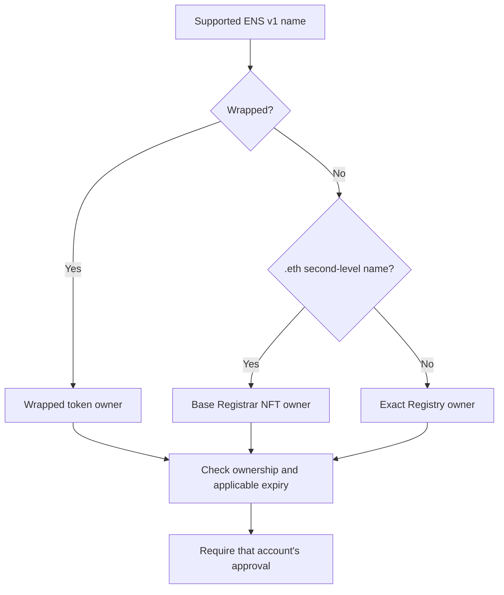

import {
  Accordion,
  AccordionContent,
  AccordionItem,
  AccordionTitle,
} from "../../../components/accordion.tsx";

# Version 1

Authority version 1 (`a=1`) selects one owner for the exact ENS name being
verified. It applies to the ENS v1 contracts on Ethereum mainnet.

## Who Qualifies

| Name                                                                  | Authority                                   |
| --------------------------------------------------------------------- | ------------------------------------------- |
| Unwrapped `.eth` second-level name, such as `alice.eth`               | Base Registrar NFT owner                    |
| Wrapped name                                                          | Name Wrapper token owner                    |
| Other unwrapped name, such as `app.alice.eth` or an imported DNS name | Owner of the exact name in the ENS Registry |

For an unwrapped `.eth` registration, the NFT owner and Manager can be different
accounts. Version 1 requires the NFT owner's approval. For other unwrapped
names, the Registry owner qualifies even if an interface calls it the Manager.

Wrapped names use their token owner because the Name Wrapper contract holds
the underlying name. See the [ENS Name Wrapper overview](https://docs.ens.domains/wrapper/overview/)
for how wrapping changes ownership.

## Selection Flow

The flow summarizes selection. The implementer guide defines the checks that
must pass before an account is accepted.

## Examples

- Alice owns the `alice.eth` NFT and Bob is its Manager. Alice approves the
  claim; Bob can publish the records and proof location.
- Carol owns the wrapped token for `app.alice.eth`. Carol approves the claim,
  rather than the Name Wrapper contract or Alice.
- Dave is the Registry owner of an unwrapped `app.alice.eth`. Dave approves the
  claim, even though Alice controls the parent name.

## Expiry and Scope

An expired `.eth` registration cannot provide authority under version 1,
including during its renewal grace period. Wrapped subnames also undergo the
applicable wrapper ownership and expiry checks.

Version 1 does not select operators, resolver delegates, parent owners, or an
address merely stored in a record. It excludes the root and reverse names.
Names that resolve through wildcard or offchain records still need an exact
owner under this algorithm.

For an unwrapped subname, selection follows its Registry entry without checking
the parent's registration history. For an imported DNS name, it follows ENS
ownership without proving current DNS control. These are limits of the
ownership rule, not additional guarantees of verification.

## Decisions

<Accordion>
  <AccordionItem>
    <AccordionTitle>Why exclude a separate Manager and other delegates?</AccordionTitle>
    <AccordionContent>

A delegated record writer can publish records without being the account that
owns the name. Requiring the selected owner's approval keeps that distinction.
A Manager can still publish a proof signed by the owner. Version 1 does not
interpret record-editing or token approvals as permission to sign verification
claims.

    </AccordionContent>

  </AccordionItem>
</Accordion>

## Implementer Guide

See [Version 1 for implementers](/implementers/authority/version-1) for the
contracts, ordered algorithm, and expiry rules.
