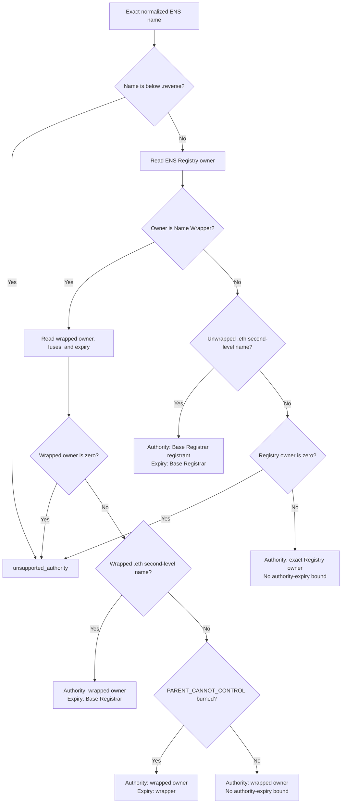

import {
  Accordion,
  AccordionContent,
  AccordionItem,
  AccordionTitle,
} from "../../../components/accordion.tsx";

# Authority

:::warning[Work in progress]
This page has not been finalized. Requirements, formats, and examples may
change while the protocol is under discussion.
:::

Authority is the account allowed to approve verification for an exact ENS
name. The verifier computes it from live ENS state. The proof does not provide
or choose it.

```text
ResolveAuthority(name, authorityVersion, evaluationBlock)
  -> authority
  -> authorityValidUntil, when ENS exposes an ownership expiry
```

The authority is not necessarily the account that can edit the record. A
resolver operator, delegated record writer, CCIP Read gateway, or ENSv2 role
holder may be able to change data without owning the name.

## Inputs

Authority resolution uses:

| Input              | Purpose                                                          |
| ------------------ | ---------------------------------------------------------------- |
| Normalized name    | Selects the exact name, not its parent or resolver.              |
| `authorityVersion` | Selects one immutable authority algorithm.                       |
| Evaluation block   | Pins ownership, expiry, records, and signatures to one snapshot. |

The descriptor field `a` is an authority algorithm version. It is not an ENS
protocol version. A change to ENS ownership rules can allocate a new authority
version without changing discovery, claims, methods, or results.

## Profile Applicability

The descriptor does not get to force an obsolete authority algorithm. At the
evaluation block, a verifier must first identify the name's live ownership
system from live ENS state. It then requires descriptor field `a` to name a
profile that applies to that state.

If two ownership systems appear active, the migration state is unknown, or the
selected profile does not apply, authority resolution fails. A profile must
define this applicability and precedence rule as strictly as its owner lookup.

## Current ENS Profile

Authority Algorithm 1 applies to the current ENS deployment on Ethereum
mainnet.

| Contract       | Address                                      |
| -------------- | -------------------------------------------- |
| ENS Registry   | `0x00000000000C2E074eC69A0dFb2997BA6C7d2e1e` |
| Base Registrar | `0x57f1887a8BF19b14fC0dF6Fd9B2acc9Af147eA85` |
| Name Wrapper   | `0xD4416b13d2b3a9Bae7AcD5D6C2BbDBE25686401`  |

The selected authority depends on how the exact name is registered:



An imported DNS name uses its current ENS owner. A positive result proves that
owner approved the ENS record; it does not prove that the owner still controls
the DNS domain.

### Algorithm

Use the evaluation block for every contract call and its timestamp for every
expiry check.

1. Normalize the name with ENSIP-15 and calculate its namehash.
2. Reject every name at or below the `reverse` suffix.
3. Read `ENSRegistry.owner(node)`.
4. If the Registry owner is the Name Wrapper:
   1. read `NameWrapper.getData(uint256(node))`;
   2. require a nonzero exact wrapped owner;
   3. for a wrapped `.eth` second-level name, require the Base Registrar
      registration to be active and owned by the Name Wrapper, then use its
      expiry;
   4. for another name with `PARENT_CANNOT_CONTROL` burned, require its wrapper
      expiry to be active and use that expiry;
   5. otherwise select the wrapped owner without treating wrapper expiry as an
      ownership expiry.
5. Otherwise, for an unwrapped `.eth` second-level name:
   1. calculate `tokenId = uint256(keccak256(bytes(label)))`;
   2. require `BaseRegistrar.nameExpires(tokenId)` to be in the future;
   3. select `BaseRegistrar.ownerOf(tokenId)` and use the registration expiry.
6. For every other unwrapped name, require and select the nonzero exact
   `ENSRegistry.owner(node)`.
7. Require the selected account to equal `claim.authority`.
8. Validate `proof.authoritySignature` for that account at the same evaluation
   block.

A wrapped `.eth` token stores registrar expiry plus the renewal grace period.
That stored wrapper value is not the verification-authority bound. Verification
authority ends when the active Base Registrar registration ends, at the start
of grace. This is a verification-policy cutoff; some stored resolver-management
permissions may continue to work during grace.

For other wrapped names, wrapper expiry has two meanings. If
`PARENT_CANNOT_CONTROL` is burned, expiry ends the child's independent
ownership. Without that fuse, expiry only resets fuses and the parent can
already replace the child; the wrapped owner does not disappear at that time.

## Subnames

The exact child owner is the authority. Do not use the parent owner.

For an unwrapped child, the ENS Registry stores no expiry. If `alice.eth`
transfers, expires, or is re-registered, the stored owner of
`team.alice.eth` does not automatically change. Authority Algorithm 1 continues
to select that child owner until the parent replaces it.

Whether an old child should remain accepted after a parent expires and is
re-registered is still an open security decision. Current contracts provide no
generic ancestor registration generation that a verifier can bind.

An emancipated wrapped child has its own explicit ownership expiry. A
parent-controlled wrapped child does not gain independent ownership merely
because it has an expiry value.

## CCIP Read and Wildcard Names

CCIP Read changes how resolver data is fetched, not who owns the name.

If `alice.eth` exists onchain and its resolver uses CCIP Read, use the normal
exact authority for `alice.eth`. The gateway only transports data that the
resolver callback authenticates.

If `team.alice.eth` exists only as a wildcard answer and has no exact ownership
state, Algorithm 1 returns `unsupported_authority`. Do not substitute the
ancestor owner, wildcard resolver, gateway, resolved address, or a value inside
the gateway response.

An offchain namespace can be supported later by a separate authority profile
that defines exact-name ownership and authenticates that state.

Resolver aliases follow the same boundary. A record may be read from an alias
target, but authority remains attached to the exact requested source name.

## Reverse Names

Algorithm 1 rejects every name at or below the `reverse` suffix. The Registry owner
of a reverse node can be a delegated manager, while the account encoded by the
reverse label retains the ability to reclaim it. This is similar to the
registrant-manager split for `.eth`, but reverse namespaces also vary by chain.

A reverse authority profile must define the chain-specific label, derive the
underlying account, and validate that account's EOA or smart-account approval.
Until then, returning `unsupported_authority` is safer than accepting a
temporary Registry manager as the durable authority.

The current claim can represent only a mainnet EVM reverse authority. Other
ENSIP-19 coin types need a chain-qualified principal and chain-specific
signature or contract-account validation in a future claim version.

## Contract Authorities

Calculate the EIP-712 digest of the complete common claim. Select one signature
path using the authority's code at the evaluation block:

- if the authority has no code, require strict EOA recovery to produce it;
- if the authority has code, use an ERC-1271 `staticcall` and require the exact
  `0x1626ba7e` magic value.

Do not apply EOA recovery as a fallback for a contract. Reject an ERC-1271
revert, malformed return value, or failed call.

One authority address is enough for a multisig, smart account, or other custom
policy because the contract implements that policy behind ERC-1271. The proof
cannot select the signature path.

## ENSv2

The current ENSv2 design stays on Ethereum L1 and can reuse the common record
verification components when authority remains an Ethereum account. It still
needs a new authority algorithm and may need a new claim version to bind
ownership generation. A future L2 or non-EVM authority may also require a new
principal type, signature rules, and domain.

ENSv2 uses a root registry followed by a hierarchy of registries instead of one
global Registry, Base Registrar, and Name Wrapper ownership model.

For a name such as `team.alice.eth`, a future ENSv2 profile would:

```text
Root Registry
  -> subregistry("eth")
  -> subregistry("alice")
  -> owner("team")
```

The owner of a label is read from its parent registry. The profile must:

1. start from the trusted ENSv2 root and traverse the requested name from the
   root down;
2. read the final label's exact owner from its live parent registry;
3. require the registry to expose the registered ownership interface;
4. bind the supported registry implementations and every available
   registration generation into an authority context;
5. cap validity at the earliest applicable name or ancestor expiry;
6. reject an expired, unreachable, reserved, or ownerless path;
7. keep resolver and registry role holders separate from the exact owner.

Each label's owner and expiry come from its parent registry. For the example
above, the expiry reads are conceptually:

```text
root.findExpiry("eth")
ethRegistry.findExpiry("alice")
aliceRegistry.findExpiry("team")
```

A profile must state which registry implementations are supported and whether
they are persistent or must expose the temporal interface. It must not silently
treat a missing expiry interface on an unknown registry as infinite validity.

`UniversalResolverV2.findOwner()` returns only an address, so it is not enough
to distinguish unsupported, reserved, expired, and absent state or to compute
path expiry and generation. A complete authority profile must perform or
validate the rooted traversal.

ENSv2 allows one registry to be reachable under multiple names. All live paths
are valid; a verifier must not require the requested path to equal the
registry's single canonical name. `getParent()` may describe another alias and
must not be used to construct the requested path. Only root-down traversal of
the exact requested labels authenticates it.

Migration is also profile-specific. A name may resolve through the ENSv2
Universal Resolver while still using ENSv1 ownership fallback. Such a name
continues to use Algorithm 1. It moves to the future ENSv2 authority profile
only after native ENSv2 ownership exists. The final migration profile must
define how that state is recognized, which system wins if both contain data,
and when Algorithm 1 becomes inapplicable.

ENSv2 is still under development, so its authority profile number, trusted
deployments, supported interfaces, and migration rules are not frozen here.

## Open Issues

<Accordion>
  <AccordionItem>
    <AccordionTitle>What happens when a subname's parent is re-registered?</AccordionTitle>
    <AccordionContent>

Suppose Bob owns unwrapped `team.alice.eth`. `alice.eth` expires and Carol
registers it. The ENS Registry still stores Bob as the child owner until Carol
replaces that child, so Algorithm 1 continues to accept Bob.

This matches exact live Registry state and preserves delegated subnames, but it
does not prove that Carol authorized the child in her new registration
generation. Possible stricter rules are to reject such children, require
current ancestor co-approval, require an emancipated wrapped name, or use
authenticated ownership-event history. ENSv1 has no generic onchain generation
value for this check.

    </AccordionContent>

  </AccordionItem>

  <AccordionItem>
    <AccordionTitle>Can an old proof become valid after an owner returns?</AccordionTitle>
    <AccordionContent>

Yes. Suppose Alice signs a proof, transfers the name to Bob, and later receives
the name back while the old claim is still within its signed lifetime. A
verifier sees Alice as the current authority again, so the old proof can pass.

Current ENS does not expose one ownership-generation number for every kind of
name. Possible fixes are short maximum proof lifetimes, a signed authority
epoch, an indexed ownership-change event, or an explicit verification
delegation record with revocation. The protocol must choose one before claiming
that every transfer permanently invalidates old proofs. This blocks finalizing
the authority profile unless reactivation is explicitly accepted as protocol
behavior.

    </AccordionContent>

  </AccordionItem>

  <AccordionItem>
    <AccordionTitle>How should ownerless L2 and offchain names define authority?</AccordionTitle>
    <AccordionContent>

A future profile needs more than a gateway address. It must bind the exact
name, chain, registry or namespace, owner, generation, expiry, authenticated
state root, and finality rule. The record, descriptor, and authority must come
from the same authenticated revision.

It must also state its trust source. A finalized L2 storage proof, DNSSEC chain,
and provider-signed database revision provide different guarantees even when
all three are transported through CCIP Read.

The current common claim represents authority as an Ethereum `address` and
uses EIP-712. A non-EVM authority may therefore require a new common claim
version, not only a new value of `a`.

    </AccordionContent>

  </AccordionItem>

  <AccordionItem>
    <AccordionTitle>How is the ENSv2 profile frozen safely?</AccordionTitle>
    <AccordionContent>

ENSv2 contracts and migration behavior are still changing. The final profile
must pin the chain, trusted root, supported ownership and expiry interfaces,
root-to-name traversal, fallback states, and deployment activation policy.

Custom registries that do not expose the required ownership interface must
fail with `unsupported_authority`. They can be supported only by a separately
specified profile whose authority semantics are known.

    </AccordionContent>

  </AccordionItem>

  <AccordionItem>
    <AccordionTitle>Should ENS support delegated verification authority?</AccordionTitle>
    <AccordionContent>

The baseline requires the exact owner. Automatically accepting resolver
writers would be unsafe because permissions differ by resolver and may cover
one key, one record type, every record, or arbitrary custom logic.

If delegation is added, it should be explicit and bind the exact name, record
type, record key, method, authority profile, validity period, and a revocation
or generation value.

    </AccordionContent>

  </AccordionItem>

  <AccordionItem>
    <AccordionTitle>How are DNS-controlled names handled without an ENS owner?</AccordionTitle>
    <AccordionContent>

A DNS name imported into ENS has an ENS owner and follows Algorithm 1. A
gasless DNS or DNSSEC-only name may resolve without one, so an Ethereum address
signature cannot represent its authority automatically.

Supporting that case needs a separate DNS authority profile. It could publish
the common claim digest in a DNSSEC-authenticated record, or use DNSSEC to
delegate to a canonical account or key that signs the claim. Either model must
define DNS signature validity, key rotation, delegation revocation, and proof
freshness.

    </AccordionContent>

  </AccordionItem>
</Accordion>

## Decisions

<Accordion>
  <AccordionItem>
    <AccordionTitle>Why use the owner instead of a record writer?</AccordionTitle>
    <AccordionContent>

The authority signature is an independent approval from the ENS name. If any
account that can write the record and descriptor can also act as authority, it
can create every input required for a positive result by itself.

Owner lookup is defined for the supported name types. Resolver permissions are
implementation-specific and cannot be discovered through one common
interface. ENS Registry operators, Base Registrar approvals, Name Wrapper token
approvals, and global wrapper operators are also not authority; the selected
owner must approve the claim.

    </AccordionContent>

  </AccordionItem>

  <AccordionItem>
    <AccordionTitle>Why use the exact child owner instead of the parent?</AccordionTitle>
    <AccordionContent>

ENS supports delegated subnames. Requiring the parent to sign would remove that
independence and would disagree with the child ownership stored in the Registry
or Name Wrapper.

The parent may still replace a parent-controlled child. Verification follows
the live exact owner and changes as soon as that replacement occurs.

    </AccordionContent>

  </AccordionItem>

  <AccordionItem>
    <AccordionTitle>Why return one address?</AccordionTitle>
    <AccordionContent>

Current ENS ownership resolves to one Ethereum address. An EOA signs directly,
while a smart account or multisig defines any threshold, session key, or policy
through ERC-1271.

Putting signer lists or wallet policy into this protocol would duplicate smart
account logic and become stale when the account changes its rules.

    </AccordionContent>

  </AccordionItem>

  <AccordionItem>
    <AccordionTitle>Why is authority versioned separately?</AccordionTitle>
    <AccordionContent>

ENS ownership architecture can change without changing the verification method
or descriptor grammar. Separate `a` versions let a verifier select the exact
authority algorithm and reject unsupported semantics instead of guessing.

The profile also decides whether it applies to the name's live state. A proof
cannot select an obsolete profile merely because that profile returns a signer
it prefers.

    </AccordionContent>

  </AccordionItem>

  <AccordionItem>
    <AccordionTitle>Why use the same evaluation block?</AccordionTitle>
    <AccordionContent>

Reading the record at one block and authority at another can combine states
that never existed together. A transfer or record update between those reads
could incorrectly validate an old signer against a new value.

The target record, descriptor, authority, expiry, and ERC-1271 call therefore
use one Ethereum block reference. An offchain or L2 profile additionally needs
one compatible authenticated source revision, such as a finalized state root
or provider-signed database revision, for all of its reads.

    </AccordionContent>

  </AccordionItem>

  <AccordionItem>
    <AccordionTitle>Why not use an ENSv2 canonical-name check?</AccordionTitle>
    <AccordionContent>

ENSv2 deliberately allows one registry to appear under more than one name. Its
parent pointer can describe only one canonical path, so requiring that path
would reject other valid aliases.

Authority instead follows the exact requested path from the trusted root and
accepts it when every link is live and supported.

    </AccordionContent>

  </AccordionItem>

  <AccordionItem>
    <AccordionTitle>Why fail when exact authority is unavailable?</AccordionTitle>
    <AccordionContent>

Falling back to a parent, resolver, gateway, or proof-supplied account changes
the meaning of authority and can let infrastructure approve records it does
not own.

Returning `unsupported_authority` is safe and makes the missing authority model
visible. A later profile can add support with explicit rules.

    </AccordionContent>

  </AccordionItem>
</Accordion>
