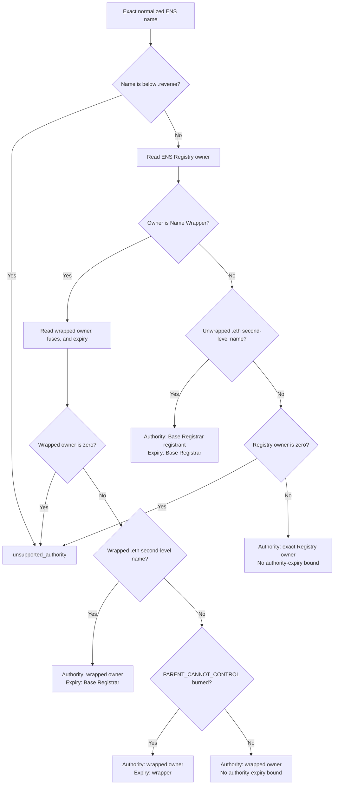

import {
  Accordion,
  AccordionContent,
  AccordionItem,
  AccordionTitle,
} from "../../../components/accordion.tsx";

# Authority

:::warning[Work in progress]
This page has not been finalized. Requirements, formats, and examples may
change while the protocol is under discussion.
:::

Authority is the account allowed to approve verification for an exact ENS
name. The verifier computes it from live ENS state. The proof does not provide
or choose it.

```ts
resolve_authority(name, authority_version, evaluation_block)
  -> authority
  -> authorityValidUntil, when ENS exposes an ownership expiry
```

## Inputs

Authority resolution uses:

| Input              | Purpose                                                          |
| ------------------ | ---------------------------------------------------------------- |
| Normalized name    | Selects the exact name, not its parent or resolver.              |
| `authorityVersion` | Selects one immutable authority algorithm.                       |
| Evaluation block   | Pins ownership, expiry, records, and signatures to one snapshot. |

The descriptor field `a` is an authority algorithm version. It is not an ENS protocol version. A change to ENS ownership rules can allocate a new authority version without changing discovery, claims, methods, or results.

## Current ENS Profile

Authority Algorithm 1 applies to the current ENS deployment on Ethereum
mainnet.

| Contract       | Address                                      |
| -------------- | -------------------------------------------- |
| ENS Registry   | `0x00000000000C2E074eC69A0dFb2997BA6C7d2e1e` |
| Base Registrar | `0x57f1887a8BF19b14fC0dF6Fd9B2acc9Af147eA85` |
| Name Wrapper   | `0xD4416b13d2b3a9Bae7AcD5D6C2BbDBE25686401`  |

The selected authority depends on how the exact name is registered:



An imported DNS name uses its current effective ENS owner: the exact Registry
owner when unwrapped or the wrapped owner when wrapped. A positive result does
not prove that account still controls the DNS domain.

### Algorithm

Use the same evaluation block for every contract read. Let `evaluationTime` be
that block's timestamp. Any failed requirement returns `unsupported_authority`;
the verifier must not try another branch or fall back to a parent or resolver.

1. Normalize the name with ENSIP-15, calculate its namehash as `node`, and
   reject names at or below `.reverse`.
2. Read `registryOwner = ENSRegistry.owner(node)`.
3. If `registryOwner` is the Name Wrapper:
   - Read `(wrappedOwner, fuses, wrapperExpiry)` from
     `NameWrapper.getData(uint256(node))` and require `wrappedOwner` to be
     nonzero.
   - If the name is exactly one label below `.eth`, require `IS_DOT_ETH`,
     calculate `tokenId = uint256(keccak256(bytes(label)))`, and read
     `registrarExpiry = BaseRegistrar.nameExpires(tokenId)`. Require
     `registrarExpiry > evaluationTime` and
     `BaseRegistrar.ownerOf(tokenId) == NameWrapper`, then return
     `(wrappedOwner, registrarExpiry)`.
   - For any other wrapped name with `PARENT_CANNOT_CONTROL` burned, require
     `wrapperExpiry >= evaluationTime`, then return
     `(wrappedOwner, wrapperExpiry)`.
   - For every remaining wrapped name, return `(wrappedOwner, null)` because
     ENS provides no authority-expiry bound for that ownership state.
4. Otherwise, if the name is exactly one label below `.eth`:
   1. calculate its `tokenId` and read `registrarExpiry`;
   2. require `registrarExpiry > evaluationTime` and read
      `registrant = BaseRegistrar.ownerOf(tokenId)`;
   3. reject the inconsistent state where `registrant` is the Name Wrapper but
      `registryOwner` is not;
   4. return the registrant and `registrarExpiry`.
5. For every other unwrapped name, require `registryOwner` to be nonzero and
   return it with no ENS-provided authority expiry.

After authority resolution succeeds, require the returned address to equal
`claim.authority` and validate `proof.authoritySignature` for that address at
the same evaluation block. If an authority expiry is returned, the effective
verification result must not remain valid after it.

The Name Wrapper really does store a wrapped `.eth` second-level expiry as the
Base Registrar expiry plus the 90-day grace period. It does this when wrapping,
registering and wrapping, receiving the registrar NFT, and renewing. The
wrapper can therefore continue returning a wrapped owner during grace. That
stored value preserves wrapper state through renewal; it is not the active
registration expiry. The algorithm reads `BaseRegistrar.nameExpires()`
directly and stops accepting the authority when grace begins.

For other wrapped names, the fuse determines whether wrapper expiry is an
authority bound. With `PARENT_CANNOT_CONTROL`, expiry ends the child's
independent ownership. Without it, the parent can already replace the child,
and the Name Wrapper keeps the child owner while resetting its fuses after
expiry. In that case the stored expiry is not treated as an authority expiry.

## Reverse Names

Reverse names work differently from normal names. A name such as
`<address>.addr.reverse` belongs logically to the address written in its label,
but that address can assign another account as the node's Registry owner.

For example, Alice can assign a manager as the Registry owner of her reverse
node. Reading only `ENSRegistry.owner(node)` would select the manager, even
though Alice can call the Reverse Registrar and replace that manager at any
time. The Registry owner is therefore not a reliable canonical authority for a
reverse name.

The alternative is to derive authority from the account encoded in the reverse
name. That needs separate rules because reverse namespaces can represent
different chains and account formats, not only Ethereum addresses. The current
claim and signature rules do not define those cases.

Algorithm 1 therefore returns `unsupported_authority` for `.reverse` names.
This does not mean reverse resolution is invalid; it means reverse ownership
needs its own authority profile before it can be used for record verification.

## Open Issues

<Accordion>
  <AccordionItem>
    <AccordionTitle>What happens when a subname's parent is re-registered?</AccordionTitle>
    <AccordionContent>

Suppose Bob owns unwrapped `team.alice.eth`. `alice.eth` expires and Carol
registers it. The ENS Registry still stores Bob as the child owner until Carol
replaces that child, so Algorithm 1 continues to accept Bob.

This follows the exact live child owner, but it does not prove that Carol
accepted Bob's subname in the new parent registration. ENS does not expose one
generic ownership-generation value that links every child to the current
generation of its parent.

The profile must either accept this behavior or add a stricter rule. Possible
rules include requiring parent co-approval, requiring an independently wrapped
child, or binding verified ownership history. Each option changes normal
subname delegation, so this remains open.

    </AccordionContent>

  </AccordionItem>

  <AccordionItem>
    <AccordionTitle>Can an old proof become valid after an owner returns?</AccordionTitle>
    <AccordionContent>

Yes. Suppose Alice signs a proof, transfers the name to Bob, and later receives
the name back while the old claim is still within its signed lifetime. A
verifier sees Alice as the current authority again, so the old proof can pass
if the signed record value is also current again.

Current ENS does not expose one ownership-generation number for every kind of
name. The simplest rule is to accept reactivation and keep proof lifetimes
short. Preventing it requires an authority epoch, authenticated ownership-event
history, or another revocation value that changes on every ownership cycle.
The protocol must explicitly choose between those behaviors.

    </AccordionContent>

  </AccordionItem>

  <AccordionItem>
    <AccordionTitle>How should names without an exact onchain owner be supported?</AccordionTitle>
    <AccordionContent>

A wildcard, CCIP Read namespace, DNSSEC-only name, or another offchain system
may return records without storing an exact owner in the ENS Registry. A
gateway, ancestor owner, or resolved address is not automatically the name's
authority, so Algorithm 1 rejects these names.

A future authority version must authenticate the exact name and owner from the
same revision as the record, and define expiry, replay protection, and the
trust source for that state. If the owner is not an Ethereum account, the
common claim and signature format may also need a new version.

    </AccordionContent>

  </AccordionItem>
</Accordion>

## Decisions

<Accordion>
  <AccordionItem>
    <AccordionTitle>Why use one owner instead of every record writer?</AccordionTitle>
    <AccordionContent>

One name can have a registrant, Registry manager, operators, resolver
delegates, and parent control at the same time. Those accounts have different
permissions and are not equivalent owners.

The profile chooses one canonical account: the Base Registrar registrant for
an unwrapped `.eth` second-level name, the wrapped owner for a wrapped name, or
the exact Registry owner for another unwrapped name. Operators and resolver
delegates are not additional authorities.

This keeps the authority signature independent from record writing. Otherwise
one delegated writer could set the record, descriptor, and authority approval
without the name owner participating. Resolver permissions are also
implementation-specific and cannot be discovered through one common rule.

    </AccordionContent>

  </AccordionItem>

  <AccordionItem>
    <AccordionTitle>Why not use the stored wrapped .eth expiry?</AccordionTitle>
    <AccordionContent>

The Name Wrapper stores `.eth` second-level expiry as Base Registrar expiry
plus the 90-day grace period. `getData()` can therefore continue returning the
wrapped owner after the active registration has expired.

Using that timestamp would allow verification throughout grace. Algorithm 1
instead reads `BaseRegistrar.nameExpires()` and uses the actual registration
expiry. It does not derive the value by subtracting a hardcoded grace period,
so the source and meaning of the expiry remain explicit.

    </AccordionContent>

  </AccordionItem>

  <AccordionItem>
    <AccordionTitle>Why use the exact child owner instead of the parent?</AccordionTitle>
    <AccordionContent>

ENS supports delegated subnames. Requiring the parent to sign would remove that
independence and would disagree with the child ownership stored in the Registry
or Name Wrapper.

The parent may still replace a parent-controlled child. Verification follows
the live exact owner and changes as soon as that replacement occurs.

    </AccordionContent>

  </AccordionItem>

  <AccordionItem>
    <AccordionTitle>Why return one address?</AccordionTitle>
    <AccordionContent>

Current ENS ownership resolves to one Ethereum address. An EOA signs directly,
while a smart account or multisig defines any threshold, session key, or policy
through ERC-1271.

Putting signer lists or wallet policy into this protocol would duplicate smart
account logic and become stale when the account changes its rules.

    </AccordionContent>

  </AccordionItem>

  <AccordionItem>
    <AccordionTitle>Why does an imported DNS name use its ENS owner?</AccordionTitle>
    <AccordionContent>

The DNS Registrar verifies a DNSSEC proof and writes the selected address into
the ENS Registry. After import, Algorithm 1 treats the name like another
non-`.eth` ENS name. If it is later wrapped, the wrapped owner is selected.

This proves approval by the current ENS owner, not continuing control of the
DNS domain. The DNS owner can publish a new authenticated claim and take the
ENS name back, but ENS does not automatically expire the previously imported
owner. Proving current DNS control would require a separate DNSSEC authority
profile with freshness and expiry rules.

    </AccordionContent>

  </AccordionItem>

  <AccordionItem>
    <AccordionTitle>Why is authority versioned separately?</AccordionTitle>
    <AccordionContent>

ENS ownership architecture can change without changing the verification method
or descriptor grammar. Separate `a` versions let a verifier select the exact
authority algorithm and reject unsupported semantics instead of guessing.

The profile also decides whether it applies to the name's live state. A proof
cannot select an obsolete profile merely because that profile returns a signer
it prefers.

    </AccordionContent>

  </AccordionItem>

  <AccordionItem>
    <AccordionTitle>Why use the same evaluation block?</AccordionTitle>
    <AccordionContent>

Reading the record at one block and authority at another can combine states
that never existed together. A transfer or record update between those reads
could incorrectly validate an old signer against a new value.

The target record, descriptor, authority, expiry, and ERC-1271 call therefore
use one Ethereum block reference. A future offchain profile must provide the
equivalent single authenticated revision for all of its reads.

    </AccordionContent>

  </AccordionItem>

  <AccordionItem>
    <AccordionTitle>Why fail when exact authority is unavailable?</AccordionTitle>
    <AccordionContent>

Falling back to a parent, resolver, gateway, or proof-supplied account changes
the meaning of authority and can let infrastructure approve records it does
not own.

Returning `unsupported_authority` is safe and makes the missing authority model
visible. A later profile can add support with explicit rules.

    </AccordionContent>

  </AccordionItem>
</Accordion>
