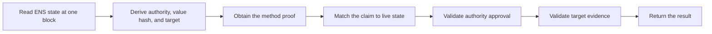

# Protocol Overview

:::warning[Work in progress]
This page has not been finalized. Requirements, formats, and examples may
change while the protocol is under discussion.
:::

Record Verification lets a client check one precise statement:

> The current ENS authority approved this exact resolver record, and the
> external target accepted the same binding using the selected method.

Verification happens in a client or SDK. It does not change normal ENS
resolution, require a new resolver interface, or store a permanent
`verified` state onchain.

## What Is Published

Verification uses three pieces:

| Piece          | Where it is found              | Purpose                                                       |
| -------------- | ------------------------------ | ------------------------------------------------------------- |
| Target record  | ENS resolver                   | Contains the value being verified.                            |
| Descriptor     | Companion ENS text record      | Selects the authority algorithm, method, and optional URI.    |
| Proof envelope | Location defined by the method | Carries the signed claim and method-specific target evidence. |

For example:

```text
text("url") = "https://example.com/profile"
text("verification[text][url]") = "ensrv1 a=1 m=https-origin.v1"
```

The target record remains an ordinary ENS record. The companion descriptor
means:

- `ensrv1`: use version 1 of the common protocol;
- `a=1`: use Authority Algorithm 1; and
- `m=https-origin.v1`: use the HTTPS-origin verification method.

Some methods also require `u=<absolute-uri>`. `u` only tells the verifier where
to fetch the proof envelope. It is not proof data and is not part of the signed
claim.

## What The Proof Binds

Every proof envelope contains:

| Field                | Meaning                                                                 |
| -------------------- | ----------------------------------------------------------------------- |
| `v`                  | Common envelope version.                                                |
| `claim`              | The exact ENS record, authority, method, target, and validity interval. |
| `authoritySignature` | Approval from the authority computed from live ENS state.               |
| `proof`              | Evidence defined by the selected method.                                |

The common claim binds all of the following:

```text
normalized ENS name + node
record type + record key + hash of the live value
authority algorithm + current authority
verification method + canonical target
issued time + expiry time
```

The verifier derives these values again. A value is never trusted only because
it appears in the proof envelope.

## Verification Flow



A verifier performs these steps:

1. Normalize the ENS name using ENSIP-15.
2. Resolve the target record and its descriptor using the same name and
   Ethereum block.
3. Parse the descriptor and load the exact authority and method versions. Do
   not fall back to another version or method.
4. At the same block, compute the authority for the exact name and any known
   authority expiry.
5. Hash the decoded live record value and derive the method's canonical target.
6. Obtain the proof envelope from the exact location defined by the method.
7. Require every common claim field to match the values derived from live ENS
   state, then check its lifetime.
8. Validate `authoritySignature` against the computed authority.
9. Validate the method-specific target evidence against the same claim.

A positive result requires every step to succeed. Changing the record,
descriptor, authority, proof, or target evidence requires a fresh evaluation.

## What Each Method Checks

| Method                           | Supported record | Target evidence                                                                 | Positive result means                                      |
| -------------------------------- | ---------------- | ------------------------------------------------------------------------------- | ---------------------------------------------------------- |
| `https-origin.v1`                | HTTPS text value | The envelope is served at the derived well-known URL by the exact HTTPS origin. | Control of the HTTPS origin for this ENS record.           |
| `dns-txt.v1`                     | HTTPS text value | DNSSEC authenticates the envelope at the derived TXT owner.                     | Control of DNS for the exact hostname in this ENS record.  |
| `account-signature.<profile>.v1` | Address record   | The target account signs the common claim digest using its native profile.      | Control of the CAIP-10 account in this ENS address record. |

Every method also requires the current ENS authority's signature. HTTPS and
DNS use `proof: {}` because publication at the method-derived location is the
target evidence. An account method carries a `targetSignature` in `proof`.

## Result And Freshness

When all common and method checks succeed, the minimal result is:

```json
{
  "verified": true,
  "verificationType": "control"
}
```

When any required check fails, is unsupported, or cannot be completed, the
minimal result is:

```json
{
  "verified": false
}
```

A positive result applies only to the record value, ENS block, target evidence,
and time at which it was evaluated. Its hard expiry is the earliest applicable
claim, authority, or method-evidence expiry. A cached positive result must also
be checked again within five minutes, or sooner when a method requires it.

`control` means the capabilities required by the selected method participated
in the binding. It does not prove safety, reputation, legal ownership, human
identity, or ENS endorsement. `attestation` is reserved for a future method;
version 1 does not currently define one.

## Component Definitions

Read the detailed rules in this order:

1. [Discovery Records](./discovery-records)
2. [Verification Descriptor](./verification-descriptor)
3. [Authority](./authority)
4. [Claims and Target Proofs](./claims-and-signatures)
5. [Lifecycle](./lifecycle)
6. [Verification Results](./results)
7. [Method Profiles](../methods/overview)
