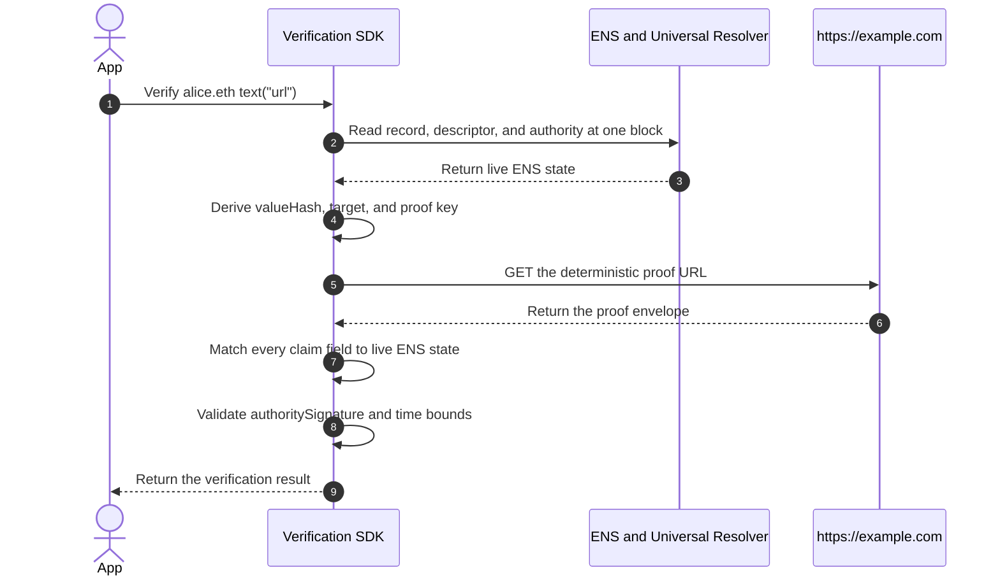

# Protocol Overview

:::warning[Work in progress]
This page has not been finalized. Requirements, formats, and examples may
change while the protocol is under discussion.
:::

This page explains the complete protocol using one example: verifying the URL
record of `alice.eth` with `https-origin.v1`.

The result answers one question:

> Did the current authority for `alice.eth` approve this exact URL record, and
> is the HTTPS origin currently publishing that approval?

Verification happens in a client or SDK. The protocol does not store a
permanent onchain `verified` flag.

## 1. Publish The ENS Records

`alice.eth` publishes the URL as a normal resolver record:

```text
text("url") = "https://example.com/profile"
```

It opts this record into verification with a companion text record:

```text
text("verification[text][url]") = "ensrv1 a=1 m=https-origin.v1"
```

The descriptor means:

- `ensrv1`: use version 1 of Record Verification;
- `a=1`: use Authority Algorithm 1; and
- `m=https-origin.v1`: verify control through the HTTPS origin.

There is no `u` field. This method derives the proof location from the live URL
record, so the descriptor cannot redirect verification to another server.

## 2. Build The Claim

The proof publisher derives the claim from one ENS snapshot. A verifier later
derives the same values again from its own evaluation snapshot. For this
example, assume Authority Algorithm 1 returns:

```text
0x1234567890abcdef1234567890abcdef12345678
```

The protocol derives these claim values:

| Claim field        | Derived value                                                    |
| ------------------ | ---------------------------------------------------------------- |
| `name`             | `alice.eth`                                                      |
| `node`             | `namehash("alice.eth")`                                          |
| `recordType`       | `text`                                                           |
| `recordKey`        | `url`                                                            |
| `valueHash`        | `keccak256(UTF8("https://example.com/profile"))`                 |
| `authorityVersion` | `1`, copied from descriptor field `a`                            |
| `authority`        | Current authority computed from ENS                              |
| `method`           | `https-origin.v1`, copied from descriptor field `m`              |
| `target`           | `https://example.com`, the canonical origin derived from the URL |
| `issuedAt`         | Time at which the claim is created                               |
| `validUntil`       | First time at which the claim is no longer valid                 |

The exact hashes used below are:

```text
node      = 0x787192fc5378cc32aa956ddfdedbf26b24e8d78e40109add0eea2c1a012c3dec
valueHash = 0x34174bbdf078fba55709ff82e2d5929de2e915c964d18dc57907afc851781142
```

The current ENS authority signs the complete claim using EIP-712:

```text
domain.name    = "ENS Record Verification"
domain.version = "1"
domain.chainId = 1

commonClaimDigest = EIP712Hash(domain, claim)
authoritySignature = authority.signTypedData(domain, claim)
```

The resulting signature is over `commonClaimDigest`. The authority does not
sign the JSON file or an Ethereum-prefixed personal message.

## 3. Publish The Proof Envelope

The complete proof envelope is:

```json
{
  "v": "ensrv1",
  "claim": {
    "name": "alice.eth",
    "node": "0x787192fc5378cc32aa956ddfdedbf26b24e8d78e40109add0eea2c1a012c3dec",
    "recordType": "text",
    "recordKey": "url",
    "valueHash": "0x34174bbdf078fba55709ff82e2d5929de2e915c964d18dc57907afc851781142",
    "authorityVersion": "1",
    "authority": "0x1234567890abcdef1234567890abcdef12345678",
    "method": "https-origin.v1",
    "target": "https://example.com",
    "issuedAt": "1783728000",
    "validUntil": "1786320000"
  },
  "authoritySignature": "0x<authority-signature>",
  "proof": {}
}
```

`0x<authority-signature>` represents the actual lowercase hexadecimal
signature bytes in a published envelope.

`https-origin.v1` calculates a proof key from the ENS name, record selector,
authority, authority version, and method. The origin publishes the envelope at:

```text
https://example.com/.well-known/ens-record-verification/<64-lowercase-hex-proof-key>
```

The proof key gives this record its own deterministic publication path. It is
not a secret or an integrity hash.

`proof` is empty because no additional target signature is needed. Serving the
envelope from the exact WebPKI-authenticated origin is the target's evidence.

## 4. Verify The Record



The verifier performs these checks:

1. Normalize `alice.eth` using ENSIP-15.
2. Read `text("url")`, its descriptor, and all authority state at one Ethereum
   block.
3. Require both resolver records to be non-empty.
4. Parse the descriptor and load exactly Authority Algorithm 1 and
   `https-origin.v1`. Do not fall back to another version or method.
5. Compute the current authority for the exact name.
6. Hash the decoded URL value and derive the canonical HTTPS origin.
7. Derive the proof key and fetch the envelope from the exact well-known URL.
8. Require the HTTP response to pass the method's TLS, redirect, status,
   media-type, size, encoding, and network rules.
9. Parse the closed envelope and require every claim field to equal the value
   derived from live ENS state.
10. Require the claim, authority, and method evidence to be current.
11. Validate `authoritySignature` against the computed ENS authority using EOA
    recovery or ERC-1271 at the same block.
12. Require `proof` to be exactly an empty object.

If any check fails or cannot be completed, verification is not positive.

## 5. Return The Result

When every check succeeds:

```json
{
  "verified": true,
  "verificationType": "control"
}
```

This means the current ENS authority approved the exact live URL record and the
origin `https://example.com` published that approval at the required path.

It does not prove that the page is safe, that the authority legally owns the
domain, or that the same controller owns another subdomain, protocol, or port.

A positive result applies only to the ENS snapshot, proof publication, and time
used for that evaluation. It must not be cached for more than five minutes and
must expire sooner if the claim, ENS authority, or method evidence expires.

When a required check fails, is unsupported, or is unavailable:

```json
{
  "verified": false
}
```

The resolver still returns the original URL. A non-positive verification result
does not remove or invalidate the ENS record.

## Other Methods

The common flow stays the same for every method. Only the target and its
evidence change:

- `dns-txt.v1` reads the envelope from a DNSSEC-authenticated TXT record.
- `account-signature.<profile>.v1` validates a signature from the account in an
  ENS address record.

See [Method Profiles](../methods/overview) for those rules.

## Detailed Components

1. [Discovery Records](./discovery-records)
2. [Verification Descriptor](./verification-descriptor)
3. [Authority](./authority)
4. [Claims and Target Proofs](./claims-and-signatures)
5. [Lifecycle](./lifecycle)
6. [Verification Results](./results)
