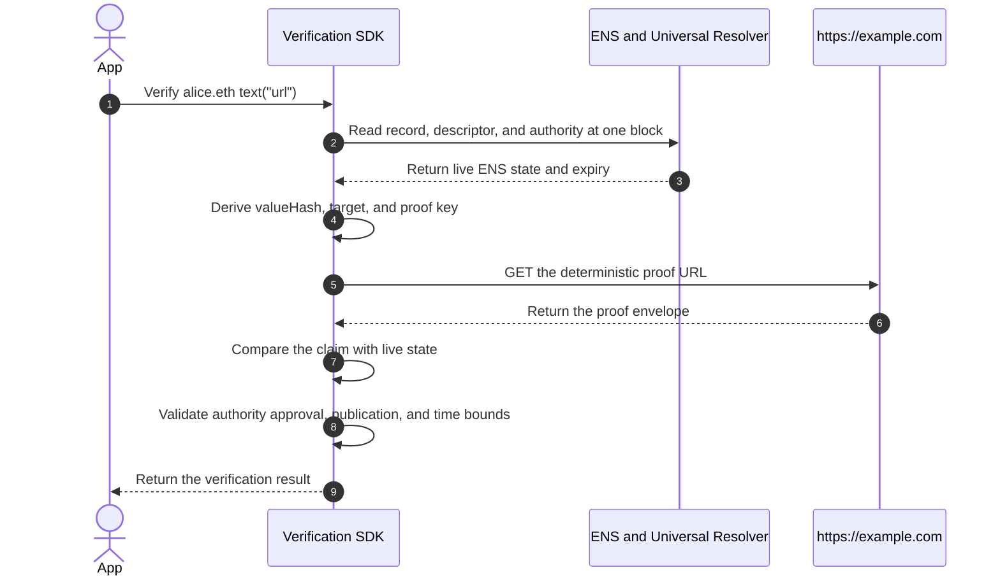

# Protocol Overview

:::warning[Work in progress]
This page has not been finalized. Requirements, formats, and examples may
change while the protocol is under discussion.
:::

This page follows one URL record through the complete protocol. It explains
what each component does without defining every low-level rule.

We want to verify:

```text
alice.eth → https://example.com/profile
```

A positive result should mean:

> The current authority for `alice.eth` approved this exact URL record, and
> the HTTPS origin `https://example.com` is currently publishing that
> approval.

Both sides must participate. ENS approval alone does not prove control of the
website, and website publication alone does not prove approval from the ENS
name.

## The Participants

| Participant          | Role                                                                              |
| -------------------- | --------------------------------------------------------------------------------- |
| `alice.eth` resolver | Returns the URL record and its verification descriptor.                           |
| ENS authority        | The canonical account allowed to approve verification for the exact ENS name.     |
| HTTPS origin         | Demonstrates control by serving the proof from the required HTTPS path.           |
| Verifier             | Reads live ENS state, fetches the proof, checks both sides, and returns a result. |

Verification is performed by a client or SDK. The protocol does not add an
onchain `verified` flag and does not change the value returned by the resolver.

## 1. Publish The URL Record

`alice.eth` publishes a normal ENS text record:

```text
text("url") = "https://example.com/profile"
```

At this point, the resolver only says that `alice.eth` is associated with this
URL. It does not prove that anyone connected to `alice.eth` can control
`example.com`.

An ENS owner can also delegate resolver-writing permission to another account.
That delegate may be able to set the URL, but it is not automatically allowed
to approve verification. Record writing and verification authority are
separate permissions.

## 2. Publish The Verification Descriptor

The client needs a predictable way to discover how this one record should be
verified. The companion descriptor key is derived from the target record:

```text
target:     text("url")
descriptor text("verification[text][url]")
```

`alice.eth` sets:

```text
text("verification[text][url]") = "ensrv1 a=1 m=https-origin.v1"
```

The descriptor contains instructions, not proof:

| Part                | Meaning                                                      |
| ------------------- | ------------------------------------------------------------ |
| `ensrv1`            | Use version 1 of the common Record Verification protocol.    |
| `a=1`               | Use Authority Algorithm 1 to find the current ENS authority. |
| `m=https-origin.v1` | Use the HTTPS-origin method to verify the external target.   |

There is no `u` field. `https-origin.v1` derives its proof location from the
live URL record, so the descriptor cannot redirect the verifier to an unrelated
proof server.

Removing this descriptor disables verification for `text("url")`. It does not
remove the URL record itself.

## 3. Find The ENS Authority

The authority is the account whose approval is required for the exact ENS name.
It is computed from ENS ownership state; it is never chosen by the proof.

Authority Algorithm 1 follows the current ENS ownership model. At a high level:

| Name state                    | Authority selected by Algorithm 1                      |
| ----------------------------- | ------------------------------------------------------ |
| Unwrapped `.eth` second-level | Base Registrar registrant                              |
| Wrapped name                  | Exact Name Wrapper owner, subject to the wrapper rules |
| Other exact unwrapped name    | Exact ENS Registry owner                               |
| Reverse name                  | Unsupported                                            |

Resolver operators, approval operators, and delegated record writers are not
additional authorities.

For this walkthrough, assume `alice.eth` is an active, unwrapped `.eth`
second-level name. The algorithm reads the Base Registrar at the evaluation
block:

```text
tokenId = uint256(keccak256(bytes("alice")))

BaseRegistrar.ownerOf(tokenId)
  → 0x1234567890abcdef1234567890abcdef12345678

BaseRegistrar.nameExpires(tokenId)
  → authorityValidUntil
```

Therefore:

```text
authority = 0x1234567890abcdef1234567890abcdef12345678
```

The registration expiry becomes an upper bound on verification. A signed claim
cannot remain positive after the current `.eth` authority expires.
`authorityValidUntil` is verifier context, not a field supplied by the proof.

The proof envelope will repeat this address, but the verifier independently
reads ENS and requires an exact match. Writing another address into the proof
cannot change who the authority is.

See [Authority](./authority) for wrapped names, subnames, imported DNS names,
expiry behavior, and unsupported cases.

## 4. Describe The Exact Statement

The protocol now builds one common claim. This is the statement that the ENS
authority approves and that the target evidence must cover.

The complete URL and the HTTPS target are deliberately different:

```text
record value = https://example.com/profile
target       = https://example.com
```

HTTPS authenticates an origin, not an individual path. The complete URL is
still protected by `valueHash`, while `target` states which origin must publish
the proof.

The claim fields for this example are:

| Claim field        | Value and purpose                                           |
| ------------------ | ----------------------------------------------------------- |
| `name`             | `alice.eth`, the normalized readable name.                  |
| `node`             | `namehash("alice.eth")`, the onchain name identifier.       |
| `recordType`       | `text`, which prevents reuse for another resolver function. |
| `recordKey`        | `url`, which selects this exact text record.                |
| `valueHash`        | Keccak-256 of the exact UTF-8 URL value.                    |
| `authorityVersion` | `1`, copied from descriptor field `a`.                      |
| `authority`        | The account computed from live ENS ownership state.         |
| `method`           | `https-origin.v1`, copied from descriptor field `m`.        |
| `target`           | `https://example.com`, derived from the URL by the method.  |
| `issuedAt`         | When this signed claim was created.                         |
| `validUntil`       | The first time at which this signed claim is invalid.       |

The exact hashes used in the envelope are:

```text
node      = 0x787192fc5378cc32aa956ddfdedbf26b24e8d78e40109add0eea2c1a012c3dec
valueHash = keccak256(UTF8("https://example.com/profile"))
          = 0x34174bbdf078fba55709ff82e2d5929de2e915c964d18dc57907afc851781142
```

If the URL changes by even one byte, `valueHash` changes and this claim no
longer matches the resolver record.

## 5. Get Approval From The ENS Authority

The common claim is encoded as EIP-712 typed data on Ethereum mainnet:

```text
domain.name    = "ENS Record Verification"
domain.version = "1"
domain.chainId = 1

commonClaimDigest = EIP712Hash(domain, claim)
authoritySignature = authority.signTypedData(domain, claim)
```

The signature approves every claim field together: the name, record selector,
URL hash, current authority, method, target, and validity interval. It cannot be
moved to another name, another record, another URL, or another method.

The authority signs the typed claim, not the JSON file and not an
Ethereum-prefixed personal message. Equivalent JSON formatting therefore does
not change the signed statement.

For an EOA authority, the verifier recovers the signer from the EIP-712 digest.
For a contract authority, it calls ERC-1271 at the same block used for the ENS
reads.

This signature proves ENS-side approval. It still does not prove control of
`example.com`; the HTTPS origin must participate next.

## 6. Publish The Proof From The HTTPS Origin

The method derives a proof key from information already known to the verifier:
the protocol domain, authority algorithm, current authority, ENS node, record
type, record key, and method.

The proof key gives this one record and authority its own deterministic
publication slot. It is not a secret, signature, or content hash.

Encode the proof key as 64 lowercase hexadecimal characters without `0x`. The
origin must serve the envelope at:

```text
https://example.com/.well-known/ens-record-verification/<64-lowercase-hex-proof-key>
```

The complete proof envelope is:

```json
{
  "v": "ensrv1",
  "claim": {
    "name": "alice.eth",
    "node": "0x787192fc5378cc32aa956ddfdedbf26b24e8d78e40109add0eea2c1a012c3dec",
    "recordType": "text",
    "recordKey": "url",
    "valueHash": "0x34174bbdf078fba55709ff82e2d5929de2e915c964d18dc57907afc851781142",
    "authorityVersion": "1",
    "authority": "0x1234567890abcdef1234567890abcdef12345678",
    "method": "https-origin.v1",
    "target": "https://example.com",
    "issuedAt": "1783728000",
    "validUntil": "1786320000"
  },
  "authoritySignature": "0x<authority-signature>",
  "proof": {}
}
```

`0x<authority-signature>` is replaced by the actual lowercase hexadecimal
signature bytes.

`issuedAt` and `validUntil` are Unix timestamps in seconds. This example uses a
30-day signed lifetime; `https-origin.v1` permits at most one year.

`proof` is empty for this method because there is no separate target signature.
Serving this exact envelope from the WebPKI-authenticated origin is the target's
approval. An unrelated server can copy the JSON, but it cannot serve it as
`https://example.com` without controlling that origin.

## 7. Verify Everything Against Live State



The verifier does not trust the envelope as a source of current state. It uses
the envelope as a claim and checks that claim against fresh inputs:

1. Normalize `alice.eth` using ENSIP-15.
2. Read `text("url")`, its descriptor, and all authority state at one Ethereum
   block. Using one block prevents a transfer or record update from being mixed
   across different snapshots.
3. Require the URL and descriptor to be non-empty.
4. Parse the descriptor and load exactly Authority Algorithm 1 and
   `https-origin.v1`. Never fall back to another version or method.
5. Compute the exact-name authority and its known expiry from ENS.
6. Hash the decoded live URL value and derive the canonical HTTPS origin.
7. Derive the proof key and fetch the envelope from the exact well-known URL.
8. Require WebPKI-authenticated TLS, status `200`, `application/json`, no
   redirects, no ambient credentials, strict size and encoding limits, and the
   method's network-safety checks.
9. Parse the closed envelope. Reject missing, duplicate, or unknown members.
10. Recompute and compare `name`, `node`, `recordType`, `recordKey`,
    `valueHash`, `authorityVersion`, `authority`, `method`, and `target`.
11. Validate `issuedAt`, `validUntil`, the HTTPS method's maximum lifetime, and
    every applicable authority or method expiry.
12. Validate `authoritySignature` for the computed authority using EOA recovery
    or ERC-1271 at the same block.
13. Require `proof` to be exactly an empty object. Successful retrieval from the
    derived origin is the method evidence.

Every check is required. A verifier cannot return a positive result after
skipping an unavailable or unsupported check.

## 8. Return A Bounded Result

When every check succeeds:

```json
{
  "verified": true,
  "verificationType": "control"
}
```

This means:

- the current ENS authority approved the exact live URL record; and
- the controller of `https://example.com` published that approval at the
  required path.

It does not prove that the page is safe, that either party has a particular
human identity, that the authority legally owns the domain, or that it controls
another origin.

A positive result describes one evaluation, not permanent state. It cannot be
cached for more than five minutes and ends sooner if the claim, ENS authority,
or method evidence expires.

When a required check fails, is unsupported, or cannot be completed:

```json
{
  "verified": false
}
```

The resolver still returns `https://example.com/profile`. A non-positive result
does not remove or invalidate the ENS record.

## What Makes The Result Change?

| Change                              | Why the previous evaluation no longer applies          |
| ----------------------------------- | ------------------------------------------------------ |
| URL record changes                  | The live `valueHash` no longer matches the claim.      |
| Verification descriptor is removed  | Verification is no longer configured for this record.  |
| Method or authority version changes | The signed claim no longer matches the selected rules. |
| ENS authority changes               | The claim and signature name the previous authority.   |
| Origin removes the proof            | The target is no longer publishing its approval.       |
| Claim or authority expires          | The applicable validity bound has ended.               |
| Cached result reaches five minutes  | The verifier must evaluate the mutable inputs again.   |

## Other Methods

The common discovery, authority, claim, signature, lifecycle, and result rules
stay the same for other methods. Only the target and its evidence change:

- `dns-txt.v1` uses a DNSSEC-authenticated TXT publication as target evidence.
- `account-signature.<profile>.v1` uses a native signature from the account in
  an ENS address record.

See [Method Profiles](../methods/overview) for those rules.

## Detailed Components

1. [Discovery Records](./discovery-records)
2. [Verification Descriptor](./verification-descriptor)
3. [Authority](./authority)
4. [Claims and Target Proofs](./claims-and-signatures)
5. [Lifecycle](./lifecycle)
6. [Verification Results](./results)
