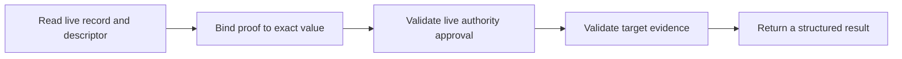

# Protocol Overview

Record Verification adds a proof layer to an existing ENS resolver record. It
binds a method-specific proof to one exact name, record selector, and live
resolver value. It does not replace the record or change normal ENS resolution.

## Records

Assume `alice.eth` contains:

```text
text("url") = "https://example.com/profile"
```

The name can opt into verification by setting another ENS text record:

```text
text("verification[text][url]") = "ensrv1 a=1 m=https-origin.v1"
```

The first record is the target resolver record. The second is its verification
descriptor. The descriptor selects the authority rules and method used to
validate target control or a policy-accepted attestation.

## Verification



A verifier reads both records at the same Ethereum block. It then checks that:

1. the common claim identifies the same ENS name and record selector;
2. `valueHash` matches the current resolver value;
3. the claim names the current authority for the exact ENS name;
4. that authority signed the complete common claim;
5. the selected method proof is valid;
6. the claim and proof have not expired or been revoked.

## Results

| Result                                              | Meaning                                                                                       |
| --------------------------------------------------- | --------------------------------------------------------------------------------------------- |
| `verified: true`, `verificationType: "control"`     | The live authority approved the claim and method evidence demonstrated control of its target. |
| `verified: true`, `verificationType: "attestation"` | A client-accepted issuer attested to the record-bound claim.                                  |
| `verified: false`                                   | One or more required checks did not pass.                                                     |

The target may be an HTTPS origin, DNS domain, blockchain account, or another
resource defined by a method profile. The method profile defines what evidence
must validate and therefore what a positive result means.

Verification proves only the verification type described by the result. It
does not establish safety, reputation, legal ownership, or ENS endorsement.
The base protocol reserves `attestation`; version 1 does not define a concrete
attestation method.

## Component Definitions

The proposal is being developed as separate components so each part can be
reviewed and hardened before an ENSIP is assembled:

1. [Resolution and Discovery](./discovery-records)
2. [Verification Descriptor](./verification-descriptor)
3. [Authority](./authority)
4. [Claims and Target Proofs](./claims-and-signatures)
5. [Lifecycle](./lifecycle)
6. [Verification Results](./results)
7. [Method Profiles](../methods/overview)
