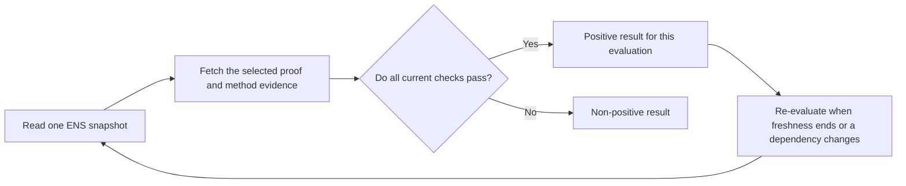

import {
  Accordion,
  AccordionContent,
  AccordionItem,
  AccordionTitle,
} from "../../../components/accordion.tsx";

# Lifecycle

A proof does not become permanently verified after it is published. Verification is a fresh comparison between the proof and the state observed by one verifier.



A result only describes its evaluation. It does not guarantee that the record, authority, proof, or external target will remain unchanged.

## Time Rules

Every method defines `methodMaxLifetime`. Immediately before returning a positive result, require:

```text
issuedAt <= checkedAt + 300
issuedAt < validUntil
checkedAt < validUntil
validUntil - issuedAt <= methodMaxLifetime
```

The 300-second allowance prevents normal clock differences from rejecting a new proof.

## Effective Expiry

The earliest hard expiry limits a positive result:

```text
effectiveValidUntil = min(
  claim.validUntil,
  authorityValidUntil?,
  methodEvidenceValidUntil?
)

checkedAt < effectiveValidUntil
```

A missing `authorityValidUntil` means ENS exposes no scheduled
expiry for that authority; it does not guarantee that the authority will never
change.

For example, if a claim expires in 30 days but its `.eth` authority expires in
2 days, `effectiveValidUntil` is 2 days. A later renewal does not extend an
existing cached evaluation. A fresh evaluation may calculate a later bound if
the same authority and every other input still match.

`effectiveValidUntil` is the latest known time at which the current evidence could remain valid. It is not a promise that verification will stay positive until then. Live state can change earlier.

## Changes And Disabling

A change invalidates the previous evaluation and requires another one. It does
not always make the next evaluation non-positive; matching new state and proof
may already be available.

| Change                                            | Effect on the next evaluation                                                                                                      |
| ------------------------------------------------- | ---------------------------------------------------------------------------------------------------------------------------------- |
| Target record value changes                       | The old `valueHash` and target no longer match. A new matching proof can verify.                                                   |
| Descriptor `a` or `m` changes                     | The old claim no longer matches the selected authority or method.                                                                  |
| Descriptor `u` changes                            | The verifier fetches the new location. The same valid envelope may be reused without new signatures.                               |
| Exact-name descriptor resolves empty              | Verification is not configured, so a fresh positive result is impossible.                                                          |
| Exact authority changes                           | The old authority and signature are rejected. The new claim, authority signature, and bound method evidence must be created again. |
| Authority or claim expires                        | The result becomes non-positive at the exact expiry.                                                                               |
| Live publication is removed                       | A live-publication method loses its target evidence. A temporary network failure is unavailability, not revocation.                |
| ERC-1271 logic or method revocation state changes | Re-evaluate using the current contract or method rules.                                                                            |
| Resolver changes but the logical records do not   | Re-resolve all inputs; the same claim may still match.                                                                             |
| ENS block is reorganized out                      | Discard the evaluation and repeat it on a canonical block.                                                                         |

## Open Issues

<Accordion>
  <AccordionItem>
    <AccordionTitle>Should restored state reactivate an old proof?</AccordionTitle>
    <AccordionContent>

The claim binds the current authority address and record state but not a unique
generation for every change. The same unexpired proof can become positive again
after authority `Alice -> Bob -> Alice`, record `A -> B -> A`, descriptor
deletion and recreation, publication restoration, or expiry followed by
renewal.

Current ENS does not expose one generation value for every name and transition.
Version 1 must either accept reactivation with short lifetimes or bind a future
claim to universally retrievable generation state. A nonce inside the proof is
not enough unless every verifier can read its current authoritative value.

    </AccordionContent>

  </AccordionItem>

  <AccordionItem>
    <AccordionTitle>How can rotation avoid a temporary verification gap?</AccordionTitle>
    <AccordionContent>

External publication and ENS writes cannot be globally atomic. Most rotations
can publish new proof material first and select it afterward. A harder case is
changing a record while old and new envelopes must occupy the same
deterministic proof location: replacing either side first temporarily breaks
the other.

The base protocol safely fails closed, but zero-downtime rotation may require a
method-defined collection, two publication slots, or a bounded overlap rule.
Those mechanisms should not be added until their selection and cleanup rules
are deterministic.

    </AccordionContent>

  </AccordionItem>

  <AccordionItem>
    <AccordionTitle>How are CCIP Read records pinned to one revision?</AccordionTitle>
    <AccordionContent>

Using one Ethereum block pins the resolver callback, but two gateway responses
can still represent different offchain revisions. A target record and its
descriptor could therefore be individually valid without having existed
together in one offchain state.

Resolvers should return both values from one authenticated revision where
possible. A general offchain profile still needs a revision identifier,
authentication rules, expiry, and replay behavior that verifiers can check.

    </AccordionContent>

  </AccordionItem>

  <AccordionItem>
    <AccordionTitle>Which chain finality policy should a verifier use?</AccordionTitle>
    <AccordionContent>

The verifier can record block numbers and hashes and discard reorged results,
but canonicality and freshness are separate. A year-old canonical block cannot
describe current ENS state. Applications also have different confirmation
requirements and may use `latest`, `safe`, `finalized`, or an explicit
confirmation depth depending on risk and latency.

The final SDK contract must define a maximum ENS snapshot age, which metadata is
always returned, and how a caller selects ENS and target-chain finality without
changing proof semantics. This must account for a finalized block sometimes
being older than the selected freshness policy.

    </AccordionContent>

  </AccordionItem>

  <AccordionItem>
    <AccordionTitle>How are non-positive results classified and cached?</AccordionTitle>
    <AccordionContent>

`verified: false` can mean not configured, unsupported, definitively invalid,
expired, temporarily unavailable, or blocked by client policy. Those cases need
different retry and cache behavior even if the public boolean remains the same.

The result and method components still need stable diagnostic classes,
precedence rules, and negative cache limits for RPC, CCIP Read, HTTP, DNSSEC,
target-chain, and revocation failures.

    </AccordionContent>

  </AccordionItem>

  <AccordionItem>
    <AccordionTitle>Which method freshness limits still need to be fixed?</AccordionTitle>
    <AccordionContent>

The common five-minute ceiling is only an upper bound. Every method still needs
exact rules for signed lifetime, live-evidence refresh, target-chain block age,
revocation status, and negative caching.

These rules are especially important for account methods. A 90-day portable
signature must not allow ENS authority or target ERC-1271 state to be reused for
90 days. The final values belong in each immutable method profile and need
executable boundary tests.

    </AccordionContent>

  </AccordionItem>
</Accordion>

## Decisions

<Accordion>
  <AccordionItem>
    <AccordionTitle>Why is verification an evaluation instead of a permanent state?</AccordionTitle>
    <AccordionContent>

ENS ownership, resolver records, contract-wallet rules, and external target
evidence can all change independently. No shared protocol state records that a
proof moved permanently from pending to verified or revoked.

Treating verification as a predicate over current inputs makes every result
reproducible and avoids claiming permanence the protocol cannot enforce.

    </AccordionContent>

  </AccordionItem>

  <AccordionItem>
    <AccordionTitle>Why separate effective expiry from cache freshness?</AccordionTitle>
    <AccordionContent>

An expiry says the proof cannot remain valid after a known time. Freshness says
when a mutable source must be checked again. A DNS TTL or revocation
`nextUpdate` normally requires another check; it does not automatically mean
the underlying claim expires at that moment.

Keeping `effectiveValidUntil` and `cacheUntil` separate prevents transport or
cache metadata from extending signed and ownership validity.

    </AccordionContent>

  </AccordionItem>

  <AccordionItem>
    <AccordionTitle>Why is an empty resolved descriptor not permanent revocation?</AccordionTitle>
    <AccordionContent>

An empty exact-name descriptor is authoritative resolved ENS state, so fresh
evaluations stop before fetching a proof. It cannot delete copies already held
by clients, and returning the same descriptor later can select the same
unexpired proof again.

Permanent revocation would require shared state that changes irreversibly and
is checked by every verifier. Version 1 does not add a nonce or revocation
registry without such a concrete state model.

    </AccordionContent>

  </AccordionItem>

  <AccordionItem>
    <AccordionTitle>Why can a proof move to another URI without new signatures?</AccordionTitle>
    <AccordionContent>

Descriptor `u` locates proof bytes; it is not part of the common claim. The new
location cannot change the signed name, record, value, authority, method,
target, or time bounds.

A verifier fetches from the current `u` and still checks the complete envelope.
This allows hosting and CID rotation without weakening verification.

    </AccordionContent>

  </AccordionItem>

  <AccordionItem>
    <AccordionTitle>Why cap every positive cache at five minutes?</AccordionTitle>
    <AccordionContent>

Even a portable account signature depends on mutable ENS records, descriptor,
and authority state. Its long signed lifetime therefore cannot be used as a
safe ENS cache lifetime.

One common ceiling gives every method a bounded stale-result window. Methods
and clients can require faster revalidation, and high-risk applications should
do so.

    </AccordionContent>

  </AccordionItem>

  <AccordionItem>
    <AccordionTitle>Why discard a reorged evaluation instead of returning false?</AccordionTitle>
    <AccordionContent>

A reorganization removes the snapshot against which the result was calculated.
It says nothing about whether the same proof is valid on the replacement
chain.

Discarding and repeating the evaluation avoids confusing missing context with
invalid evidence.

    </AccordionContent>

  </AccordionItem>
</Accordion>
