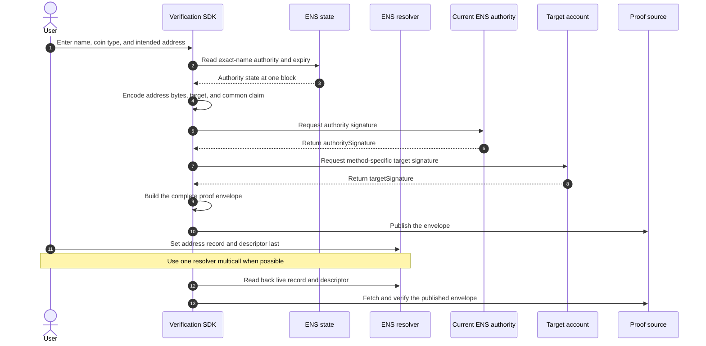

import {
  Accordion,
  AccordionContent,
  AccordionItem,
  AccordionTitle,
} from "../../../components/accordion.tsx";

# Account Signature Methods

:::warning[In progress]
These methods have been reviewed, but their final lifetime, target-chain
freshness, transport limits, and test vectors are still being discussed.
:::

Account-signature methods prove that both sides approved one ENS address
record:

1. the current ENS authority signs the
   [common claim](../components/claims-and-signatures#common-claim); and
2. the account represented by the address record signs a native proof bound to
   that same claim.

Version 1 defines two methods:

| Method                        | Supported address record                   |
| ----------------------------- | ------------------------------------------ |
| `account-signature.eip155.v1` | Ethereum and ENSIP-11 EVM address records. |
| `account-signature.bip322.v1` | Selected Bitcoin native-witness addresses. |

Both use the same [proof envelope](../components/claims-and-signatures#proof-envelope).
Their closed `proof` object contains only the target account's native signature.

## ENS Address Records

ENS stores a multicoin address as:

```solidity
function addr(bytes32 node, uint256 coinType) returns (bytes);
```

The returned bytes are the native binary representation defined for that coin
type. They are not always a public key:

- an EVM value is a 20-byte account address;
- a Bitcoin value is a `scriptPubKey`;
- a Solana value may be a public key or an off-curve program-derived address;
- another chain may use a key hash, script hash, named account, rotating key,
  multisig, or contract account.

[ENSIP-9](https://docs.ens.domains/ensip/9/) defines SLIP-44 multicoin records.
[ENSIP-11](https://docs.ens.domains/ensip/11/) adds EVM coin types derived from
chain IDs. The official
[`address-encoder`](https://github.com/ensdomains/address-encoder) implements
many current text-to-bytes codecs, but codec support is not signature-method
support.

Some representative address families are:

| Family       | Coin type | Typical control model                                        |
| ------------ | --------- | ------------------------------------------------------------ |
| Ethereum     | `60`      | secp256k1 EOA or ERC-1271 contract account.                  |
| ENSIP-11 EVM | MSB range | secp256k1 EOA or chain-specific contract account.            |
| Bitcoin      | `0`       | Script using ECDSA, BIP-340 Schnorr, multisig, or rules.     |
| Solana       | `501`     | Ed25519 keypair or an off-curve program-derived address.     |
| Arweave      | `472`     | RSA-PSS key whose hash derives the address.                  |
| Sui          | `784`     | Ed25519, secp256k1, secp256r1, multisig, or zkLogin.         |
| NEAR         | `397`     | UTF-8 account ID with mutable access keys and permissions.   |
| Cardano      | `1815`    | Ed25519 key hash or script-controlled credential.            |
| Polkadot     | `354`     | sr25519, Ed25519, or ECDSA account.                          |
| XRP Ledger   | `144`     | secp256k1, Ed25519, regular key, or signer list.             |
| Filecoin     | `461`     | secp256k1 or BLS key; other types need actor interpretation. |

The table is illustrative, not a list of supported verification methods.
Version 1 supports only the two profiles defined below. A curve name alone is
not enough to verify an account.

For every profile, `valueHash` is calculated from the exact resolved address
bytes. Do not hash a displayed address, checksum form, CAIP identifier, or a
re-encoded Bitcoin address.

## Method Selection

The method identifier selects the complete account interpretation and
verification procedure. Use:

```text
account-signature.eip155.v1
account-signature.bip322.v1
```

Do not use one generic `account-signature.v1` whose proof chooses a `scheme`.
A curve does not define address derivation, message framing, contract accounts,
multisig, key rotation, or chain-state checks.

The common claim's `target` is a canonical
[CAIP-10](https://standards.chainagnostic.org/CAIPs/caip-10) account identifier.
The method identifier and CAIP identifier have different jobs:

- `method` selects how evidence is verified;
- `target` identifies the exact chain and account being proved; and
- `recordKey` remains the decimal ENS coin type used to resolve the record.

## Proof Source

Both methods require descriptor `u` because an address cannot provide a
deterministic proof location:

```text
ensrv1 a=1 m=account-signature.eip155.v1 u=https://proofs.example/alice-eth.json
ensrv1 a=1 m=account-signature.bip322.v1 u=ipfs://bafk...
```

Version 1 accepts HTTPS and IPFS proof sources.

For HTTPS, the verifier must use the exact descriptor URI, send `GET` without
cookies, authorization, client certificates, referrer, or other ambient
credentials, reject redirects, require WebPKI-authenticated TLS and status
`200`, require the `application/json` media-type essence, enforce a 256 KiB
decoded-body limit while streaming, and use a finite timeout. A server verifier
must also reject destinations that are not globally reachable and recheck the
connected peer address.

For credentialless browser verification, the publisher must also return:

```http
Access-Control-Allow-Origin: *
```

CORS does not prevent private-network requests. A browser verifier must use a
controlled safe-fetch service that enforces the same globally reachable
destination and connected-peer checks as a server. If it cannot do so, HTTPS
verification is unavailable rather than negative.

For IPFS, `u` must contain one pathless CIDv1 using lowercase base32, the `raw`
codec, and `sha2-256`. Query and fragment components are forbidden. The raw
block bytes are the envelope bytes and must not exceed 256 KiB.

The proof source only transports the envelope. The authority and target
signatures authenticate it. Account methods do not use a proof key because `u`
already selects one exact envelope.

The provisional maximum signed lifetime is 30 days:

```text
validUntil - issuedAt <= 2,592,000 seconds
```

## Setup



The SDK must display the complete intended common claim before requesting
either signature. The native signing prompt may show only the account and
claim digest. After the ENS write, verify again from the live resolved state.

## Verification

```mermaid
sequenceDiagram
  autonumber
  actor App
  participant SDK as Verification SDK
  participant ENS as ENS and Universal Resolver
  participant Host as Proof source
  participant Method as Method verifier

  App->>SDK: Verify one ENS address record
  SDK->>ENS: Read record, descriptor, and authority at one block
  ENS-->>SDK: Live ENS state
  SDK->>SDK: Derive valueHash and canonical target
  SDK->>Host: Fetch descriptor u
  Host-->>SDK: Return proof envelope
  SDK->>SDK: Compare every common claim field
  SDK->>SDK: Validate authoritySignature
  SDK->>Method: Validate targetSignature using selected method
  Note over Method: Local for Bitcoin; target-chain call for ERC-1271
  Method-->>SDK: Native account-proof result
  SDK->>SDK: Check claim, authority, and evidence freshness
  SDK-->>App: Return control result
```

A verifier succeeds only when it:

1. resolves the address record, descriptor, and authority at one ENS block;
2. derives the target from the exact live coin type and address bytes;
3. fetches and strictly parses the envelope from descriptor `u`;
4. compares every common claim field with the live inputs;
5. validates `authoritySignature` against the current ENS authority;
6. validates the closed method proof against the same common claim; and
7. applies the common lifetime, expiry, and freshness rules.

## EVM: `account-signature.eip155.v1`

### Supported Records

The method accepts exactly 20 nonzero resolved address bytes for:

| ENS coin type                                             | Target EIP-155 chain ID |
| --------------------------------------------------------- | ----------------------- |
| `60`                                                      | `1`                     |
| `0x80000000 \| chainId`, for `1 <= chainId <= 0x7fffffff` | `chainId`               |

Coin type `0x80000000` is the chain-agnostic default EVM record and does not
identify a concrete chain, so it is unsupported. Other legacy SLIP-44 EVM coin
types are also unsupported.

Use the resolved address bytes even when a resolver inherits them from a
default EVM record. Set `target` to the lowercase CAIP-10 identifier:

```text
eip155:<chainId>:0x<40-lowercase-hex>
```

For Ethereum mainnet:

```text
eip155:1:0x1234567890abcdef1234567890abcdef12345678
```

### Target Payload

The target signs this [EIP-712](https://eips.ethereum.org/EIPS/eip-712) value:

```solidity
struct ENSRecordAccountProof {
  bytes32 commonClaimDigest;
  string account;
}
```

Use this domain on the target EIP-155 chain:

```text
name:    ENS Record Account Proof
version: 1
chainId: target EIP-155 chain ID
```

`account` must equal the exact canonical `claim.target`. It repeats information
already protected by `commonClaimDigest`, but lets a wallet display the account
being approved. The EIP-712 domain does not contain `verifyingContract`: an EOA
is not a contract that verifies this signature.

The struct name, fields, field types, and field order above are exact.

Let `targetProofDigest` be the EIP-712 digest of this value. The closed proof is:

```json
{
  "targetSignature": "0x<signature>"
}
```

It contains no account type, signature scheme, public key, chain, or block.
Those values are derived by the verifier.

### Target Validation

Select one recent finalized block on the target chain and confirm its chain ID.
If the target chain is Ethereum mainnet, the ENS evaluation block must satisfy
the target freshness and finality policy and must be used for both checks.
Record the selected block number and hash in diagnostic metadata.

Read the target's code at that block, then choose exactly one path:

1. **No code:** require an exact 65-byte `r || s || v` secp256k1 signature.
   Require low `s`, require `v` to equal 27 or 28, and require recovery from
   `targetProofDigest` to produce the target address.
2. **Code present:** evaluate
   `isValidSignature(targetProofDigest, targetSignature)` on the target through
   a read-only call at the same block. Require success and exactly 32 return
   bytes: `0x1626ba7e` followed by 28 zero bytes.

The contract path implements
[ERC-1271](https://eips.ethereum.org/EIPS/eip-1271).

Never try both paths. A revert, malformed return, incorrect magic value, stale
block, reorganized block, or unavailable target-chain RPC is non-positive. Do
not treat a contract as an EOA when ERC-1271 validation fails.

`targetSignature` is an even-length lowercase `0x` byte string. The EOA form is
exactly 65 bytes. The contract form is opaque and at most 8,192 bytes. It may be
empty because ERC-1271 gives the target contract final authority over its
interpretation.

Version 1 does not support `personal_sign`, EIP-2098 compact signatures,
ERC-6492 counterfactual signatures, or proof-selected signature algorithms.

## Bitcoin: `account-signature.bip322.v1`

### Supported Records

The method supports coin type `0` on Bitcoin mainnet. The live ENSIP-9 value is
the exact `scriptPubKey`, not a Base58 or Bech32 string.

Version 1 pins
[BIP-322](https://github.com/bitcoin/bips/blob/master/bip-0322.mediawiki)
Simple version 2.0.0 and accepts only two signature-bearing native witness
patterns:

| Script        | `scriptPubKey` pattern        | Required evidence            |
| ------------- | ----------------------------- | ---------------------------- |
| P2WPKH        | `0x0014` followed by 20 bytes | secp256k1 ECDSA signature.   |
| P2TR key path | `0x5120` followed by 32 bytes | BIP-340 secp256k1 signature. |

P2PKH, P2SH wrappers, P2WSH, P2TR script-path proofs, unknown witness versions,
BIP-322 Legacy, Full, and Proof-of-Funds are unsupported. This restriction is
deliberate: an arbitrary Bitcoin script can be satisfied by a hash preimage or
another condition without a cryptographic signature over this message.

Derive the Bitcoin mainnet address directly from the live script:

- for P2WPKH, encode HRP `bc`, witness version `0`, and its 20-byte witness
  program using [BIP-173](https://github.com/bitcoin/bips/blob/master/bip-0173.mediawiki)
  Bech32;
- for P2TR, encode HRP `bc`, witness version `1`, and its 32-byte witness
  program using [BIP-350](https://github.com/bitcoin/bips/blob/master/bip-0350.mediawiki)
  Bech32m; and
- convert the witness program from 8-bit to 5-bit groups with padding enabled,
  emit lowercase, then decode the result and require the same witness version,
  program, and exact `scriptPubKey`.

Set `target` to:

```text
bip122:000000000019d6689c085ae165831e93:<canonical-address>
```

For example:

```text
bip122:000000000019d6689c085ae165831e93:bc1q...
```

### Target Payload

The target signs these exact ASCII bytes through BIP-322:

```text
ENS Record Verification
Method: account-signature.bip322.v1
Account: bip122:000000000019d6689c085ae165831e93:bc1q...
Claim: 0x<64-lowercase-hex-commonClaimDigest>
```

Use one LF byte after each of the first three lines. Do not add an LF or null
terminator after the final line. `Account` must equal the exact `claim.target`.
BIP-322 applies its own tagged hash and virtual transaction construction to
these message bytes.

The closed proof is:

```json
{
  "targetSignature": "smp<canonical-padded-base64-witness>"
}
```

### Target Validation

The verifier must:

1. require the exact `smp` variant prefix;
2. decode the remainder as canonical padded RFC 4648 base64 and require
   decode/re-encode equality;
3. reject more than 64 KiB of decoded witness data before parsing;
4. consensus-decode exactly one witness stack without trailing bytes;
5. for P2WPKH, require exactly two witness items: strict DER-encoded ECDSA bytes
   followed by the sighash byte `0x01`, and one compressed public key whose
   hash matches the live script;
6. for P2TR, require exactly one witness item: either a 64-byte BIP-340
   key-path signature using `SIGHASH_DEFAULT`, or that signature followed by
   the sighash byte `0x01`; reject annexes and script-path witnesses;
7. construct BIP-322's `to_spend` and `to_sign` transactions from the exact
   message and live `scriptPubKey`;
8. apply BIP-322 Simple version 2.0.0 and its required script rules; and
9. accept only `valid at time 0 and age 0`.

Reject missing prefixes, noncanonical base64, malformed witness data,
unsupported scripts, disallowed witness shapes or sighashes, and failed script
evaluation. Treat BIP-322 `inconclusive` as non-positive, never as valid.

Simple verification does not require a Bitcoin node, UTXO lookup, balance, or
proof that funds exist.

## Result And Caching

After both signatures and every live-state check succeed, return:

```json
{
  "verified": true,
  "verificationType": "control"
}
```

A positive result must not be reused past the earliest of five minutes after
evaluation, `claim.validUntil`, `authorityValidUntil` when present, or a
shorter target-chain freshness bound. An EVM result must be discarded if its
target-chain block is reorganized out.

The 30-day signed lifetime is not a 30-day cache. Fresh ENS reads detect
ENS-side record, descriptor, and authority changes, but they cannot detect an
EOA or Bitcoin key transfer, loss, or compromise. Target-side stale evidence
ends only when the claim expires or the ENS-side inputs change, so higher-risk
uses should use shorter claims.

## Security Boundary

These methods prove a narrow relationship:

> The current ENS authority approved the exact live address record, and the
> target account supplied evidence accepted by the selected method.

They do not prove legal ownership, uncompromised custody, balance, willingness
to receive funds, or payment safety. A Bitcoin proof shows that the witness
satisfied the recorded script for one message; it does not prove control of any
current UTXO. ERC-1271 validity can change when contract state or logic changes.

## Open Issues

<Accordion>
  <AccordionItem>
    <AccordionTitle>What target-chain block and call policy is required?</AccordionTitle>
    <AccordionContent>

The EVM method needs one interoperable freshness and finality policy for every
target chain. It must define maximum block age, reorganization handling, RPC
chain-ID checks, and resource bounds for ERC-1271 calls.

A direct JSON-RPC `eth_call` prevents persisted changes but does not necessarily
execute the target inside a true EVM `STATICCALL`. Version 1 must decide whether
read-only `eth_call` is sufficient or define a helper that enforces the opcode's
static context. It must also freeze `from` and therefore `msg.sender`, zero
`value`, gas limits, block environment, and other call inputs so two verifiers
cannot receive different ERC-1271 results.

    </AccordionContent>

  </AccordionItem>

  <AccordionItem>
    <AccordionTitle>Which Bitcoin limits and vectors are final?</AccordionTitle>
    <AccordionContent>

Version 1 still needs executable vectors for every accepted script, Bech32 and
Bech32m round-tripping, canonical base64, witness parsing, sighashes, rejected
script paths and annexes, invalid scripts, and the 64 KiB boundary.

The BIP-122 CAIP-10 account profile is still a draft. Before this method is
frozen, confirm that its target remains a valid CAIP-10 identifier. The
script-to-address conversion fixed above does not inherit later profile
changes.

    </AccordionContent>

  </AccordionItem>

  <AccordionItem>
    <AccordionTitle>Which EVM limits and vectors are final?</AccordionTitle>
    <AccordionContent>

Version 1 needs executable vectors for EIP-712 hashing, canonical CAIP targets,
coin-type mapping, low-`s` and `v` rejection, code/no-code path selection,
ERC-1271 calldata and return data, reverts, call context, size limits, and every
unsupported signature form.

The profile also needs fixed RPC error categories and resource limits. Without
them, implementations can agree on valid proofs while handling malformed or
expensive proofs differently.

    </AccordionContent>

  </AccordionItem>

  <AccordionItem>
    <AccordionTitle>Is 30 days the right signed lifetime?</AccordionTitle>
    <AccordionContent>

Portable EOA and Bitcoin signatures have no native online revocation check. A
short lifetime limits stale proof reactivation but requires the target account
to sign more often. ERC-1271 accounts are different because their current
policy is checked during every fresh evaluation.

Thirty days is the current conservative draft value. It needs wallet and
operational testing before the method is frozen.

    </AccordionContent>

  </AccordionItem>

  <AccordionItem>
    <AccordionTitle>What is the final proof-transport profile?</AccordionTitle>
    <AccordionContent>

HTTPS still needs exact timeout, content-coding, cache, browser, SSRF, and error
rules. IPFS needs gateway-independent retrieval vectors and clear behavior for
unsupported multihashes and unavailable blocks.

Neither transport changes proof validity: the signatures authenticate the
claim. Transport failures must remain distinguishable from invalid evidence.

    </AccordionContent>

  </AccordionItem>
</Accordion>

## Decisions

<Accordion>
  <AccordionItem>
    <AccordionTitle>Why use one method for each account profile?</AccordionTitle>
    <AccordionContent>

The descriptor and signed common claim select the method before the proof is
read. This prevents untrusted proof data from choosing a chain, curve, account
model, message encoding, or weaker verification path.

Adding a future profile creates a new immutable method identifier. Existing
clients reject it instead of guessing how to verify it.

    </AccordionContent>

  </AccordionItem>

  <AccordionItem>
    <AccordionTitle>Why are both signatures required?</AccordionTitle>
    <AccordionContent>

The target signature is already bound to the ENS name because it covers
`commonClaimDigest`. It cannot be copied to another name or record.

It proves only target-side participation. The separate authority signature
proves that the current ENS authority approved the same association. Requiring
both prevents either side from creating a positive relationship alone.

    </AccordionContent>

  </AccordionItem>

  <AccordionItem>
    <AccordionTitle>Why bind both resolver bytes and a CAIP target?</AccordionTitle>
    <AccordionContent>

`valueHash` protects the exact bytes returned by the resolver. `target` records
their method-specific account meaning, including the chain and canonical
address.

For Bitcoin, the resolver bytes are a `scriptPubKey` while the target is a
readable CAIP-10 address. The verifier derives both from the same live value and
requires them to agree.

    </AccordionContent>

  </AccordionItem>

  <AccordionItem>
    <AccordionTitle>Can every curve sign the common digest?</AccordionTitle>
    <AccordionContent>

Yes. A digest does not need to be a point on the signing curve. Signature
systems accept bytes or derive an integer from bytes, then apply their own
hashing and curve operations.

The difficult part is not curve compatibility. Each method must define exact
message framing, domain separation, signature encoding, key-to-address
binding, account rules, and live-state checks. That is why future chains wrap
`commonClaimDigest` in their own native signing format instead of using one
generic curve switch.

    </AccordionContent>

  </AccordionItem>

  <AccordionItem>
    <AccordionTitle>Why does proof contain only targetSignature?</AccordionTitle>
    <AccordionContent>

For EVM, the verifier derives the chain and address from the live coin type and
record, then selects EOA or ERC-1271 from live code. For Bitcoin, the live
`scriptPubKey` and BIP-322 witness contain everything required for script
validation.

A proof-selected `scheme`, account type, public key, chain, or block would
duplicate derived inputs or let untrusted data influence verification. Future
methods may define additional closed fields when their native account model
genuinely requires them.

    </AccordionContent>

  </AccordionItem>

  <AccordionItem>
    <AccordionTitle>Why are other ENS address records unsupported?</AccordionTitle>
    <AccordionContent>

Being storable in ENS or supported by an address codec does not define a safe
signature proof. Solana PDAs have no private key, Cardano addresses may contain
script credentials, NEAR accounts can rotate several access keys, and many
chains support several signature families.

A future method must define its accepted coin types, exact address bytes,
network mapping, CAIP target, native signed message, proof encoding,
key-to-account binding, live chain checks, rotation behavior, and test vectors.
It can then be added without changing the common claim or existing methods.

    </AccordionContent>

  </AccordionItem>
</Accordion>
