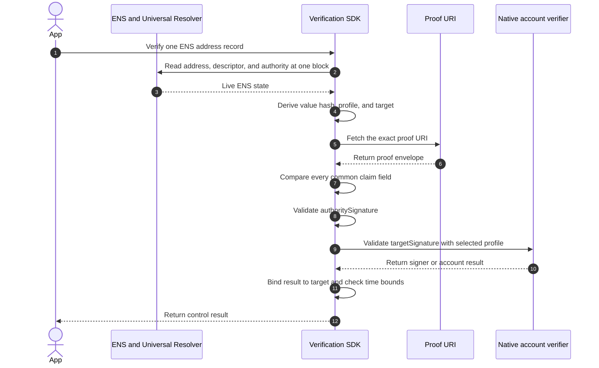

import {
  Accordion,
  AccordionContent,
  AccordionItem,
  AccordionTitle,
} from "../../../components/accordion.tsx";

# Method: `account-signature.<profile>.v1`

An ENS address record connects a name to an account:

```solidity
addr(namehash(name), coinType) -> accountBytes
```

This method asks both sides to approve that connection:

1. the current authority for the ENS name signs the claim; and
2. the account stored in the address record signs the same claim.

A result is positive only when both signatures are valid for the live record.
This prevents another ENS name from copying an address and reusing its proof.

Each target chain signs messages differently. The profile in the method name
selects the chain, supported account type, and native verification algorithm.
The claim, proof envelope, and verification flow remain the same for every
profile.

## Supported Records

The method supports an `addr(coinType)` record when the selected
[profile](#profiles) defines that chain and account type. It does not apply to
text records or to an unregistered chain profile.

For an address claim:

| Claim field  | Required value                                                   |
| ------------ | ---------------------------------------------------------------- |
| `recordType` | `addr`                                                           |
| `recordKey`  | Coin type as an unsigned decimal string                          |
| `valueHash`  | Keccak-256 of the exact bytes returned by `addr(node, coinType)` |
| `method`     | Exact profile identifier from the registry                       |
| `target`     | Canonical CAIP-10 account derived by the selected profile        |

Hash the resolver bytes, not a displayed or re-encoded address.

## Descriptor

HTTPS publication:

```text
ensrv1 a=1 m=account-signature.<profile>.v1 u=https://proofs.example/account-proof.json
```

IPFS publication:

```text
ensrv1 a=1 m=account-signature.<profile>.v1 u=ipfs://<proof-envelope-cid>
```

Replace `<profile>` with one exact identifier from the profile table and replace
`<proof-envelope-cid>` with the complete CID. The angle-bracket placeholders
are explanatory and are not included in a real descriptor.

`u` is required and points directly to the proof envelope. Account records do
not provide a deterministic place from which to fetch a signature, so these
methods do not use a proof key.

The proof may be published at an HTTPS URL or as immutable IPFS content. For
IPFS, `u` contains the CID of the proof envelope. Changing the envelope creates
a new CID, so the descriptor must also be updated.

Apply the URI and retrieval rules defined by the
[verification descriptor](../components/verification-descriptor). A verifier
must not search for a proof at another location.

## Target

`target` answers one question: **which account must sign this claim?**

The verifier derives it from the live address record. It is never copied from
the proof without checking it.

Start with these live inputs:

| Input           | Source                                         |
| --------------- | ---------------------------------------------- |
| `coinType`      | The selected `addr(coinType)` record           |
| `recordBytes`   | Exact bytes returned by `addr(node, coinType)` |
| `method`        | Descriptor field `m`                           |
| account profile | The exact profile selected by `method`         |

Then derive the target in this order:

1. Decode the exact resolver bytes using the registered ENS address codec.
2. Require the profile to support that coin type and decoded account form.
3. Derive the profile's exact CAIP-2 chain identifier from the coin type.
4. Canonicalize the account address using the profile's rules.
5. Join the CAIP-2 chain and canonical address as one CAIP-10 account.

```text
target = <namespace>:<reference>:<account-address>
```

The complete CAIP-10 string becomes `claim.target`. The exact resolver bytes
are hashed separately:

```text
valueHash = keccak256(recordBytes)
```

Reject the proof if the chain or account cannot be derived without guessing.
The verifier must not infer a network from user settings, accept another
profile's address rules, or treat an unsupported account type as a direct-key
account.

## Signed Message

Both sides approve the same `commonClaimDigest`:

| Signature            | Approver                  | Protocol input      | Verification system                  |
| -------------------- | ------------------------- | ------------------- | ------------------------------------ |
| `authoritySignature` | Current ENS authority     | `commonClaimDigest` | ECDSA or ERC-1271                    |
| `targetSignature`    | Account in `claim.target` | `commonClaimDigest` | Algorithm selected by `claim.method` |

First build the complete common claim:

```json
{
  "name": "<normalized ENS name>",
  "node": "0x<64 lowercase hex digits>",
  "recordType": "addr",
  "recordKey": "<coin type as decimal>",
  "valueHash": "0x<keccak256 of exact resolver bytes>",
  "authorityVersion": "1",
  "authority": "0x<40 lowercase hex digits>",
  "method": "account-signature.<profile>.v1",
  "target": "<canonical CAIP-10 account>",
  "issuedAt": "<Unix time in seconds>",
  "validUntil": "<Unix time in seconds>"
}
```

Encode this claim using the
[common EIP-712 rules](../components/claims-and-signatures#common-claim):

```text
structHash = EIP712.hashStruct(commonClaim)

commonClaimDigest = keccak256(
  0x1901 || domainSeparator || structHash
)
```

`commonClaimDigest` is exactly 32 bytes. It is the only protocol input to both
approval procedures:

```text
authoritySignature = approveWithENSAuthority(commonClaimDigest)
targetSignature    = approveWithTargetProfile(commonClaimDigest)
```

Do not hash the JSON serialization. Do not calculate a second
`keccak256(abi.encode(commonClaim))` for the target. The JSON only transports
the typed fields; whitespace, member order, and string escaping do not affect
the digest.

The target profile may apply its required native tagging, hashing, structured
encoding, or account-policy check internally. That native operation is part of
the selected algorithm. Its application message remains the exact 32-byte
`commonClaimDigest`, and proof data cannot select another wrapper.

## Proof

After both signatures are created, publish one proof envelope at descriptor
`u`:

```json
{
  "v": "ensrv1",
  "claim": {
    "name": "<normalized ENS name>",
    "node": "0x<64 lowercase hex digits>",
    "recordType": "addr",
    "recordKey": "<coin type as decimal>",
    "valueHash": "0x<keccak256 of exact resolver bytes>",
    "authorityVersion": "1",
    "authority": "0x<40 lowercase hex digits>",
    "method": "account-signature.<profile>.v1",
    "target": "<canonical CAIP-10 account>",
    "issuedAt": "<Unix time in seconds>",
    "validUntil": "<Unix time in seconds>"
  },
  "authoritySignature": "<ENS-authority approval of commonClaimDigest>",
  "proof": {
    "targetSignature": "<native target-account approval of commonClaimDigest>"
  }
}
```

The envelope contains the typed claim and the two approvals. It does not contain
a separately signed JSON document or a separate target hash.

### Public Key

The bytes returned by `addr()` encode an account address. They are not always a
public key. An address may instead contain a key hash, script hash, account ID,
or another chain-defined identifier.

If the resolver bytes are the public key, the signature can recover the key, or
the native proof already carries it, `publicKey` is forbidden. If none of those
is true, the selected profile may require:

```json
{
  "targetSignature": "<profile-defined signature>",
  "publicKey": "<profile-defined public key>"
}
```

Both values are strings and unknown fields are forbidden. The profile defines
their exact encodings. Before checking the signature, the verifier must derive
the live account identifier from `publicKey` and require it to equal the target
derived from `addr()`. A supplied public key is never trusted by itself.

A proof cannot become valid by copying these fields into another envelope. Both
signatures are bound to `commonClaimDigest`, and that digest includes the ENS
name, record, address value, authority, method, target, and validity period.

## Profiles

The method identifier selects the complete native profile. A verifier must use
the exact row selected by `claim.method` and must not fall back to another row.

| Method name                              | Chains              | Account type                                           | Algorithm                                                                                                                         |
| ---------------------------------------- | ------------------- | ------------------------------------------------------ | --------------------------------------------------------------------------------------------------------------------------------- |
| `account-signature.eip155.v1`            | EVM chains          | EOA or deployed ERC-1271 contract                      | [EIP-712](https://eips.ethereum.org/EIPS/eip-712) or [ERC-1271](https://eips.ethereum.org/EIPS/eip-1271)                          |
| `account-signature.bip322.v1`            | Bitcoin             | BIP-322-compatible address                             | [BIP-322 Simple](https://github.com/bitcoin/bips/blob/master/bip-0322.mediawiki)                                                  |
| `account-signature.solana-offchain.v1`   | Solana              | On-curve Ed25519 account                               | [Solana off-chain message signing](https://github.com/anza-xyz/agave/blob/master/docs/src/proposals/off-chain-message-signing.md) |
| `account-signature.arweave-rsapss.v1`    | Arweave             | RSA account                                            | [RSA-PSS message signing](https://docs.arconnect.io/api/sign-message)                                                             |
| `account-signature.nep413.v1`            | NEAR                | Named or implicit account with a valid full-access key | [NEP-413](https://github.com/near/NEPs/blob/master/neps/nep-0413.md)                                                              |
| `account-signature.cip8.v1`              | Cardano             | Address with a key payment credential                  | [CIP-8 COSE signing](https://cips.cardano.org/cip/CIP-8)                                                                          |
| `account-signature.adr36.v1`             | Cosmos SDK chains   | Direct secp256k1 account                               | [ADR-036](https://github.com/cosmos/cosmos-sdk/blob/main/docs/architecture/adr-036-arbitrary-signature.md)                        |
| `account-signature.substrate-signraw.v1` | Polkadot and Kusama | Direct SS58 account                                    | [Substrate `signRaw`](https://polkadot.js.org/docs/extension/cookbook/#sign-a-message)                                            |
| `account-signature.arc60.v1`             | Algorand            | Direct, non-rekeyed Ed25519 account                    | [ARC-60](https://dev.algorand.co/arc-standards/arc-0060/)                                                                         |
| `account-signature.sui-personal.v1`      | Sui                 | Native Sui account                                     | [Sui personal-message signing](https://sdk.mystenlabs.com/sui/cryptography)                                                       |
| `account-signature.sep53.v1`             | Stellar             | Ed25519 `G...` account                                 | [SEP-53](https://github.com/stellar/stellar-protocol/blob/master/ecosystem/sep-0053.md)                                           |
| `account-signature.tip191.v1`            | TRON                | Direct secp256k1 account                               | [TIP-191](https://github.com/tronprotocol/tips/blob/master/tip-191.md)                                                            |
| `account-signature.filecoin-wallet.v1`   | Filecoin            | Direct `f1` secp256k1 or `f3` BLS account              | [WalletSign and WalletVerify](https://docs.filecoin.io/reference/json-rpc/wallet)                                                 |
| `account-signature.tezos-micheline.v1`   | Tezos               | Implicit `tz1`, `tz2`, `tz3`, or `tz4` account         | [Micheline string signing](https://gitlab.com/tezos/tzip/-/blob/master/drafts/current/draft-string-signing.md)                    |

The table is an allowlist. Multisig, script, contract, delegated, rekeyed,
off-curve, or rotating-key account forms are unsupported unless their row
explicitly permits them. Support for an ENS address codec alone does not make
an account verifiable.

## Verification



A verifier succeeds only when it:

1. resolves the address, descriptor, and authority at one ENS evaluation block;
2. requires the selected profile to support the live coin type and account form;
3. recomputes `valueHash` and the canonical `target` from the live address;
4. fetches and parses the closed envelope from the exact descriptor `u`;
5. compares every common claim field with the live inputs;
6. validates `authoritySignature` against the live exact-name authority;
7. validates `targetSignature` using only the selected native profile;
8. proves that the native signer or account policy controls the exact target;
9. validates any required target-chain state; and
10. requires the claim, authority, and method evidence to be current.

The minimal positive result is:

```json
{
  "verified": true,
  "verificationType": "control"
}
```

An SDK should expose the exact method, coin type, canonical target, ENS block,
and any target-chain block as diagnostic metadata.

An unknown profile, unsupported account form, unavailable proof URI, or
unavailable target-chain state is not a positive result. A transport failure is
not evidence that either signature is cryptographically invalid.

## Lifetime And Caching

The maximum signed lifetime is 30 days:

```text
validUntil - issuedAt <= 2,592,000 seconds
```

A positive result must not be reused past the earliest of:

- five minutes after evaluation;
- `claim.validUntil`;
- `authorityValidUntil`, when present; and
- a shorter target-chain or account-policy validity bound.

The 30-day signature lifetime does not permit a 30-day cache. ENS state and
stateful account authority can change earlier and must be re-evaluated.

## Security Boundary

This method returns `verificationType: "control"` only when:

1. the current exact-name ENS authority approved the exact address record; and
2. the account or account policy selected by the live address approved the same
   claim through its native signing standard.

This prevents another ENS name from copying an address and reusing its proof.
The target signature is bound to the common claim, which includes the ENS name,
record key, address value, authority, method, target, and validity period.

The result does not prove identity, legal ownership, account safety, balance,
or willingness to receive funds. For stateful accounts, it proves control only
under the profile's account-state and freshness rules.

## Open Issues

<Accordion>
  <AccordionItem>
    <AccordionTitle>Which profiles are ready to be frozen?</AccordionTitle>
    <AccordionContent>

Every row needs one exact target mapping, native procedure for approving the
32-byte `commonClaimDigest`, signature and key encoding, size limit, and
positive and negative test vectors. Profiles without two interoperable
implementations should remain draft and be reported as unsupported by
production verifiers.

    </AccordionContent>

  </AccordionItem>

  <AccordionItem>
    <AccordionTitle>How should stateful account authority be evaluated?</AccordionTitle>
    <AccordionContent>

Contract wallets, NEAR access keys, rekeyed accounts, delegated accounts, and
multisig policies can change after signing. Each profile that accepts mutable
authority must define the target-chain block, finality rule, maximum block age,
and which live policy is checked.

Until those rules are fixed, the profile must support only direct accounts or
return unsupported.

    </AccordionContent>

  </AccordionItem>

  <AccordionItem>
    <AccordionTitle>Which proof URI transports are final?</AccordionTitle>
    <AccordionContent>

HTTPS and immutable IPFS publication are intended, but the descriptor component
still needs final, shared retrieval profiles. Each profile must use those exact
rules; it must not invent redirects, gateway behavior, authentication, or
scheme fallback.

    </AccordionContent>

  </AccordionItem>
</Accordion>

## Decisions

<Accordion>
  <AccordionItem>
    <AccordionTitle>Why is the profile part of the method identifier?</AccordionTitle>
    <AccordionContent>

The descriptor and signed claim select the verification algorithm before the
untrusted proof is read. The proof cannot request a different curve, message
format, network, or account model.

A change to one native profile allocates a new method version without changing
the common account-signature flow.

    </AccordionContent>

  </AccordionItem>

  <AccordionItem>
    <AccordionTitle>Why are both signatures required?</AccordionTitle>
    <AccordionContent>

The target signature alone proves only that an account signed a message. Any ENS
name could otherwise copy that account and signature. The authority signature
alone proves only that the ENS authority made a claim about an account.

Requiring both signatures over the same record-bound claim proves that the
current ENS authority and the target account approved this exact binding.

    </AccordionContent>

  </AccordionItem>

  <AccordionItem>
    <AccordionTitle>Why not define profiles only by curve?</AccordionTitle>
    <AccordionContent>

A curve is not an account-verification protocol. Ethereum, Bitcoin, TRON, and
Cosmos commonly use secp256k1 but have different message wrappers, addresses,
networks, and account rules. Solana and Stellar both use Ed25519 but also use
different message and account formats.

The profile therefore selects the complete native signing standard, not only
the mathematical signature algorithm.

    </AccordionContent>

  </AccordionItem>

  <AccordionItem>
    <AccordionTitle>Why link native standards instead of copying them?</AccordionTitle>
    <AccordionContent>

This method defines the shared claim, target binding, and permitted profile.
The linked native standard remains authoritative for its cryptographic
algorithm and native proof validation.

Each frozen profile must pin an exact standard version and its accepted options.
A moving link to “latest” is not sufficient.

    </AccordionContent>

  </AccordionItem>

  <AccordionItem>
    <AccordionTitle>Why is a proof key not used?</AccordionTitle>
    <AccordionContent>

Descriptor `u` already selects one exact proof resource. A proof key is needed
only when a method derives a shared publication location, such as an HTTPS
well-known path or DNS owner name.

Adding another key here would not improve signature validation or prevent proof
reuse; the signed common claim already binds the proof to one record and target.

    </AccordionContent>

  </AccordionItem>
</Accordion>
