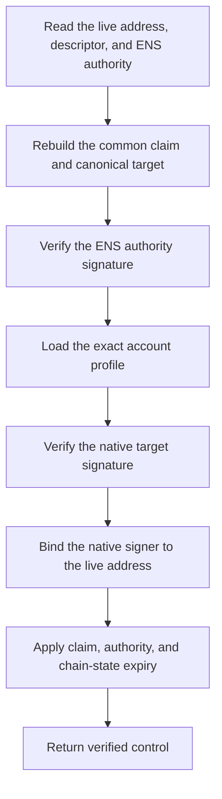

import {
  Accordion,
  AccordionContent,
  AccordionItem,
  AccordionTitle,
} from "../../../components/accordion.tsx";

# Account Signature Methods

:::warning[In progress]
The common structure and initial profile registry are drafts. Each profile still
needs frozen options, test vectors, and wallet interoperability testing before
the specification is final.
:::

Account-signature methods verify an ENS `addr` record from both sides:

1. the current ENS authority approves the exact address record; and
2. the address account produces a native signature for the same claim.

The envelope, claim, publication, and lifecycle are shared. Only the native
account profile changes.

For example, Ethereum uses EIP-712, Bitcoin uses BIP-322, Solana uses its
off-chain message format, and Cardano uses CIP-8. They remain separate method
identifiers because their address and signature rules are different.

## Shared Structure

Every account method uses the
[common claim](../components/claims-and-signatures#common-claim) and
[proof envelope](../components/claims-and-signatures#proof-envelope).

For an address record:

| Claim field  | Value                                                               |
| ------------ | ------------------------------------------------------------------- |
| `recordType` | `addr`                                                              |
| `recordKey`  | ENS coin type as canonical unsigned decimal                         |
| `valueHash`  | Keccak-256 of the exact bytes returned by `addr(node, coinType)`    |
| `method`     | Exact account-profile identifier                                    |
| `target`     | Canonical CAIP-10 account derived from the live network and address |

`valueHash` always covers the resolver bytes. It does not hash the displayed
address, CAIP identifier, checksum form, or a re-encoded value.

The target account approves `commonClaimDigest`. Text-based profiles use these
exact ASCII lines:

```text
ENS Record Verification
Method: <method>
Account: <target>
Claim: 0x<64-lowercase-hex-commonClaimDigest>
```

Use LF between lines and no final line break. A native structured-data standard
may encode the same method, account, and digest as typed fields instead.

## Proof

Every profile requires `targetSignature`:

```json
{
  "targetSignature": "<profile-defined native signature>"
}
```

A profile may also require `publicKey` when the address contains only a key hash
and the signature cannot recover the key:

```json
{
  "targetSignature": "<profile-defined native signature>",
  "publicKey": "<profile-defined public key>"
}
```

The selected method closes the `proof` object. `publicKey` is forbidden unless
that profile requires it. Other fields are forbidden.

If the native standard defines a canonical textual signature, use it unchanged.
Otherwise, encode the native binary proof using canonical unpadded base64url.
The native proof may already contain a public key, signer list, or signature
scheme; do not duplicate those values as separate JSON fields.

The authority signature remains the envelope's common `authoritySignature`.
Both signatures bind the same claim, so neither the ENS authority nor the target
account can create a positive relationship alone.

## Method Registry

Method identifiers select complete account profiles, not only curves. The
initial registry is:

| Method                                   | ENS coin type                    | Native signing reference                                                                                                          |
| ---------------------------------------- | -------------------------------- | --------------------------------------------------------------------------------------------------------------------------------- |
| `account-signature.eip155.v1`            | `60` and ENSIP-11 EVM coin types | [EIP-712](https://eips.ethereum.org/EIPS/eip-712) and [ERC-1271](https://eips.ethereum.org/EIPS/eip-1271)                         |
| `account-signature.bip322.v1`            | `0`                              | [BIP-322 Simple](https://github.com/bitcoin/bips/blob/master/bip-0322.mediawiki)                                                  |
| `account-signature.solana-offchain.v1`   | `501`                            | [Solana off-chain message signing](https://github.com/anza-xyz/agave/blob/master/docs/src/proposals/off-chain-message-signing.md) |
| `account-signature.arweave-rsapss.v1`    | `472`                            | [Wander `signMessage`](https://docs.arconnect.io/api/sign-message)                                                                |
| `account-signature.nep413.v1`            | `397`                            | [NEP-413](https://github.com/near/NEPs/blob/master/neps/nep-0413.md)                                                              |
| `account-signature.cip8.v1`              | `1815`                           | [CIP-8 message signing](https://cips.cardano.org/cip/CIP-8)                                                                       |
| `account-signature.adr36.v1`             | Registered Cosmos SDK coin types | [ADR-036](https://github.com/cosmos/cosmos-sdk/blob/main/docs/architecture/adr-036-arbitrary-signature.md)                        |
| `account-signature.substrate-signraw.v1` | `354` and `434`                  | [Polkadot `signRaw`](https://polkadot.js.org/docs/extension/cookbook/#sign-a-message)                                             |
| `account-signature.arc60.v1`             | `283`                            | [ARC-60](https://dev.algorand.co/arc-standards/arc-0060/)                                                                         |
| `account-signature.sui-personal.v1`      | `784`                            | [Sui personal-message signing](https://sdk.mystenlabs.com/sui/cryptography)                                                       |
| `account-signature.sep53.v1`             | `148`                            | [SEP-53](https://github.com/stellar/stellar-protocol/blob/master/ecosystem/sep-0053.md)                                           |
| `account-signature.tip191.v1`            | `195`                            | [TIP-191](https://github.com/tronprotocol/tips/blob/master/tip-191.md)                                                            |
| `account-signature.filecoin-wallet.v1`   | `461`                            | [Filecoin WalletSign and WalletVerify](https://docs.filecoin.io/reference/json-rpc/wallet)                                        |
| `account-signature.tezos-micheline.v1`   | `1729`                           | [Tezos Micheline string signing](https://gitlab.com/tezos/tzip/-/blob/master/drafts/current/draft-string-signing.md)              |

All profiles above are part of the draft specification. “Registered” does not
mean final or universally supported by wallets.

The official ENS
[address encoder list](https://github.com/ensdomains/address-encoder/blob/master/docs/supported-cryptocurrencies.md)
is the source for commonly supported ENS coin types. An address codec only
converts display text to resolver bytes. It does not make the corresponding
account-signature profile safe or interoperable.

## Profile Scope

Each profile applies the referenced native standard to the shared claim. The
following restrictions prevent one method from guessing how an account works:

| Profile             | Supported account forms                                                                 |
| ------------------- | --------------------------------------------------------------------------------------- |
| EVM                 | 20-byte EOAs and deployed ERC-1271 contract accounts on the selected EIP-155 chain.     |
| Bitcoin             | BIP-322 Simple address forms whose accepted witness contains a signature for the claim. |
| Solana              | On-curve Ed25519 accounts. Off-curve program-derived addresses cannot sign.             |
| Arweave             | RSA-PSS accounts whose supplied public modulus hashes to the live Arweave address.      |
| NEAR                | Named or implicit accounts using a live full-access key accepted by NEP-413.            |
| Cardano             | Addresses with a key payment credential accepted by CIP-8. Script credentials differ.   |
| Cosmos ADR-036      | Registered Cosmos SDK secp256k1 accounts with a fixed chain and Bech32 profile.         |
| Polkadot and Kusama | Direct SS58 accounts using Ed25519, sr25519, or ECDSA through `signRaw`.                |
| Algorand            | Direct Ed25519 accounts. Rekeyed, multisig, and logic-signature accounts are excluded.  |
| Sui                 | Native Sui serialized signatures that verify against the live Sui address.              |
| Stellar             | Ed25519 `G...` accounts. Muxed accounts and contract accounts are excluded.             |
| TRON                | Direct secp256k1 externally owned accounts accepted by TIP-191.                         |
| Filecoin            | Direct `f1` secp256k1 and `f3` BLS key addresses. Actor and delegated forms differ.     |
| Tezos               | Implicit `tz1`, `tz2`, `tz3`, or `tz4` accounts with the required public key.           |

Account forms outside the table require a new method version or profile. A
verifier must not fall back from a contract, script, multisig, delegated, or
rotating-key account to a simpler raw-key check.

### EVM Mapping

The EVM profile accepts:

| ENS coin type                                              | Target chain                        |
| ---------------------------------------------------------- | ----------------------------------- |
| `60`                                                       | Ethereum mainnet, EIP-155 chain `1` |
| `0x80000000 \| chainId` where `1 <= chainId <= 0x7fffffff` | That EIP-155 chain                  |

The chain-agnostic default EVM coin type `0x80000000` does not identify a
network and is unsupported. See [ENSIP-11](https://docs.ens.domains/ensip/11/).

EOAs sign the EIP-712 account proof. Contract accounts are checked only through
ERC-1271 at the selected target-chain block.

### Cosmos Mapping

ADR-036 is one signature format used by several Cosmos SDK wallets, but a
shared coin type does not identify every Cosmos network. Version 1 starts with
the address-encoder coin types below:

| Coin type | Network family |
| --------- | -------------- |
| `118`     | Cosmos Hub     |
| `330`     | Terra          |
| `459`     | Kava           |
| `566`     | IRISnet        |
| `714`     | BNB Beacon     |
| `931`     | THORChain      |

Each entry still needs its exact CAIP-2 chain ID, Bech32 prefix, accepted key
algorithm, and ADR-036 wallet vectors. A verifier supports only entries frozen
in the final profile registry.

## Publication

Account methods require descriptor `u` because an address record does not
provide a deterministic proof location:

```text
ensrv1 a=1 m=account-signature.solana-offchain.v1 u=https://proofs.example/alice-sol.json
ensrv1 a=1 m=account-signature.cip8.v1 u=ipfs://bafk...
```

`u` points directly to one proof envelope, so account methods do not use a
proof key. Apply the common
[verification descriptor](../components/verification-descriptor) and
[proof-envelope](../components/claims-and-signatures#proof-envelope) retrieval
rules. The transport does not decide whether the signature is valid.

## Setup

1. Resolve the intended `addr` value and compute the current ENS authority.
2. Select the profile from the exact coin type and account form.
3. Build the common claim and its canonical target.
4. Ask the ENS authority to sign the common claim.
5. Ask the target wallet to sign the same claim through the native profile.
6. Publish the envelope at descriptor `u`.
7. Set the address record and verification descriptor.
8. Read the live records back and verify them again.

The SDK must show the complete ENS name, coin type, target address, and validity
period before either signature is requested.

## Verification



A verifier succeeds only when:

1. the live resolver bytes match `valueHash`;
2. the live coin type, network, and address produce the exact `target`;
3. the current ENS authority validates `authoritySignature`;
4. the selected native standard validates `targetSignature`;
5. any supplied public key or signer set maps to the live address;
6. required target-chain account state is valid at the selected block; and
7. the common lifecycle and cache rules succeed.

Unsupported wallet features, unavailable chain state, unknown account forms,
and unknown method versions are unavailable, not verified.

## Result

After both sides and every live input validate:

```json
{
  "verified": true,
  "verificationType": "control"
}
```

This proves control under the selected native account profile. It does not prove
identity, legal ownership, account safety, balance, or willingness to receive
funds.

## Other ENS Address Types

The address encoder supports many more coin types, including Litecoin,
Dogecoin, Bitcoin Cash, XRP, Monero, Zcash, Flow, Hedera, Stacks, Nostr, and
others. They are not automatically aliases of the profiles above:

- Bitcoin-derived address syntax does not guarantee BIP-322 support.
- A shared curve does not guarantee the same message prefix or address mapping.
- Privacy addresses may not expose one reusable public signing key.
- An account may be controlled by chain state, scripts, multisig, or a rotated
  key.
- Some ecosystems still lack a final arbitrary-message signing standard. For
  example, the XRPL
  [XLS-63 SignIn proposal](https://xls.xrpl.org/xls/XLS-0063-signin.html) is
  currently stagnant.

Add a profile when there is a stable native format, exact ENS byte mapping,
canonical network identifier, wallet support, and cross-implementation test
vectors. Adding a profile does not change the common claim or envelope.

## Open Issues

<Accordion>
  <AccordionItem>
    <AccordionTitle>Which profiles are ready for version 1?</AccordionTitle>
    <AccordionContent>

The registry is intentionally broad, but not every native reference has the
same maturity. EIP-712, BIP-322, CIP-8, NEP-413, and SEP-53 are written
standards. Other entries rely partly on wallet APIs, ecosystem conventions, or
draft documents.

Each profile needs at least two compatible implementations and positive and
negative vectors before it can move from draft to final. Profiles that are not
ready can remain registered as later versions without blocking the common
account-signature structure.

    </AccordionContent>

  </AccordionItem>

  <AccordionItem>
    <AccordionTitle>How are target networks registered?</AccordionTitle>
    <AccordionContent>

`target` should be a canonical CAIP-10 account, but several coin types can be
used on more than one network and some CAIP namespace profiles are still
evolving. The final registry must pin the CAIP-2 chain ID and account
canonicalization for every accepted coin type.

A bare coin type or display prefix is not enough. If the network cannot be
derived unambiguously, that profile must reject the record.

    </AccordionContent>

  </AccordionItem>

  <AccordionItem>
    <AccordionTitle>How is changing account authority evaluated?</AccordionTitle>
    <AccordionContent>

NEAR access keys, Algorand rekeying, contract wallets, delegated accounts,
multisig policies, and other stateful accounts can change after a signature is
created. Profiles must state whether they use only direct key accounts or read
target-chain state at a particular block.

The final rules need one freshness and finality policy so different verifiers
do not evaluate the same proof against different account authority.

    </AccordionContent>

  </AccordionItem>

  <AccordionItem>
    <AccordionTitle>What are the final proof encodings?</AccordionTitle>
    <AccordionContent>

Some native standards already define a complete textual or binary envelope.
Others return a signature and public key as separate wallet fields. Each method
must freeze its exact `targetSignature` encoding, optional `publicKey`
encoding, size limits, and canonical decoding rules.

The common JSON object should not reinterpret native signature bytes or allow
the proof to select a weaker algorithm.

    </AccordionContent>

  </AccordionItem>
</Accordion>

## Decisions

<Accordion>
  <AccordionItem>
    <AccordionTitle>Why share one account-signature structure?</AccordionTitle>
    <AccordionContent>

Every address profile proves the same relationship: the ENS authority and the
target account approved one exact `addr` record. The claim, envelope, proof
location, lifecycle, and result therefore remain common.

Only the native message wrapper, signature encoding, address binding, and
optional chain-state lookup change between profiles.

    </AccordionContent>

  </AccordionItem>

  <AccordionItem>
    <AccordionTitle>Why is the profile in the method identifier?</AccordionTitle>
    <AccordionContent>

The descriptor and signed common claim select the method before untrusted proof
data is read. A proof cannot claim a different curve, network, address model, or
verification algorithm.

Changing a native profile allocates a new method version. Existing verifiers
reject it instead of guessing.

    </AccordionContent>

  </AccordionItem>

  <AccordionItem>
    <AccordionTitle>Why not name methods only after curves?</AccordionTitle>
    <AccordionContent>

Solana and Stellar both use Ed25519 but have different address encodings and
message formats. Ethereum, TRON, Bitcoin, and Cosmos commonly use secp256k1 but
do not sign or identify accounts in the same way.

A curve verifies a mathematical signature. A method profile verifies that the
signing key or policy controls one specific account on one specific network.

    </AccordionContent>

  </AccordionItem>

  <AccordionItem>
    <AccordionTitle>Why link native standards instead of copying them?</AccordionTitle>
    <AccordionContent>

The account profile should define how the common claim enters the native
standard and which options are accepted. The native standard remains the
reference for its signature construction and cryptographic verification.

Copying complete algorithms here would duplicate large specifications and
eventually drift from their test vectors. The profile still has to pin an exact
standard version; a link to “latest” is not sufficient for a final method.

    </AccordionContent>

  </AccordionItem>

  <AccordionItem>
    <AccordionTitle>Why is codec support not enough?</AccordionTitle>
    <AccordionContent>

An address codec only says how resolver bytes become a display address. It does
not say which key signs messages, whether the key can rotate, how multisig
works, or whether a contract or script controls the account.

Verification support is added profile by profile even when ENS can already
store and display the address.

    </AccordionContent>

  </AccordionItem>
</Accordion>
