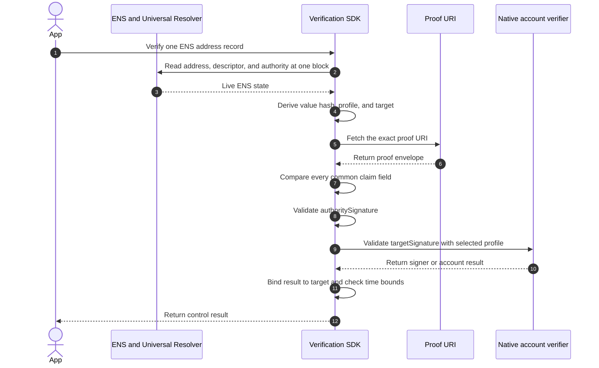

import {
  Accordion,
  AccordionContent,
  AccordionItem,
  AccordionTitle,
} from "../../../components/accordion.tsx";

# Method: `account-signature.<profile>.v1`

:::warning[In progress]
The common method is defined below. The profile registry still needs frozen
encodings and interoperability test vectors before these methods are final.
:::

`account-signature.<profile>.v1` verifies that the account stored in one ENS
`addr` record signed the same claim as the current ENS authority.

For example, a Bitcoin address uses `account-signature.bip322.v1`, while an EVM
address uses `account-signature.eip155.v1`. The common verification flow stays
the same. The profile selects only the native account-signature rules.

## Supported Records

The method supports `addr(coinType)` records listed in the
[profile registry](#profiles). It does not apply to text records or to an
unregistered coin type.

For an address claim:

| Claim field  | Required value                                                   |
| ------------ | ---------------------------------------------------------------- |
| `recordType` | `addr`                                                           |
| `recordKey`  | Coin type as an unsigned decimal string, such as `0` or `60`     |
| `valueHash`  | Keccak-256 of the exact bytes returned by `addr(node, coinType)` |
| `method`     | Exact profile identifier from the registry                       |
| `target`     | Canonical CAIP-10 account derived by the selected profile        |

Hash the resolver bytes, not a displayed or re-encoded address.

## Descriptor

```text
ensrv1 a=1 m=account-signature.bip322.v1 u=https://proofs.example/alice-btc.json
```

`u` is required and points directly to the proof envelope. Account records do
not provide a deterministic place from which to fetch a signature, so these
methods do not use a proof key.

Apply the URI and retrieval rules defined by the
[verification descriptor](../components/verification-descriptor). A verifier
must not search for a proof at another location.

## Target

The selected profile derives `target` from the live coin type and address bytes:

1. Decode the exact resolver bytes using the registered ENS address codec.
2. Require the coin type and account form allowed by the selected profile.
3. Derive the profile's exact CAIP-2 network identifier.
4. Canonicalize the account address using that profile's rules.
5. Serialize the result as one CAIP-10 account identifier.

```text
<namespace>:<reference>:<account-address>
```

Do not trust `claim.target` as an input. Recompute it from the live record and
require an exact match. Reject the record if its network or account form cannot
be derived without guessing.

## Signed Message

Calculate `commonClaimDigest` from the complete
[common claim](../components/claims-and-signatures#common-claim).

Text-message profiles sign the UTF-8 bytes of exactly:

```text
ENS Record Verification
Method: <claim.method>
Account: <claim.target>
Claim: 0x<64-lowercase-hex-commonClaimDigest>
```

Use one LF byte between lines and no final line break. Replace each placeholder
with its exact claim value; angle brackets are not included.

Structured-message profiles encode the same `method`, `target`, and
`commonClaimDigest` as native typed fields. The profile registry selects the
only permitted native wrapper. Proof data cannot select a different wrapper or
signature algorithm.

## Proof

Every profile requires `targetSignature`:

```json
{
  "targetSignature": "<profile-defined signature>"
}
```

When the profile registry says that a public key is required, the proof is
exactly:

```json
{
  "targetSignature": "<profile-defined signature>",
  "publicKey": "<profile-defined public key>"
}
```

Both values are strings. Unknown fields are forbidden. `publicKey` is forbidden
unless the selected profile requires it.

The public key is not trusted because it appears in the proof. The verifier
must prove that it maps to the live address before using it to validate the
signature. A native proof that already carries the public key or signer data
must not duplicate it in `publicKey`.

The ENS authority signature remains in the envelope's common
`authoritySignature` field. A positive result requires both signatures.

## Profiles

The method identifier selects the complete native profile. A verifier must use
the exact row selected by `claim.method` and must not fall back to another row.

| Method                                   | ENS coin type                    | Supported account                                      | Native verifier                                                                                                                   | `proof` object                          |
| ---------------------------------------- | -------------------------------- | ------------------------------------------------------ | --------------------------------------------------------------------------------------------------------------------------------- | --------------------------------------- |
| `account-signature.eip155.v1`            | `60` and ENSIP-11 EVM coin types | EOA or deployed ERC-1271 account                       | [EIP-712](https://eips.ethereum.org/EIPS/eip-712) and [ERC-1271](https://eips.ethereum.org/EIPS/eip-1271)                         | `targetSignature`                       |
| `account-signature.bip322.v1`            | `0`                              | Address supported by BIP-322 Simple                    | [BIP-322 Simple](https://github.com/bitcoin/bips/blob/master/bip-0322.mediawiki)                                                  | `targetSignature` contains native proof |
| `account-signature.solana-offchain.v1`   | `501`                            | On-curve Ed25519 account                               | [Solana off-chain message signing](https://github.com/anza-xyz/agave/blob/master/docs/src/proposals/off-chain-message-signing.md) | `targetSignature`                       |
| `account-signature.arweave-rsapss.v1`    | `472`                            | RSA-PSS account                                        | [Arweave message signing](https://docs.arconnect.io/api/sign-message)                                                             | `targetSignature`, `publicKey`          |
| `account-signature.nep413.v1`            | `397`                            | Named or implicit account with a valid full-access key | [NEP-413](https://github.com/near/NEPs/blob/master/neps/nep-0413.md)                                                              | `targetSignature`, `publicKey`          |
| `account-signature.cip8.v1`              | `1815`                           | Address with a key payment credential                  | [CIP-8](https://cips.cardano.org/cip/CIP-8)                                                                                       | `targetSignature`, `publicKey`          |
| `account-signature.adr36.v1`             | Registered Cosmos SDK coin types | Direct secp256k1 account                               | [ADR-036](https://github.com/cosmos/cosmos-sdk/blob/main/docs/architecture/adr-036-arbitrary-signature.md)                        | `targetSignature`, `publicKey`          |
| `account-signature.substrate-signraw.v1` | `354`, `434`                     | Direct Polkadot or Kusama account                      | [Substrate `signRaw`](https://polkadot.js.org/docs/extension/cookbook/#sign-a-message)                                            | `targetSignature` contains native proof |
| `account-signature.arc60.v1`             | `283`                            | Direct, non-rekeyed Ed25519 account                    | [ARC-60](https://dev.algorand.co/arc-standards/arc-0060/)                                                                         | `targetSignature`                       |
| `account-signature.sui-personal.v1`      | `784`                            | Account supported by a native Sui serialized signature | [Sui personal-message signing](https://sdk.mystenlabs.com/sui/cryptography)                                                       | `targetSignature` contains native proof |
| `account-signature.sep53.v1`             | `148`                            | Ed25519 `G...` account                                 | [SEP-53](https://github.com/stellar/stellar-protocol/blob/master/ecosystem/sep-0053.md)                                           | `targetSignature`                       |
| `account-signature.tip191.v1`            | `195`                            | Direct secp256k1 account                               | [TIP-191](https://github.com/tronprotocol/tips/blob/master/tip-191.md)                                                            | `targetSignature`                       |
| `account-signature.filecoin-wallet.v1`   | `461`                            | Direct `f1` secp256k1 or `f3` BLS account              | [Filecoin WalletSign and WalletVerify](https://docs.filecoin.io/reference/json-rpc/wallet)                                        | `targetSignature` contains native proof |
| `account-signature.tezos-micheline.v1`   | `1729`                           | Implicit `tz1`, `tz2`, `tz3`, or `tz4` account         | [Tezos Micheline string signing](https://gitlab.com/tezos/tzip/-/blob/master/drafts/current/draft-string-signing.md)              | `targetSignature`, `publicKey`          |

“Native proof” means the linked standard already carries the key, signer, or
script data needed by its verifier. It remains inside `targetSignature` in the
profile's canonical encoding.

The table is an allowlist. Multisig, script, contract, delegated, rekeyed,
off-curve, or rotating-key account forms are unsupported unless their row
explicitly permits them. Support for an ENS address codec alone does not make
an account verifiable.

## Verification



A verifier succeeds only when it:

1. resolves the address, descriptor, and authority at one ENS evaluation block;
2. requires the selected profile to support the live coin type and account form;
3. recomputes `valueHash` and the canonical `target` from the live address;
4. fetches and parses the closed envelope from the exact descriptor `u`;
5. compares every common claim field with the live inputs;
6. validates `authoritySignature` against the live exact-name authority;
7. validates `targetSignature` using only the selected native profile;
8. proves that the native signer or account policy controls the exact target;
9. validates any required target-chain state; and
10. requires the claim, authority, and method evidence to be current.

The minimal positive result is:

```json
{
  "verified": true,
  "verificationType": "control"
}
```

An SDK should expose the exact method, coin type, canonical target, ENS block,
and any target-chain block as diagnostic metadata.

An unknown profile, unsupported account form, unavailable proof URI, or
unavailable target-chain state is not a positive result. A transport failure is
not evidence that either signature is cryptographically invalid.

## Lifetime And Caching

The maximum signed lifetime is 30 days:

```text
validUntil - issuedAt <= 2,592,000 seconds
```

A positive result must not be reused past the earliest of:

- five minutes after evaluation;
- `claim.validUntil`;
- `authorityValidUntil`, when present; and
- a shorter target-chain or account-policy validity bound.

The 30-day signature lifetime does not permit a 30-day cache. ENS state and
stateful account authority can change earlier and must be re-evaluated.

## Security Boundary

This method returns `verificationType: "control"` only when:

1. the current exact-name ENS authority approved the exact address record; and
2. the account or account policy selected by the live address approved the same
   claim through its native signing standard.

This prevents another ENS name from copying an address and reusing its proof.
The target signature is bound to the common claim, which includes the ENS name,
record key, address value, authority, method, target, and validity period.

The result does not prove identity, legal ownership, account safety, balance,
or willingness to receive funds. For stateful accounts, it proves control only
under the profile's account-state and freshness rules.

## Open Issues

<Accordion>
  <AccordionItem>
    <AccordionTitle>Which profiles are ready to be frozen?</AccordionTitle>
    <AccordionContent>

Every row needs one exact target mapping, native-message adapter, signature and
key encoding, size limit, and positive and negative test vectors. Profiles
without two interoperable implementations should remain draft and be reported
as unsupported by production verifiers.

    </AccordionContent>

  </AccordionItem>

  <AccordionItem>
    <AccordionTitle>How should stateful account authority be evaluated?</AccordionTitle>
    <AccordionContent>

Contract wallets, NEAR access keys, rekeyed accounts, delegated accounts, and
multisig policies can change after signing. Each profile that accepts mutable
authority must define the target-chain block, finality rule, maximum block age,
and which live policy is checked.

Until those rules are fixed, the profile must support only direct accounts or
return unsupported.

    </AccordionContent>

  </AccordionItem>

  <AccordionItem>
    <AccordionTitle>Which proof URI transports are final?</AccordionTitle>
    <AccordionContent>

HTTPS and immutable IPFS publication are intended, but the descriptor component
still needs final, shared retrieval profiles. Each profile must use those exact
rules; it must not invent redirects, gateway behavior, authentication, or
scheme fallback.

    </AccordionContent>

  </AccordionItem>
</Accordion>

## Decisions

<Accordion>
  <AccordionItem>
    <AccordionTitle>Why is the profile part of the method identifier?</AccordionTitle>
    <AccordionContent>

The descriptor and signed claim select the verification algorithm before the
untrusted proof is read. The proof cannot request a different curve, message
format, network, or account model.

A change to one native profile allocates a new method version without changing
the common account-signature flow.

    </AccordionContent>

  </AccordionItem>

  <AccordionItem>
    <AccordionTitle>Why are both signatures required?</AccordionTitle>
    <AccordionContent>

The target signature alone proves only that an account signed a message. Any ENS
name could otherwise copy that account and signature. The authority signature
alone proves only that the ENS authority made a claim about an account.

Requiring both signatures over the same record-bound claim proves that the
current ENS authority and the target account approved this exact binding.

    </AccordionContent>

  </AccordionItem>

  <AccordionItem>
    <AccordionTitle>Why not define profiles only by curve?</AccordionTitle>
    <AccordionContent>

A curve is not an account-verification protocol. Ethereum, Bitcoin, TRON, and
Cosmos commonly use secp256k1 but have different message wrappers, addresses,
networks, and account rules. Solana and Stellar both use Ed25519 but also use
different message and account formats.

The profile therefore selects the complete native signing standard, not only
the mathematical signature algorithm.

    </AccordionContent>

  </AccordionItem>

  <AccordionItem>
    <AccordionTitle>Why link native standards instead of copying them?</AccordionTitle>
    <AccordionContent>

This method defines the shared claim, target binding, and permitted profile.
The linked native standard remains authoritative for its cryptographic
algorithm and native proof validation.

Each frozen profile must pin an exact standard version and its accepted options.
A moving link to “latest” is not sufficient.

    </AccordionContent>

  </AccordionItem>

  <AccordionItem>
    <AccordionTitle>Why is a proof key not used?</AccordionTitle>
    <AccordionContent>

Descriptor `u` already selects one exact proof resource. A proof key is needed
only when a method derives a shared publication location, such as an HTTPS
well-known path or DNS owner name.

Adding another key here would not improve signature validation or prevent proof
reuse; the signed common claim already binds the proof to one record and target.

    </AccordionContent>

  </AccordionItem>
</Accordion>
