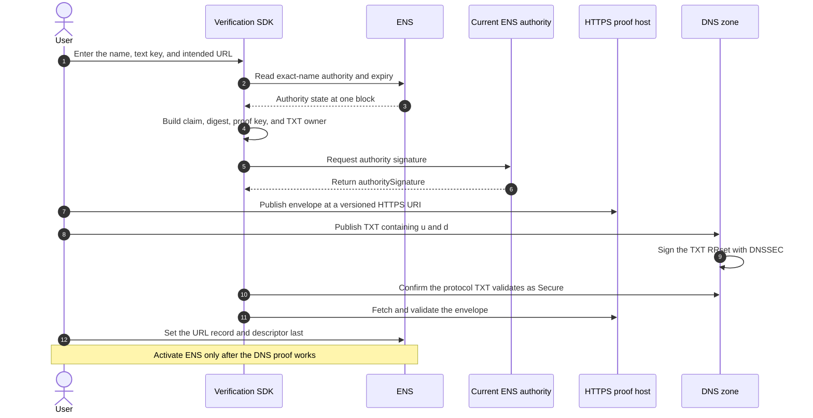
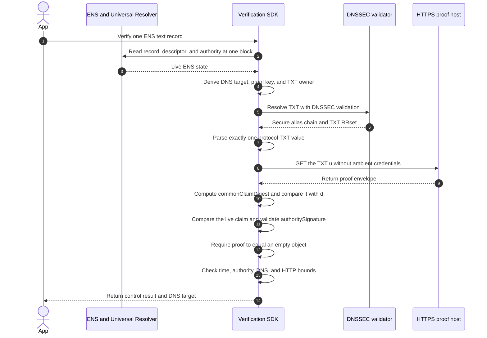

import {
  Accordion,
  AccordionContent,
  AccordionItem,
  AccordionTitle,
} from "../../../components/accordion.tsx";

# Method: `dns-txt.url.v1`

:::warning[Not finalized]
This method is still being designed. Its identifier, DNSSEC profile, TXT
format, URL profile, and limits may change.
:::

`dns-txt.url.v1` verifies a DNSSEC-authenticated approval published at a TXT
owner derived from an HTTPS hostname and one ENS text record.

For example, both records below use the same DNS target:

```text
https://example.com/profile
https://example.com:8443/blog

target = dns:example.com
```

The evidence is publication beneath `example.com`. It does not prove control of
the URL path, port, or web server.

## When To Use It

Use this method when the URL operator can publish a DNSSEC-signed TXT record
beneath the hostname but cannot publish a file at the website's `/.well-known/`
path.

Use [`https-origin.v1`](./https-origin) when the operator controls the web
origin instead. The two methods have different trust boundaries and neither is
an automatic fallback for the other.

## Supported Records

The method can be used with any `text(key)` whose complete value is an eligible
HTTPS URL. It is not limited to `text("url")`.

```text
text("url")  = "https://example.com"
text("blog") = "https://example.com/blog"
```

The `.url` in the method identifier means that the method uses the URL parsing
rules defined by `https-origin.v1`. The exact text key remains part of the
common claim and proof key.

## Descriptor

```text
ensrv1 a=1 m=dns-txt.url.v1
```

`u` is forbidden in the ENS descriptor. The DNSSEC-authenticated TXT record
selects the external proof URI. This keeps proof-location control with the DNS
target instead of the ENS authority alone.

## Derive The Target

Parse the exact text-record value using the [`https-origin.v1` URL
rules](./https-origin#derive-the-target).

This method requires a domain host. IPv4 and IPv6 hosts are unsupported because
there is no derived DNS zone in which to place the TXT record.

Set the target to:

```text
dns:<lowercase-ascii-host>
```

This is a method-local identity string, not an [RFC 4501 DNS
URI](https://www.rfc-editor.org/rfc/rfc4501). Never dereference or URI-normalize
it.

Use the exact URL hostname in lowercase ASCII A-label form. Do not climb to its
registrable domain.

| Record value                            | `target`                    |
| --------------------------------------- | --------------------------- |
| `https://example.com/profile`           | `dns:example.com`           |
| `https://example.com:8443/profile`      | `dns:example.com`           |
| `https://blog.example.com/post?draft=1` | `dns:blog.example.com`      |
| `https://bücher.example/profile`        | `dns:xn--bcher-kva.example` |

Path, query, fragment, and port remain bound by `valueHash`, but they do not
change which DNS hostname participates.

## TXT Owner

Encode the 32-byte proof key with [RFC 4648
base32](https://www.rfc-editor.org/rfc/rfc4648):

- use lowercase `a-z2-7`;
- remove `=` padding; and
- require exactly 52 characters.

Then query QCLASS `IN`, QTYPE `TXT` at:

```text
<52-character-proof-key>._ens-record-verification.<host>.
```

For `example.com`, the owner looks like:

```text
orsxg5banfxhizlto5xxe3deorsxg5banfxhizlto5xxe3deorsq._ens-record-verification.example.com.
```

The complete wire-format owner must fit DNS limits: at most 63 octets per
label and at most 255 octets for the full name. Reject the method as unsupported
for a hostname that cannot fit after the protocol labels are added.

## TXT Value

The DNS target publishes:

```text
ensrv1 u=https://proofs.example/alice-url-v1.json d=0x<common-claim-digest>
```

`u` is the proof-envelope location. `d` is the EIP-712 digest of the complete
common claim, encoded as `0x` followed by 64 lowercase hexadecimal characters.
DNSSEC therefore authenticates the same semantic claim that the ENS authority
signed.

The canonical field order is `u`, then `d`. A parser treats their order as
irrelevant.

`u` must be an absolute HTTPS URL without credentials or a fragment. It may use
any public host; that host only transports the envelope. It does not become the
verified target because `d` prevents it from substituting a different claim.

The complete protocol TXT value must be ASCII and at most 2,048 bytes.

### TXT RDATA Parsing

A DNS TXT RDATA can contain multiple character strings. Parse it as follows:

1. Concatenate character strings only within one RDATA, in wire order, without
   adding a separator.
2. Never concatenate separate RDATA records.
3. Ignore unrelated RDATA that do not begin with exact ASCII `ensrv1 `.
4. Require exactly one RDATA that begins with `ensrv1 `.
5. For that RDATA, require exact prefix `ensrv1` followed by one ASCII space,
   then two non-empty `name=value` fields separated by one ASCII space.
6. Reject leading or trailing whitespace, repeated spaces, tabs, line breaks,
   empty names or values, duplicate fields, and fields other than `u` and `d`.
7. Split each field on its first `=` so `=` can remain inside `u`, then apply
   the field rules and total ASCII size limit above.

This follows the TXT wire model in [RFC
1035](https://www.rfc-editor.org/rfc/rfc1035). Multiple protocol RDATA are
ambiguous and therefore invalid.

## How To Set It Up



The recommended order is:

1. Build the common claim for the intended ENS value.
2. Obtain a signature accepted by the current exact-name authority.
3. Publish the envelope at a new, versioned HTTPS URI.
4. Publish the TXT `u` and `d` beneath the derived hostname.
5. Confirm that the complete DNSSEC answer validates as `Secure`.
6. Fetch the envelope and run the complete verification procedure.
7. Set the ENS target record and descriptor together when possible.
8. Verify again against the live ENS state.

Set the ENS records last so clients do not discover a configured method before
its external evidence is ready.

## DNSSEC Validation

A positive result requires DNSSEC state `Secure`. Treat `Insecure`, `Bogus`,
and `Indeterminate` as non-positive results with different diagnostics. Never
fall back to unsigned DNS or `https-origin.v1`.

For public DNS names, validation must chain to the current [IANA root trust
anchor set](https://www.iana.org/dnssec/files). Implementations must support
authenticated trust-anchor updates, such as [RFC
5011](https://www.rfc-editor.org/rfc/rfc5011), rather than hardcoding one root
key forever.

An SDK may:

- perform DNSSEC validation locally; or
- use a trusted validating recursive resolver over an authenticated channel.

The `AD` bit from an arbitrary network resolver is not enough. The resolver and
channel are part of the verifier's trust boundary when validation is delegated.
These rules are defined by [RFC
4033](https://www.rfc-editor.org/rfc/rfc4033) and [RFC
4035](https://www.rfc-editor.org/rfc/rfc4035).

### CNAME And DNAME

Secure alias delegation is allowed:

1. Follow at most eight CNAME or DNAME steps.
2. Reject loops, conflicting answers, and overlong synthesized names.
3. Require every source alias RRset and the final TXT RRset to validate as
   `Secure`.
4. For DNAME, validate the signed DNAME and its synthesized CNAME according to
   [RFC 6672](https://www.rfc-editor.org/rfc/rfc6672); the synthesized CNAME
   does not normally carry its own signature.

A secure alias to an external provider is valid because the original DNS zone
authenticated that delegation.

## Verification



A verifier succeeds only when all of these checks succeed:

1. Resolve the target record, descriptor, and authority at one evaluation
   block.
2. Parse the URL, require a domain host, and derive the target.
3. Calculate the proof key and complete TXT owner.
4. DNSSEC-validate the full answer and alias chain as `Secure`.
5. Select and parse exactly one protocol TXT RDATA.
6. Fetch `u` with the [`https-origin.v1` HTTPS retrieval
   rules](./https-origin#https-retrieval-rules).
7. Parse the closed envelope and recompute its `commonClaimDigest`.
8. Require that digest to equal TXT field `d`.
9. Compare every common claim field with the live ENS inputs.
10. Validate `authoritySignature` against the live exact-name authority.
11. Require `proof` to be exactly an empty object.
12. Require the claim and all method evidence to be current.

A minimal positive result is:

```json
{
  "verified": true,
  "verificationType": "control"
}
```

An SDK should also expose `method: "dns-txt.url.v1"` and the canonical DNS
target as diagnostic metadata. They are not required fields in the minimal
result.

## Renewal And Rotation

Use a new versioned or immutable proof URI for each renewed claim:

1. Publish the new envelope without deleting the old one.
2. Replace the complete TXT RRset with the new `u` and `d` in one DNS update.
3. Keep the old proof resource available for at least the previous DNS TTL.
4. Delete it only after old DNS caches can no longer return its URI.

When the hostname changes, prepare the proof and TXT beneath the new hostname
before updating ENS.

## Lifetime And Caching

The current draft limits `validUntil - issuedAt` to 30 days. A positive result
must not be reused past the earliest of:

- five minutes after this evaluation;
- `claim.validUntil`;
- `authorityValidUntil`, when present;
- the DNSSEC validator's remaining secure-answer reuse bound, including every
  RRset and RRSIG used to prove the chain and answer; and
- a shorter authenticated HTTP freshness bound, when applicable.

The DNSSEC validator, not this method, calculates that bound from the answer,
aliases, DS, DNSKEY, denial records when relevant, and their signatures. The
method must not extend it.

Publishers should use a TXT TTL of at most five minutes. A verifier's local
five-minute cap cannot evict a longer-lived answer already held by an upstream
recursive resolver.

Authenticated NXDOMAIN and NODATA may use the validated negative TTL. Do not
cache a timeout, `SERVFAIL`, `Bogus`, or `Indeterminate` result as ordinary
proof absence.

## Security Boundary

This method proves:

> A DNSSEC-authenticated TXT owner derived from the exact URL hostname approved
> the common claim for this ENS record.

It does not prove control of the URL path, query, fragment, port, or web
service. It also does not prove legal domain ownership, organizational identity,
or safe content. A securely delegated DNS proof provider is inside this
method's control boundary.

The external proof host learns that its URI was fetched. DNS resolvers and
authoritative servers can observe the proof-owner lookup. The proof key is
opaque but not secret because all inputs used to derive it are public.

## Open Issues

<Accordion>
  <AccordionItem>
    <AccordionTitle>Should valueHash be part of the proof key?</AccordionTitle>
    <AccordionContent>

The shared proof key currently excludes `valueHash`. Changing the ENS URL while
keeping the same name, text key, and method therefore reuses one DNS owner. DNS
caches make the temporary old/new mismatch more visible than with a direct web
proof.

Including `valueHash` would create a new TXT owner for each record value and
allow the next proof to be prepared before changing ENS. It would also leave
more stale DNS records to remove. This is a shared proof-key decision and must
be resolved consistently across all methods.

    </AccordionContent>

  </AccordionItem>

  <AccordionItem>
    <AccordionTitle>Which DNSSEC algorithms must every SDK support?</AccordionTitle>
    <AccordionContent>

DNSSEC validators do not all support the same legacy and modern algorithms.
Version 1 needs a minimum algorithm policy and conformance zones so that one
proof does not validate in one SDK and fail as unsupported in another.

The policy must distinguish an unsupported algorithm from a cryptographically
`Bogus` answer and define how algorithm rollovers are evaluated.

    </AccordionContent>

  </AccordionItem>

  <AccordionItem>
    <AccordionTitle>How should DNS freshness and failures appear in SDKs?</AccordionTitle>
    <AccordionContent>

A five-minute application cache cap does not override a longer cache inside a
recursive resolver. The final profile must decide whether the protocol TXT TTL
is required to be at most five minutes and how longer CNAME or DNAME TTLs are
reported.

SDKs also need stable diagnostics for authenticated absence, `Insecure`,
`Bogus`, `Indeterminate`, timeout, `SERVFAIL`, malformed TXT, and digest
mismatch. They may all produce `verified: false`, but applications should not
treat them as the same event.

    </AccordionContent>

  </AccordionItem>

  <AccordionItem>
    <AccordionTitle>Which exact URL and DNS names are interoperable?</AccordionTitle>
    <AccordionContent>

The URL profile still needs executable cross-language vectors. This method
additionally needs vectors for IDNA, maximum DNS owner length, TXT
chunking, wildcard synthesis, CNAME and DNAME chains, and trust-anchor
rollovers.

The method should not be frozen until independent implementations agree on all
of these cases.

    </AccordionContent>

  </AccordionItem>
</Accordion>

## Decisions

<Accordion>
  <AccordionItem>
    <AccordionTitle>Why keep DNS TXT and HTTPS origin as separate methods?</AccordionTitle>
    <AccordionContent>

They prove control through different systems. HTTPS authenticates a serialized
origin, including a non-default port. DNSSEC authenticates publication beneath
the exact hostname and ignores the port. A user may control one system without
controlling the other.

The verifier applies only the descriptor's selected method. It never falls back
between them because that would change the promised trust boundary.

    </AccordionContent>

  </AccordionItem>

  <AccordionItem>
    <AccordionTitle>Why commit to the claim digest instead of JSON bytes?</AccordionTitle>
    <AccordionContent>

The EIP-712 common-claim digest represents the statement being approved. JSON
whitespace, member order, equivalent escaping, HTTP compression, or a different
valid encoding of the same authority signature do not change that statement.

Hashing the raw JSON resource would make every harmless serialization change
require a DNS update. Field `d` instead binds DNS directly to the semantic claim
while the envelope carries the full claim and signature.

    </AccordionContent>

  </AccordionItem>

  <AccordionItem>
    <AccordionTitle>Why use the exact host instead of the registrable domain?</AccordionTitle>
    <AccordionContent>

Subdomains can be delegated independently. For `blog.example.com`, a record at
`example.com` would let the parent approve a target whose day-to-day control may
belong to someone else. The proof is therefore placed beneath the exact ASCII
hostname from the URL.

This also avoids depending on the changing Public Suffix List.

    </AccordionContent>

  </AccordionItem>

  <AccordionItem>
    <AccordionTitle>Why use base32 for the proof key?</AccordionTitle>
    <AccordionContent>

A 32-byte key needs 64 hexadecimal characters, but one DNS label can contain at
most 63 octets. Lowercase unpadded base32 represents the same key in 52
DNS-safe characters and fits in one label.

    </AccordionContent>

  </AccordionItem>

  <AccordionItem>
    <AccordionTitle>Why does DNS contain u while ENS does not?</AccordionTitle>
    <AccordionContent>

DNS TXT records are too small and operationally awkward for the complete proof
envelope. The DNS target therefore chooses an HTTPS location and commits to the
claim digest stored there. Keeping `u` in DNS means the DNS target controls both
the approval and its relocation; the ENS authority cannot redirect it alone.

The envelope still uses `proof: {}` because the secure TXT publication is the
target evidence. No separate target signature is needed.

    </AccordionContent>

  </AccordionItem>
</Accordion>
