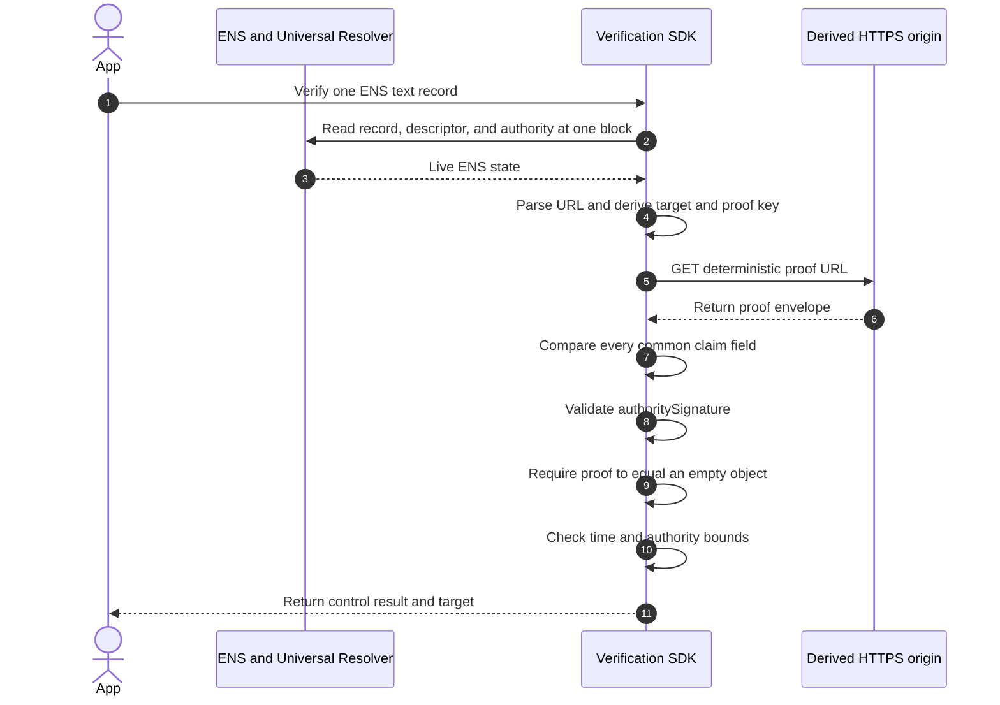

import {
  Accordion,
  AccordionContent,
  AccordionItem,
  AccordionTitle,
} from "../../../components/accordion.tsx";

# Method: `https-origin.v1`

`https-origin.v1` verifies that a WebPKI-authenticated HTTPS origin is currently serving a proof for one ENS text record at the derived well-known path.

For example, if this is the record:

```text
text("url") = "https://example.com/profile"
```

the proof is served by:

```text
https://example.com
```

## Supported Records

The method can be used with any `text(key)` whose complete value is an eligible HTTPS URL. It is not limited to `text("url")`.

```text
text("url")  = "https://example.com"
text("blog") = "https://example.com/blog"
```

The text key is part of the common claim and proof key. A proof for `url` cannot be reused for `blog`.

## Descriptor

```text
ensrv1 a=1 m=https-origin.v1
```

`u` is forbidden. The live record determines the origin, and the method
determines the proof path. An ENS authority cannot point this method at an
unrelated proof server.

## Derive The Target

Parse the exact text-record value with the [WHATWG URL Standard](https://url.spec.whatwg.org/). Do not trim, repair, or resolve it against a base URL.

The URL must:

- be an absolute `https:` URL;
- have a non-empty host;
- have no username or password;
- contain no ASCII whitespace or C0 control characters;
- have no trailing dot on a domain host; and
- have no IPv6 zone identifier.

The path, query, and fragment are allowed. They remain bound to the proof by
the common claim's `valueHash`, but they do not change the origin.

Set `target` to the serialized WHATWG origin. Domain names use their lowercase
ASCII A-label form, the default HTTPS port disappears, and a non-default port
remains.

| Record value                                   | `target`                         |
| ---------------------------------------------- | -------------------------------- |
| `https://example.com/profile`                  | `https://example.com`            |
| `https://example.com:443/profile?tab=1#latest` | `https://example.com`            |
| `https://example.com:8443/profile`             | `https://example.com:8443`       |
| `https://bücher.example/profile`               | `https://xn--bcher-kva.example`  |
| `https://[2001:4860:4860::8888]/profile`       | `https://[2001:4860:4860::8888]` |

An IP host is syntactically supported, but the verifier's network policy must
still reject an address that is not globally reachable.

## Proof Location

Encode the 32-byte proof key as exactly 64 lowercase hexadecimal characters,
without `0x`. Fetch:

```text
<target>/.well-known/ens-record-verification/<proof-key-hex>
```

The envelope contains the common claim, `authoritySignature`, and exactly:

```json
{
  "proof": {}
}
```

## Verification



A verifier succeeds only when all of these checks succeed:

1. Resolve the target record, descriptor, and authority at one evaluation
   block.
2. Derive the target and proof key from those live values.
3. Fetch the deterministic proof URL with the shared [HTTPS retrieval
   profile](./overview#shared-https-retrieval-profile).
4. Parse the closed envelope and compare every common claim field.
5. Validate `authoritySignature` against the live exact-name authority.
6. Require `proof` to be exactly an empty object.
7. Require the claim to be active and within the method's lifetime limit.

A minimal positive result is:

```json
{
  "verified": true,
  "verificationType": "control"
}
```

An SDK should also expose `method: "https-origin.v1"` and the canonical target
as diagnostic metadata. They are not required fields in the minimal result.

Network, TLS, CORS, and timeout failures are unavailable results. They are not evidence that either signature was cryptographically invalid.

## Lifetime And Caching

The current draft limits `validUntil - issuedAt` to 30 days. A positive result
must not be reused past the earliest of:

- five minutes after this evaluation;
- `claim.validUntil`;
- `authorityValidUntil`, when present; and
- a shorter authenticated HTTP freshness bound, when applicable.

A fresh evaluation should revalidate or bypass a reusable HTTP cache. HTTP
`no-store` prevents persistent body storage, but it does not invalidate the
result that was just evaluated.

## Security Boundary

This method proves:

> A WebPKI-authenticated origin currently served an authority-signed envelope
> for this exact ENS record at the derived well-known path.

It does not prove control of the original URL path, ownership of a legal entity
or domain registration, safety of the page, or exclusive access to the server.
A CDN, reverse proxy, or hosting account that can publish the well-known route
is inside the origin's control boundary.

Someone who can edit only `https://example.com/alice` cannot use this method
unless they can also publish under `/.well-known/ens-record-verification/`.

## Open Issues

<Accordion>
  <AccordionItem>
    <AccordionTitle>Should valueHash be part of the proof key?</AccordionTitle>
    <AccordionContent>

The shared proof key currently excludes `valueHash`, so changing a URL while
keeping the same name, text key, method, and origin reuses one proof path.
Updating ENS and the web resource cannot be atomic. Some verifiers can briefly
see the old ENS value with the new envelope, or the new value with the old
envelope, and correctly return a non-positive result.

Including `valueHash` would give each record value its own path. The next proof
could be published before changing ENS, but old proof files would need cleanup.
This is a shared proof-key decision and must not be changed by this method
alone.

    </AccordionContent>

  </AccordionItem>

  <AccordionItem>
    <AccordionTitle>Which exact URL inputs must every SDK accept?</AccordionTitle>
    <AccordionContent>

The WHATWG URL Standard is a living standard and implementations do not expose
all parser validation errors in the same way. Version 1 still needs executable
vectors for whitespace, backslashes, IDNs, IPv4 and IPv6 forms, ports, trailing
dots, and invalid inputs.

The method identifier cannot be frozen until independent SDKs produce the same
target for every vector.

    </AccordionContent>

  </AccordionItem>

  <AccordionItem>
    <AccordionTitle>What is the final HTTP interoperability profile?</AccordionTitle>
    <AccordionContent>

The 256 KiB decoded limit is a draft decision, but the exact content encodings,
timeouts, cache request directives, browser behavior, and error diagnostics
still need conformance tests. Browser SDKs also cannot perform the same peer-IP
checks as a server SDK.

The well-known suffix `ens-record-verification` must be registered under [RFC
8615](https://www.rfc-editor.org/rfc/rfc8615) before the method is finalized. A
dedicated registered media type can be considered later; the draft uses
`application/json`.

    </AccordionContent>

  </AccordionItem>
</Accordion>

## Decisions

<Accordion>
  <AccordionItem>
    <AccordionTitle>Why prove the origin instead of the full URL?</AccordionTitle>
    <AccordionContent>

HTTPS authenticates the origin that serves a response. It does not give a
standard cryptographic identity to an individual path. The complete URL is
still protected by `valueHash`, while target participation is scoped to the
origin that can publish the well-known proof.

    </AccordionContent>

  </AccordionItem>

  <AccordionItem>
    <AccordionTitle>Why are redirects forbidden?</AccordionTitle>
    <AccordionContent>

A redirect moves publication to another location and makes the final target
unclear. The derived origin must serve the proof response itself. It may use a
CDN or reverse proxy internally, but that is still represented to the verifier
as the same HTTPS origin.

    </AccordionContent>

  </AccordionItem>

  <AccordionItem>
    <AccordionTitle>Why is the authority signature still required?</AccordionTitle>
    <AccordionContent>

Origin publication alone says only that the origin served some data. The
authority signature binds that publication to one ENS name, record selector,
record value, method, authority, and validity interval. Both sides must agree
to the same common claim.

    </AccordionContent>

  </AccordionItem>

  <AccordionItem>
    <AccordionTitle>Why are u and proof data omitted?</AccordionTitle>
    <AccordionContent>

The live URL already determines the origin, and the proof key determines the
path, so descriptor `u` would add an unnecessary redirectable location. The
envelope uses `proof: {}` because live publication at that location is the
target evidence; there is no separate target signature to carry.

    </AccordionContent>

  </AccordionItem>
</Accordion>
