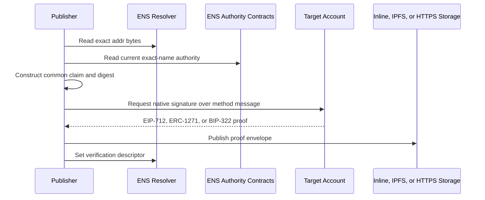
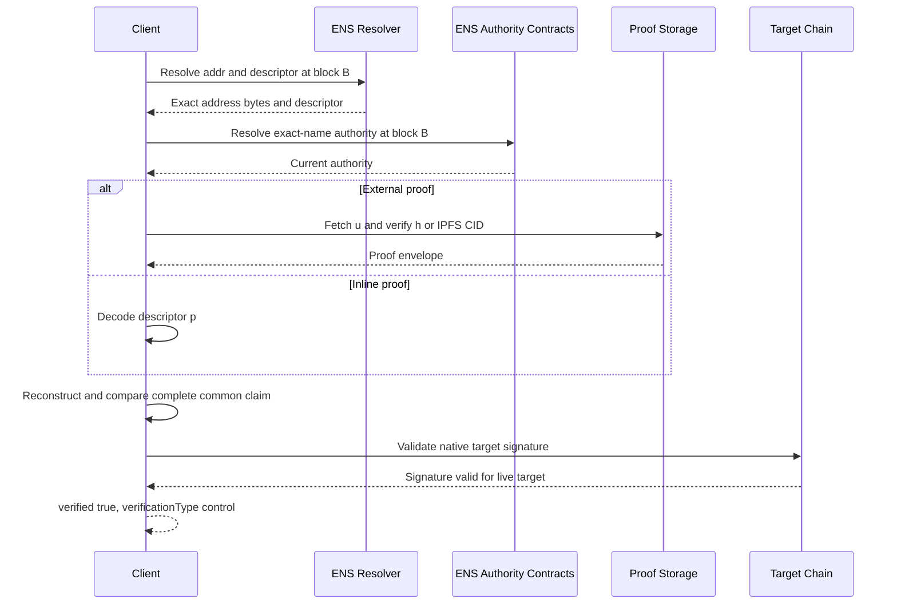

# Address Record Verification

An ENS address record contains chain-specific account bytes. Address
verification requires a native signature from the account represented by the
exact live record.

## Records

EVM example:

```text
addr(60) = 0x1234567890abcdef1234567890abcdef12345678
text("verification[addr][60]") = "ensrv1 a=1 ca=0x1234567890abcdef1234567890abcdef12345678 m=account-signature.eip155.v1 p=<inline-proof>"
```

Bitcoin example:

```text
addr(0) = <ENSIP-9 Bitcoin scriptPubKey bytes>
text("verification[addr][0]") = "ensrv1 a=1 ca=0x1234567890abcdef1234567890abcdef12345678 m=account-signature.bip322.v1 u=ipfs://bafk..."
```

The coin type is part of the selector. A proof for `addr(60)` cannot verify
`addr(0)` or another address record.

## Bound Values

The common claim binds:

```text
name, node
recordType = addr
recordKey  = canonical decimal coin type
valueHash  = keccak256(exact resolver address bytes)
authority  = current exact-name ENS authority
method, canonical target, issuedAt, validUntil
```

The target signs a method-specific message that commits to the complete common
claim digest. It does not sign only the displayed address string.

## Publication Flow



For inline publication, the proof envelope is encoded directly in descriptor
field `p`; no storage request occurs.

## Verification Flow



The verifier performs these steps:

1. Resolve the exact address bytes and descriptor at one ENS block.
2. Hash the raw resolver bytes and derive the target for the selected coin type.
3. Determine current exact-name ENS authority at the same block.
4. Decode inline `p` or retrieve external `u` with its required integrity check.
5. Reconstruct the expected common claim and compare every field.
6. Construct the method-specific target-signature message.
7. Validate the EOA, ERC-1271, or BIP-322 proof against the live target account.
8. Require the proof to be within its validity interval.
9. Return `verified: true` with `verificationType: "control"`.

If any required step does not succeed, return `verified: false`.

## What The Result Means

A positive result demonstrates that credentials controlling the target account
approved a claim bound to this exact live ENS address record. It does not prove
that the ENS authority and target account are the same person, that the account
is uncompromised, or that sending funds is safe.
