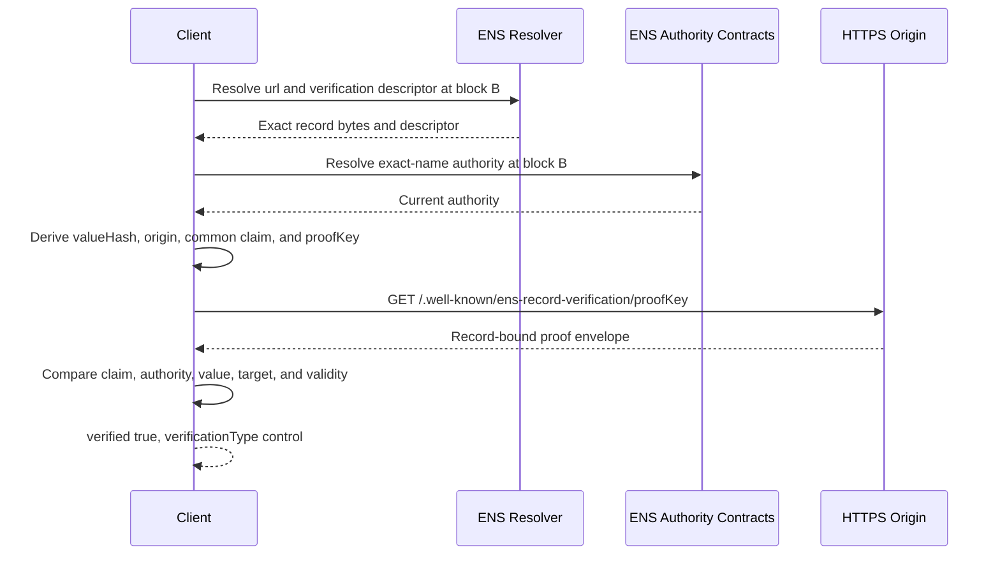

# URL Record Verification

A URL record identifies a resource, but the resolver response alone does not
prove control of its origin or domain. URL verification combines the live ENS
record with proof published by the derived target.

## Records

```text
text("url") = "https://example.com/profile"
text("verification[text][url]") = "ensrv1 a=1 ca=0x1234567890abcdef1234567890abcdef12345678 m=https-origin.v1"
```

The verification descriptor applies only to `text("url")`. It does not verify
another text record on the same name.

## Bound Values

For the example above, the verifier derives:

```text
recordType = text
recordKey  = url
valueHash  = keccak256(bytes("https://example.com/profile"))
target     = https://example.com
authority  = current exact-name ENS authority
```

All values are included in the common claim. A change to the URL, name,
authority, method, or target makes the proof non-matching.

## HTTPS-Origin Flow



The verifier performs these steps:

1. Normalize the ENS name and select one evaluation block.
2. Resolve the URL and descriptor for the exact name at that block.
3. Hash the exact UTF-8 URL bytes without normalization.
4. Determine the current exact-name ENS authority at the same block.
5. Parse the URL and derive its serialized HTTPS origin.
6. Construct the complete expected common claim.
7. Derive the proof key and fetch the deterministic same-origin resource.
8. Require the published envelope to match every expected claim field.
9. Require the proof to be live and within its validity interval.
10. Return `verified: true` with `verificationType: "control"`.

If any required step does not succeed, return `verified: false`. The URL record
continues to resolve normally.

## DNSSEC Alternative

With `dns-txt.url.v1`, the URL domain publishes a DNSSEC-authenticated TXT value
that commits to the proof-envelope hash. The common claim and live ENS checks
are identical; only the target-control evidence changes.

## Security Boundary

URL verification demonstrates control of the derived origin or domain for the
exact live URL record. It does not establish that the URL is safe, official,
available, or operated by a particular legal entity.
