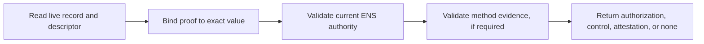

# Protocol Overview

Record Verification adds a proof layer to an existing ENS resolver record. It
binds a method-specific proof to one exact name, record selector, and live
resolver value. It does not replace the record or change normal ENS resolution.

## Records

Assume `alice.eth` contains:

```text
text("url") = "https://example.com/profile"
```

The name can opt into verification by setting another ENS text record:

```text
text("verification[text][url]") = "ensrv1 a=1 m=https-origin.v1"
```

The first record is the target resolver record. The second is its verification
descriptor. The descriptor selects the authority rules and method used to
validate authorization and, when required by the method, target control or a
policy-accepted attestation.

## Verification



A verifier reads both records at the same Ethereum block. It then checks that:

1. the signed claim identifies the same ENS name and record selector;
2. `valueHash` matches the current resolver value;
3. the signer is the current authority for the exact ENS name;
4. the selected method proof is valid;
5. the claim and proof have not expired or been revoked.

## Results

| Result                   | Meaning                                                                                  |
| ------------------------ | ---------------------------------------------------------------------------------------- |
| `verified/authorization` | Current ENS authority authorized the exact live record.                                  |
| `verified/control`       | Method-specific evidence demonstrated control of the record's canonical external target. |
| `verified/attestation`   | An issuer accepted under client policy attested to the record-bound claim.               |
| `none`                   | One or more required checks did not pass.                                                |

The target may be an HTTPS origin, DNS domain, blockchain account, or another
resource defined by a method profile. The method profile defines what evidence
must validate and therefore what a positive result means.

Verification proves only the relationship described by the returned result. It
does not establish safety, reputation, legal ownership, or ENS endorsement.
The base protocol reserves `attestation`; version 1 does not define a concrete
attestation method.

## Read The Specification

The [ENSIP](./ensip) is the normative protocol. Companion pages explain each
part separately:

1. [Resolution and Discovery](./discovery-records)
2. [Verification Descriptor](./verification-descriptor)
3. [Claims and Signatures](./claims-and-signatures)
4. [Authority and Lifecycle](./authority-and-lifecycle)
5. [Method Profiles](../methods/overview)
