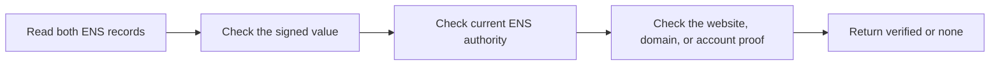

# Protocol Overview

ENS Record Verification adds proof information to an existing ENS record. It
does not replace the record or change normal ENS resolution.

## Records

Assume `alice.eth` contains:

```text
text("url") = "https://example.com/profile"
```

The name can opt into verification by setting another ENS text record:

```text
text("verification[text][url]") = "ensrv1 a=1 m=https-origin.v1"
```

The first record is the value being verified. The second record is the
verification descriptor. It selects the verification method.

## Verification



A verifier reads both records at the same Ethereum block. It then checks that:

1. the signed claim contains the same ENS name and record;
2. `valueHash` matches the current resolver value;
3. the signer is the current authority for the exact ENS name;
4. the selected method proof is valid;
5. the claim and proof have not expired or been revoked.

## Results

| Result                   | Meaning                                                                     |
| ------------------------ | --------------------------------------------------------------------------- |
| `verified/authorization` | Current ENS authority signed this exact record.                             |
| `verified/control`       | Current ENS authority signed it and the target published or signed a proof. |
| `verified/attestation`   | Current ENS authority signed it and an accepted issuer provided evidence.   |
| `none`                   | One or more required checks did not pass.                                   |

The target may be a website origin, DNS domain, or blockchain account. The
method page defines the exact check.

Verification does not establish safety, reputation, legal ownership, or ENS
endorsement.

## Read The Specification

The [ENSIP](./ensip) is the normative protocol. Companion pages explain each
part separately:

1. [Resolution and Discovery](./discovery-records)
2. [Verification Descriptor](./verification-descriptor)
3. [Claims and Signatures](./claims-and-signatures)
4. [Authority and Lifecycle](./authority-and-lifecycle)
5. [Method Profiles](../methods/overview)
