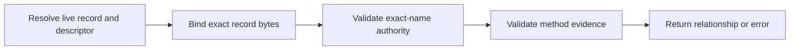

# Protocol Overview

ENS Resolver Record Verification evaluates a relationship between an exact ENS
record and signed or externally published evidence. It does not change ENS
resolution and requires no new contract.

## Components

| Component           | Function                                                                  |
| ------------------- | ------------------------------------------------------------------------- |
| Target record       | Existing `text`, `addr`, `contenthash`, or `data` resolver value.         |
| Verification record | ENSIP-5 text record containing a descriptor.                              |
| Descriptor          | Selects an authority version, concrete method, and proof location.        |
| Common claim        | Binds the name, selector, exact value hash, method, target, and lifetime. |
| Authority algorithm | Identifies the current authority for the exact name.                      |
| Method profile      | Derives the target and validates target evidence.                         |

## Result Relationships

| Relationship    | Evidence                                                       |
| --------------- | -------------------------------------------------------------- |
| `authorization` | Current ENS authority signed the exact live record.            |
| `control`       | Authorization plus evidence published or signed by the target. |
| `attestation`   | Authorization plus an issuer accepted by client policy.        |

No relationship establishes safety, reputation, legal ownership, or ENS
endorsement.

## Normative Source

The [ENSIP](./ensip) is the sole normative protocol definition. Companion pages
organize the same protocol for implementation and do not define independent
requirements.

Read next:

1. [Resolution and Discovery](./discovery-records)
2. [Verification Descriptor](./verification-descriptor)
3. [Claims and Signatures](./claims-and-signatures)
4. [Authority and Lifecycle](./authority-and-lifecycle)
5. [Method Profiles](../methods/overview)
6. [Build a Verifier](../guides/build-a-verifier)
