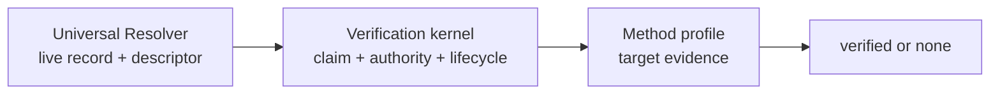

# Specification Overview

ENS Resolver Record Verification adds verifiable evidence to an existing ENS
resolver record. It does not replace the record or require a new contract.

## Protocol Layers

The layers have separate responsibilities:

| Layer               | Responsibility                                                                |
| ------------------- | ----------------------------------------------------------------------------- |
| ENS resolution      | Return the live target record and verification descriptor for the exact name. |
| Verification kernel | Bind exact bytes, current exact-name authority, time, method, and target.     |
| Method profile      | Define target canonicalization and external evidence.                         |
| Client policy       | Decide which methods, issuers, fetch modes, and cache limits are acceptable.  |

## Invariants

A verifier returns `verified` only when all of the following hold at evaluation
time:

1. The exact live resolver value exists.
2. The exact live verification descriptor is valid and selects the method.
3. The proof binds the normalized name, node, record selector, and raw value
   hash.
4. The proof was signed by the current authority for the exact ENS name.
5. The method-specific evidence validates.
6. Every applicable validity, freshness, and revocation check passes.

Verification never changes ordinary ENS resolution. Failure returns `none`; it
does not invalidate or hide the underlying resolver record.

## Positive Relationships

| Relationship    | Required evidence                                            |
| --------------- | ------------------------------------------------------------ |
| `authorization` | Current ENS authority signed the exact live resolver value.  |
| `control`       | Authorization plus participation by the external target.     |
| `attestation`   | Authorization plus an attestation accepted by client policy. |

None of these relationships means safe, official, non-malicious, legally owned,
or endorsed by ENS.

## Normative Source

The complete normative proposal is the [ENSIP](./ensip). The companion pages
explain the same rules by implementation concern:

- [Discovery Records](./discovery-records)
- [Verification Descriptor](./verification-descriptor)
- [Claims and Signatures](./claims-and-signatures)
- [Authority and Lifecycle](./authority-and-lifecycle)
- [Results and Errors](./results-and-errors)
