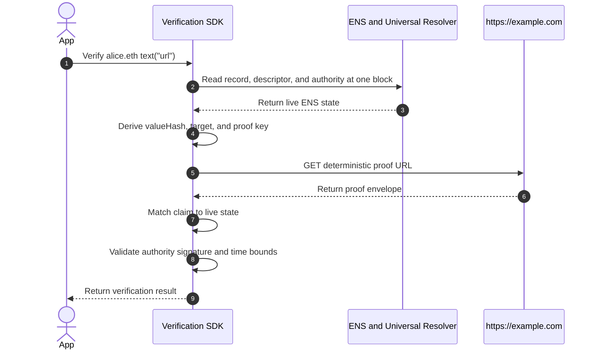

# Protocol Walkthrough

This page verifies one URL record from start to finish:

```text
alice.eth → text("url") → https://example.com/profile
```

The result answers one question:

> Did the current authority for `alice.eth` approve this exact URL record, and
> is the HTTPS origin currently publishing that approval?

Verification happens in a client or SDK. The protocol does not store a
permanent onchain `verified` flag.

## 1. Publish The ENS Records

`alice.eth` publishes the URL as a normal resolver record:

```text
text("url") = "https://example.com/profile"
```

It opts this record into verification with a companion text record:

```text
text("verification[text][url]") = "ensrv1 a=1 m=https-origin.v1"
```

The descriptor means:

- `ensrv1`: use common protocol version 1;
- `a=1`: use Authority Algorithm 1; and
- `m=https-origin.v1`: verify control through the HTTPS origin.

There is no `u` field. This method derives the proof location from the live URL,
so the descriptor cannot redirect verification to another server.

## 2. Resolve The Authority

Authority is the canonical account required to approve verification for the
exact ENS name. The verifier computes it from ENS ownership state; the proof
cannot select it.

For this example, assume `alice.eth` is an active, unwrapped `.eth`
second-level name. Authority Algorithm 1 reads the Base Registrar registrant
and registration expiry:

```text
tokenId = uint256(keccak256(bytes("alice")))
authority = BaseRegistrar.ownerOf(tokenId)
          = 0x1234567890abcdef1234567890abcdef12345678
authorityValidUntil = BaseRegistrar.nameExpires(tokenId)
```

For a wrapped name, the algorithm uses the exact Name Wrapper owner. Other
exact unwrapped names use the Registry owner. Reverse names are unsupported.
Resolver operators and delegated record writers are not additional
authorities.

The envelope repeats the authority address, but the verifier independently
resolves it and requires an exact match.

## 3. Build And Sign The Claim

The proof publisher derives the claim from one ENS snapshot. A verifier later
derives the same fields again from its own evaluation snapshot.

| Claim field        | Derived value                                                    |
| ------------------ | ---------------------------------------------------------------- |
| `name`             | `alice.eth`                                                      |
| `node`             | `namehash("alice.eth")`                                          |
| `recordType`       | `text`                                                           |
| `recordKey`        | `url`                                                            |
| `valueHash`        | `keccak256(UTF8("https://example.com/profile"))`                 |
| `authorityVersion` | `1`, copied from descriptor field `a`                            |
| `authority`        | Current authority computed from ENS                              |
| `method`           | `https-origin.v1`, copied from descriptor field `m`              |
| `target`           | `https://example.com`, the canonical origin derived from the URL |
| `issuedAt`         | Claim creation time                                              |
| `validUntil`       | First time at which the claim is invalid                         |

The full URL is bound by `valueHash`. The method target is only the origin
because HTTPS authenticates an origin, not an individual path.

The current authority signs the claim as EIP-712 typed data:

```text
domain = {
  name: "ENS Record Verification",
  version: "1",
  chainId: 1
}

primaryType = "ENSRecordVerification"
message = claim

commonClaimDigest = EIP712Hash(domain, primaryType, message)
authoritySignature = authority.signTypedData(domain, primaryType, message)
```

For the example values:

```text
node                = 0x787192fc5378cc32aa956ddfdedbf26b24e8d78e40109add0eea2c1a012c3dec
valueHash           = 0x34174bbdf078fba55709ff82e2d5929de2e915c964d18dc57907afc851781142
domainSeparator     = 0x13e18e785741386cdda7b13ad2e40f5c26c940f9942e80ff9baeb53f50ee3aaa
commonClaimDigest   = 0xdd4f601548768d2213b42b2be359d92e0f47adf25f6ae536cd206428ea65ef8d
```

The authority signs the typed claim, not the JSON file or an
Ethereum-prefixed personal message.

## 4. Publish The Proof Envelope

The method derives a proof key from the protocol domain, authority version,
authority, ENS node, record type, record key, and method. For this example:

```text
proofKey = 0xf10198b0fa04c7128a1cd77f08ce5d2437fc795dfa47dc3cff3203dfa73f0385
```

The proof key gives this record and authority one deterministic publication
slot. It is a location identifier, not proof data or a secret.

The complete proof envelope is:

```json
{
  "v": "ensrv1",
  "claim": {
    "name": "alice.eth",
    "node": "0x787192fc5378cc32aa956ddfdedbf26b24e8d78e40109add0eea2c1a012c3dec",
    "recordType": "text",
    "recordKey": "url",
    "valueHash": "0x34174bbdf078fba55709ff82e2d5929de2e915c964d18dc57907afc851781142",
    "authorityVersion": "1",
    "authority": "0x1234567890abcdef1234567890abcdef12345678",
    "method": "https-origin.v1",
    "target": "https://example.com",
    "issuedAt": "1783728000",
    "validUntil": "1786320000"
  },
  "authoritySignature": "0x<authority-signature>",
  "proof": {}
}
```

`0x<authority-signature>` is replaced by the actual hexadecimal signature
bytes.

The origin serves this JSON at the proof key without the `0x` prefix:

```text
https://example.com/.well-known/ens-record-verification/f10198b0fa04c7128a1cd77f08ce5d2437fc795dfa47dc3cff3203dfa73f0385
```

A valid response has this shape:

```http
HTTP/1.1 200 OK
Content-Type: application/json

<proof-envelope-json>
```

`proof` is empty because no target signature is required. Serving the envelope
from the exact WebPKI-authenticated origin is the target evidence.

## 5. Verify The Record



The verifier:

1. normalizes `alice.eth` using ENSIP-15;
2. reads the URL, descriptor, and authority state at one Ethereum block;
3. parses exactly `ensrv1`, Authority Algorithm 1, and `https-origin.v1`;
4. recomputes the current authority, `node`, `valueHash`, target, and proof key;
5. fetches the exact proof URL using the method's TLS, redirect, status,
   media-type, size, encoding, and network rules;
6. parses the closed envelope and compares every derived claim field with live
   state;
7. validates the claim, authority, and method time bounds;
8. validates `authoritySignature` using EOA recovery or ERC-1271 at the same
   block; and
9. requires `proof` to be exactly `{}`.

Every check is required. An unsupported or unavailable required check cannot
produce a positive result.

## 6. Return The Result

When every check succeeds:

```json
{
  "verified": true,
  "verificationType": "control"
}
```

This means the current ENS authority approved the exact live URL record and
`https://example.com` published that approval at the required path.

It does not prove that the page is safe, that the authority legally owns the
domain, or that the same controller owns another origin.

The maximum signed lifetime is one year. A positive result must be re-evaluated
within five minutes and expires sooner if the claim, authority, or method
evidence expires.

Otherwise:

```json
{
  "verified": false
}
```

The resolver still returns the original URL.

## Component References

1. [Discovery Records](./components/discovery-records)
2. [Verification Descriptor](./components/verification-descriptor)
3. [Authority](./components/authority)
4. [Claims and Target Proofs](./components/claims-and-signatures)
5. [Lifecycle](./components/lifecycle)
6. [Verification Results](./components/results)
7. [HTTPS Origin Method](./methods/https-origin)
