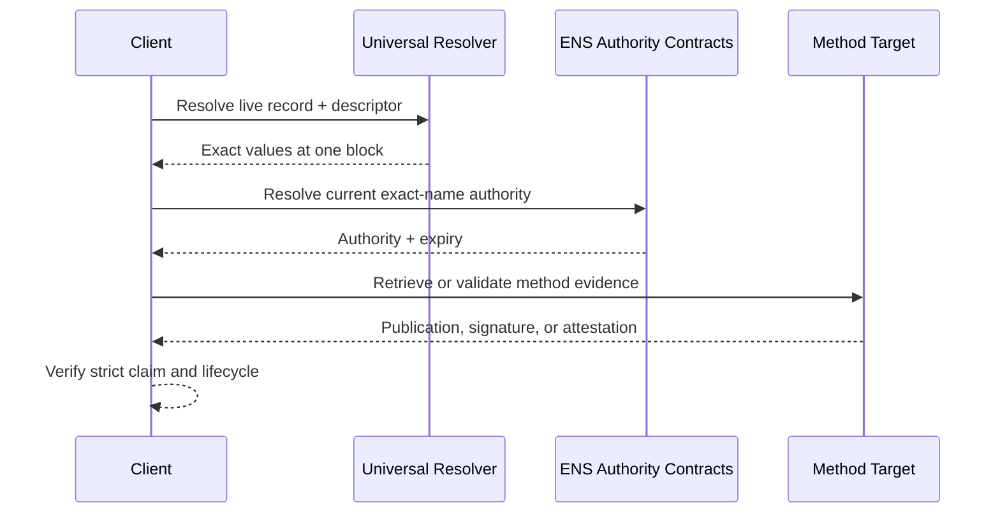

# ENS Resolver Record Verification

ENS resolver records state what a name resolves to. This protocol adds evidence
about one exact record without changing ordinary resolution or deploying a new
contract.

Positive results identify one relationship:

| Relationship    | Meaning                                                  |
| --------------- | -------------------------------------------------------- |
| `authorization` | Current ENS authority signed the exact live record.      |
| `control`       | Authorization plus participation by the external target. |
| `attestation`   | Authorization plus an issuer accepted by client policy.  |

A positive result does not mean safe, official, legal owner, non-malicious, or
endorsed by ENS.

Start with the [Quickstart](/docs/quickstart), then read the
[Specification Overview](/docs/spec/overview). The complete normative text is
the [ENSIP](/docs/spec/ensip).
