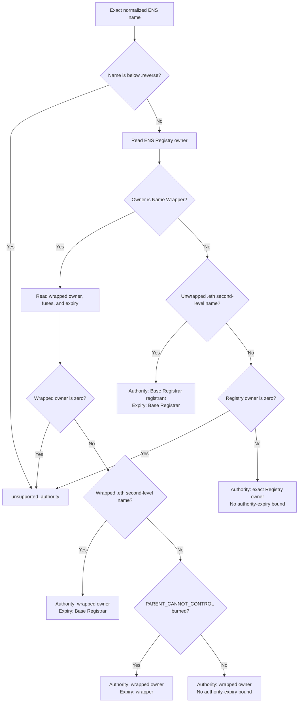

import {
  Accordion,
  AccordionContent,
  AccordionItem,
  AccordionTitle,
} from "../../../../components/accordion.tsx";

# Authority

Authority is the account allowed to approve verification for an exact ENS name. The verifier computes it from live ENS state. The proof does not provide or choose it.

```ts
resolve_authority(name, authority_version, evaluation_block)
  -> authority
  -> authorityValidUntil, when ENS exposes an ownership expiry
```

## Inputs

Authority resolution uses:

| Input              | Purpose                                                          |
| ------------------ | ---------------------------------------------------------------- |
| Normalized name    | Selects the exact name, not its parent or resolver.              |
| `authorityVersion` | Selects one immutable authority algorithm.                       |
| Evaluation block   | Pins ownership, expiry, records, and signatures to one snapshot. |

The descriptor field `a` is an authority algorithm version. It is not an ENS protocol version. A change to ENS ownership rules can allocate a new authority version without changing discovery, claims, methods, or results.

## Current ENS Profile

Authority Algorithm 1 applies to the current ENS deployment on Ethereum
mainnet.

| Contract       | Address                                      |
| -------------- | -------------------------------------------- |
| ENS Registry   | `0x00000000000C2E074eC69A0dFb2997BA6C7d2e1e` |
| Base Registrar | `0x57f1887a8BF19b14fC0dF6Fd9B2acc9Af147eA85` |
| Name Wrapper   | `0xD4416b13d2b3a9Bae7AcD5D6C2BbDBE25686401`  |

The selected authority depends on how the exact name is registered:



### Algorithm

Use the evaluation block for every contract call and its timestamp for every
expiry check.

The authority algorithm decides whether ownership is active at that snapshot.
For a live verification result, the Lifecycle component additionally requires
`checkedAt < authorityValidUntil` when an absolute authority expiry is returned.
This prevents an older block from extending authority past its known expiry.

1. Normalize the name with ENSIP-15 and calculate its namehash.
2. Reject every name at or below the `reverse` suffix.
3. Read `ENSRegistry.owner(node)`.
4. If the Registry owner is the Name Wrapper:
   1. read `NameWrapper.getData(uint256(node))`;
   2. require a nonzero exact wrapped owner;
   3. for a wrapped `.eth` second-level name, require the Base Registrar
      registration to be active and owned by the Name Wrapper, then use its
      expiry;
   4. for another name with `PARENT_CANNOT_CONTROL` burned, require its wrapper
      expiry to be active and use that expiry;
   5. otherwise select the wrapped owner without treating wrapper expiry as an
      ownership expiry.
5. Otherwise, for an unwrapped `.eth` second-level name:
   1. calculate `tokenId = uint256(keccak256(bytes(label)))`;
   2. require `BaseRegistrar.nameExpires(tokenId)` to be in the future;
   3. select `BaseRegistrar.ownerOf(tokenId)` and use the registration expiry.
6. For every other unwrapped name, require and select the nonzero exact
   `ENSRegistry.owner(node)`.
7. Require the selected account to equal `claim.authority`.
8. Validate `authoritySignature` for that account at the same evaluation block.

A wrapped `.eth` token stores registrar expiry plus the renewal grace period.
That stored wrapper value is not the verification-authority bound. Verification
authority ends when the active Base Registrar registration ends, at the start
of grace. This is a verification-policy cutoff; some stored resolver-management
permissions may continue to work during grace.

For other wrapped names, wrapper expiry has two meanings. If
`PARENT_CANNOT_CONTROL` is burned, expiry ends the child's independent
ownership. Without that fuse, expiry only resets fuses and the parent can
already replace the child; the wrapped owner does not disappear at that time.

## Reverse Names

Reverse names work differently from normal names. A name such as `<address>.addr.reverse` belongs logically to the address written in its label, but that address can assign another account as the node's Registry owner.

For example, Alice can assign a manager as the Registry owner of her reverse node. Reading only `ENSRegistry.owner(node)` would result the manager, even though Alice can call the Reverse Registrar and replace that manager at any time. The Registry owner is therefore not a reliable canonical authority for a reverse name.

Algorithm 1 therefore returns `unsupported_authority` for `.reverse` names. This does not mean reverse resolution is invalid; it means reverse ownership can not be used for record verification.

## Open Issues

<Accordion>
  <AccordionItem>
    <AccordionTitle>What happens when a subname's parent is re-registered?</AccordionTitle>
    <AccordionContent>

Suppose Bob owns unwrapped `team.alice.eth`. `alice.eth` expires and Carol
registers it. The ENS Registry still stores Bob as the child owner until Carol
replaces that child, so Algorithm 1 continues to accept Bob.

This follows the exact live child owner, but it does not prove that Carol
accepted Bob's subname in the new parent registration. ENS does not expose one
generic ownership-generation value that links every child to the current
generation of its parent.

The profile must either accept this behavior or add a stricter rule. Possible
rules include requiring current parent co-approval, accepting only an
unexpired emancipated wrapped child, or binding the proof to authenticated
ownership history. Each option changes normal subname delegation, so this
remains open.

    </AccordionContent>

  </AccordionItem>

  <AccordionItem>
    <AccordionTitle>Can an old proof become valid after an owner returns?</AccordionTitle>
    <AccordionContent>

Yes. Suppose Alice signs a proof, transfers the name to Bob, and later receives
the name back while the old claim is still within its signed lifetime. A
verifier sees Alice as the current authority again, so the old proof can pass
if the signed record value is also current again.

Current ENS does not expose one ownership-generation number for every kind of
name. The simplest rule is to accept reactivation and keep proof lifetimes
short. Preventing it requires an authority epoch, authenticated ownership-event
history, or another revocation value that changes on every ownership cycle.
The protocol must explicitly choose between those behaviors.

    </AccordionContent>

  </AccordionItem>

  <AccordionItem>
    <AccordionTitle>How should virtual names without an exact owner be supported?</AccordionTitle>
    <AccordionContent>

CCIP Read is only a way to fetch data. An exact onchain name remains supported
when its resolver uses CCIP Read. The unresolved case is a virtual child that
exists only through wildcard, DNSSEC, L2, or other offchain resolution and has
no exact owner in the ENS Registry.

Algorithm 1 rejects that virtual child. The ancestor owner, resolver, gateway,
gateway signer, and resolved address are not automatically its authority.

A future authority version must authenticate the exact name and owner from the
same revision as the record. It must also define the trust source, expiry,
finality, and replay protection for that state. If the owner is not an Ethereum
account, the common claim and signature format may also need a new version.

    </AccordionContent>

  </AccordionItem>
</Accordion>

## Decisions

<Accordion>
  <AccordionItem>
    <AccordionTitle>Why use one owner instead of every record writer?</AccordionTitle>
    <AccordionContent>

One name can have a registrant, Registry manager, operators, resolver
delegates, and parent control at the same time. Those accounts have different
permissions and are not equivalent owners.

The profile chooses one canonical account: the Base Registrar registrant for
an unwrapped `.eth` second-level name, the wrapped owner for a wrapped name, or
the exact Registry owner for another unwrapped name. Operators and resolver
delegates are not additional authorities.

This keeps the authority signature independent from record writing. Otherwise
one delegated writer could set the record, descriptor, and authority approval
without the name owner participating. Resolver permissions are also
implementation-specific and cannot be discovered through one common rule.

    </AccordionContent>

  </AccordionItem>

  <AccordionItem>
    <AccordionTitle>Why not use the stored wrapped .eth expiry?</AccordionTitle>
    <AccordionContent>

The Name Wrapper stores `.eth` second-level expiry as Base Registrar expiry
plus the 90-day grace period. `getData()` can therefore continue returning the
wrapped owner after the active registration has expired.

Using that timestamp would allow verification throughout grace. Algorithm 1
instead reads `BaseRegistrar.nameExpires()` and uses the actual registration
expiry. It does not derive the value by subtracting a hardcoded grace period,
so the source and meaning of the expiry remain explicit.

    </AccordionContent>

  </AccordionItem>

  <AccordionItem>
    <AccordionTitle>Why use the exact child owner instead of the parent?</AccordionTitle>
    <AccordionContent>

ENS supports delegated subnames. Requiring the parent to sign would remove that
independence and would disagree with the child ownership stored in the Registry
or Name Wrapper.

The parent may still replace a parent-controlled child. Verification follows
the live exact owner and changes when that replacement occurs. This rule does
not solve the stale unwrapped-child case after parent re-registration; that
remains an open issue above.

    </AccordionContent>

  </AccordionItem>

  <AccordionItem>
    <AccordionTitle>Why does an imported DNS name use its ENS owner?</AccordionTitle>
    <AccordionContent>

The DNS Registrar verifies a DNSSEC proof and writes the selected address into
the ENS Registry. After import, Algorithm 1 treats the name like another
non-`.eth` ENS name. If it is later wrapped, the wrapped owner is selected.

This proves approval by the current ENS owner, not continuing control of the
DNS domain. The DNS owner can publish a newer DNSSEC ownership record and
submit it to the DNS Registrar to take the ENS name back, but the imported ENS
owner does not expire automatically. Proving current DNS control would require
a separate DNSSEC authority profile with freshness and expiry rules.

    </AccordionContent>

  </AccordionItem>

  <AccordionItem>
    <AccordionTitle>Why use the same evaluation block?</AccordionTitle>
    <AccordionContent>

Reading the record at one block and authority at another can combine states
that never existed together. A transfer or record update between those reads
could incorrectly validate an old signer against a new value.

The target record, descriptor, authority, expiry, and ERC-1271 call therefore
use one Ethereum block reference. A future offchain profile must provide the
equivalent single authenticated revision for all of its reads.

    </AccordionContent>

  </AccordionItem>

  <AccordionItem>
    <AccordionTitle>Why fail when exact authority is unavailable?</AccordionTitle>
    <AccordionContent>

Falling back to a parent, resolver, gateway, or proof-supplied account changes
the meaning of authority and can let infrastructure approve records it does
not own.

Returning `unsupported_authority` is safe and makes the missing authority model
visible. A later profile can add support with explicit rules.

    </AccordionContent>

  </AccordionItem>
</Accordion>
