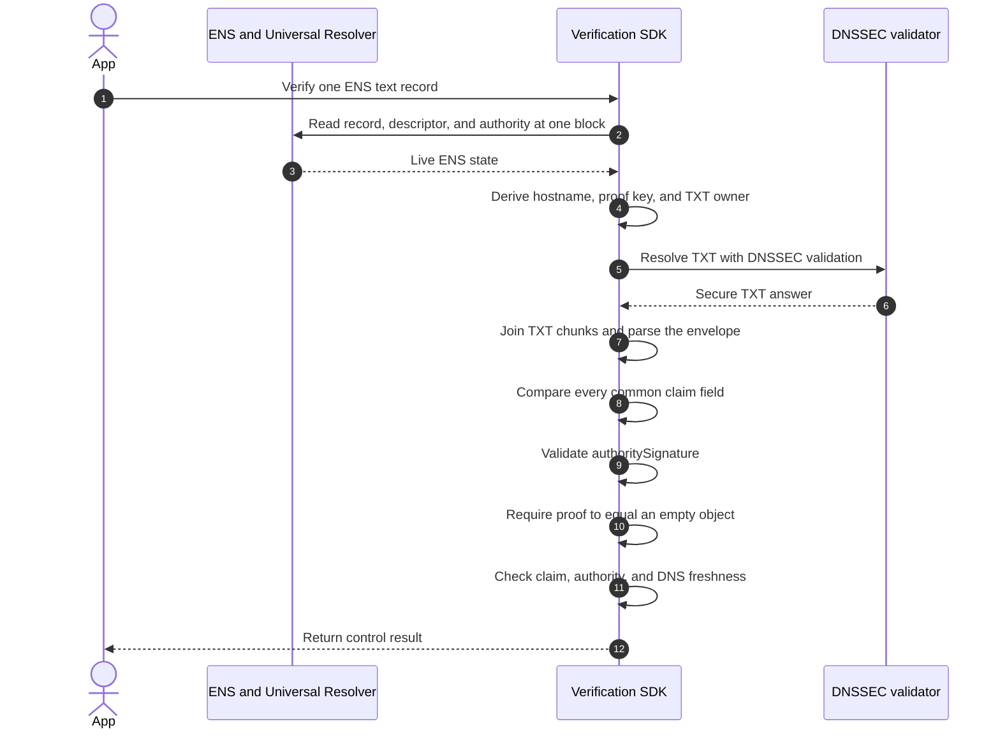

import {
  Accordion,
  AccordionContent,
  AccordionItem,
  AccordionTitle,
} from "../../../../components/accordion.tsx";

# Method: `dns-txt.v1`

`dns-txt.v1` verifies that a DNSSEC-authenticated TXT record contains a proof
envelope for one ENS URL record.

Use it when the URL operator can publish DNS records beneath the URL's hostname.
Use [`https-origin.v1`](./https-origin) when the operator can publish at the
HTTPS origin instead. A verifier applies only the method selected by the ENS
descriptor and never falls back between them.

## Supported Records

The method supports any `text(key)` whose complete value is an eligible HTTPS
URL. The exact text key remains part of the common claim and proof key.

```text
text("url")  = "https://example.com"
text("blog") = "https://example.com/blog"
```

## Descriptor

```text
ensrv1 a=1 m=dns-txt.v1
```

`u` is forbidden. The complete proof envelope is stored in DNS, so there is no
external proof URI.

## Target

Parse the text value using the URL rules in
[`https-origin.v1`](./https-origin#derive-the-target). Require a domain host;
IPv4 and IPv6 hosts are unsupported.

Set `target` to the exact URL hostname in lowercase ASCII A-label form:

```text
example.com
```

| Record value                            | `target`                |
| --------------------------------------- | ----------------------- |
| `https://example.com/profile`           | `example.com`           |
| `https://example.com:8443/profile`      | `example.com`           |
| `https://blog.example.com/post?draft=1` | `blog.example.com`      |
| `https://bücher.example/profile`        | `xn--bcher-kva.example` |

## TXT Owner

Encode the 32-byte proof key as lowercase unpadded [RFC 4648
base32](https://www.rfc-editor.org/rfc/rfc4648.html). The result must contain exactly
52 characters from `a-z2-7`.

Query QCLASS `IN`, QTYPE `TXT` at:

```text
<52-character-proof-key>._ens-record-verification.<target>.
```

For `example.com`, the owner has this form:

```text
orsxg5banfxhizlto5xxe3deorsxg5banfxhizlto5xxe3deorsq._ens-record-verification.example.com.
```

Construct the complete DNS wire name before querying. Reject it if any label
exceeds 63 octets or the complete name exceeds 255 octets.

## TXT Value

The logical TXT value is the complete proof-envelope JSON.

```json
{
  "v": "ensrv1",
  "claim": {
    "name": "alice.eth",
    "node": "0x787192fc5378cc32aa956ddfdedbf26b24e8d78e40109add0eea2c1a012c3dec",
    "recordType": "text",
    "recordKey": "url",
    "valueHash": "0x34174bbdf078fba55709ff82e2d5929de2e915c964d18dc57907afc851781142",
    "authorityVersion": "1",
    "authority": "0x1234567890abcdef1234567890abcdef12345678",
    "method": "dns-txt.v1",
    "target": "example.com",
    "issuedAt": "1783728000",
    "validUntil": "1786320000"
  },
  "authoritySignature": "0x<signature>",
  "proof": {}
}
```

### Parsing

A TXT RDATA may contain multiple character strings. The verifier must:

1. require exactly one TXT RDATA at the final proof owner;
2. concatenate its character strings in wire order without adding separators;
3. reject the value if the concatenated bytes exceed 2,048 bytes;
4. decode the bytes as strict UTF-8 JSON without a byte-order mark;
5. apply the common closed-envelope JSON rules; and
6. require `v` to equal `ensrv1`.

Never concatenate separate TXT RDATA. Zero RDATA means the proof is missing;
multiple RDATA are ambiguous and invalid. Quotes and chunk boundaries shown by
a DNS provider or zone-file editor are transport syntax and are not part of the
logical JSON value.

If the complete envelope exceeds 2,048 bytes, `dns-txt.v1` is unsupported for
that proof. Do not fall back to an external URI.

## DNSSEC Rules

A positive result requires DNSSEC state `Secure`. `Insecure`, `Bogus`, and
`Indeterminate` are non-positive results. Never fall back to unsigned DNS or
another verification method.

For public DNS names, validation must chain to the current [IANA root trust
anchor set](https://www.iana.org/dnssec/files). An SDK may validate locally or
use a trusted validating resolver over an authenticated channel. The `AD` bit
from an arbitrary network resolver is not sufficient.

A secure CNAME or DNAME delegation may be followed for at most eight steps.
Reject loops, conflicting answers, overlong synthesized names, or any alias
chain that is not entirely `Secure`. For DNAME, validate the signed DNAME and
its synthesized CNAME according to [RFC
6672](https://www.rfc-editor.org/rfc/rfc6672.html).

## Verification



A verifier succeeds only when it:

1. resolves the target record, descriptor, and authority at one evaluation
   block;
2. derives the target, proof key, and TXT owner from those live values;
3. validates the complete DNS answer and alias chain as `Secure`;
4. parses exactly one TXT RDATA using the rules above;
5. compares every common claim field with the live ENS inputs;
6. validates `authoritySignature` against the live exact-name authority;
7. requires `proof` to be exactly an empty object; and
8. requires the claim and DNS evidence to be current.

The minimal positive result is:

```json
{
  "verified": true,
  "verificationType": "control"
}
```

An SDK should expose `method: "dns-txt.v1"` and the canonical hostname as
diagnostic metadata.

## Lifetime And Caching

The maximum signed lifetime is one year:

```text
validUntil - issuedAt <= 31,536,000 seconds
```

A positive result must not be reused past the earliest of:

- five minutes after evaluation;
- `claim.validUntil`;
- `authorityValidUntil`, when present; and
- the DNSSEC validator's remaining secure-answer reuse bound.

The DNSSEC validator calculates its bound from every RRset and RRSIG used to
prove the chain and answer. A local five-minute cap does not evict a
longer-lived answer already cached by an upstream resolver, so publishers
should use a TXT TTL of at most five minutes.

## Security Boundary

This method proves that DNSSEC-authenticated DNS for the exact URL hostname
published the authority-signed proof for this ENS record. That is sufficient to
return `verificationType: "control"` for the hostname binding.

It does not prove control of the URL path, query, fragment, port, or web server.
It also does not establish legal ownership, organizational identity, or content
safety. A securely delegated DNS provider is inside this method's control
boundary.

## Decisions

<Accordion>
  <AccordionItem>
    <AccordionTitle>Why use a hostname instead of a DNS URI?</AccordionTitle>
    <AccordionContent>

The claim target identifies the hostname whose control is being verified. An
RFC 4501 DNS URI identifies a particular RRset and can also select a resolver,
class, and type. Those are proof-retrieval details determined by this method,
not part of the target identity.

Using the raw canonical hostname also avoids misinterpreting `dns:example.com`
as an RFC 4501 URI for the default `IN A` RRset.

    </AccordionContent>

  </AccordionItem>

  <AccordionItem>
    <AccordionTitle>Why use base32 instead of hexadecimal?</AccordionTitle>
    <AccordionContent>

A 32-byte proof key needs 64 hexadecimal characters, but a DNS label can
contain at most 63 octets. Lowercase unpadded base32 represents the same key in
52 DNS-safe characters and fits in one label.

    </AccordionContent>

  </AccordionItem>

  <AccordionItem>
    <AccordionTitle>Why store JSON directly in TXT?</AccordionTitle>
    <AccordionContent>

DNSSEC authenticates the TXT RRset, so the published envelope is already
target-controlled evidence. An outer prefix, proof URI, or separate claim
digest would duplicate information already carried by the dedicated proof
owner and the envelope's `v` and `claim` fields.

Inline JSON removes the second HTTPS request and its WebPKI, redirect, CORS,
SSRF, hosting, and caching requirements. The 2,048-byte limit keeps the method
bounded; proofs that do not fit require a future method with different
transport rules.

    </AccordionContent>

  </AccordionItem>

  <AccordionItem>
    <AccordionTitle>Why use the exact host instead of its parent domain?</AccordionTitle>
    <AccordionContent>

Subdomains can be delegated independently. A proof for `blog.example.com`
therefore belongs beneath that exact hostname, not `example.com`. This also
avoids dependence on the changing Public Suffix List.

    </AccordionContent>

  </AccordionItem>
</Accordion>
