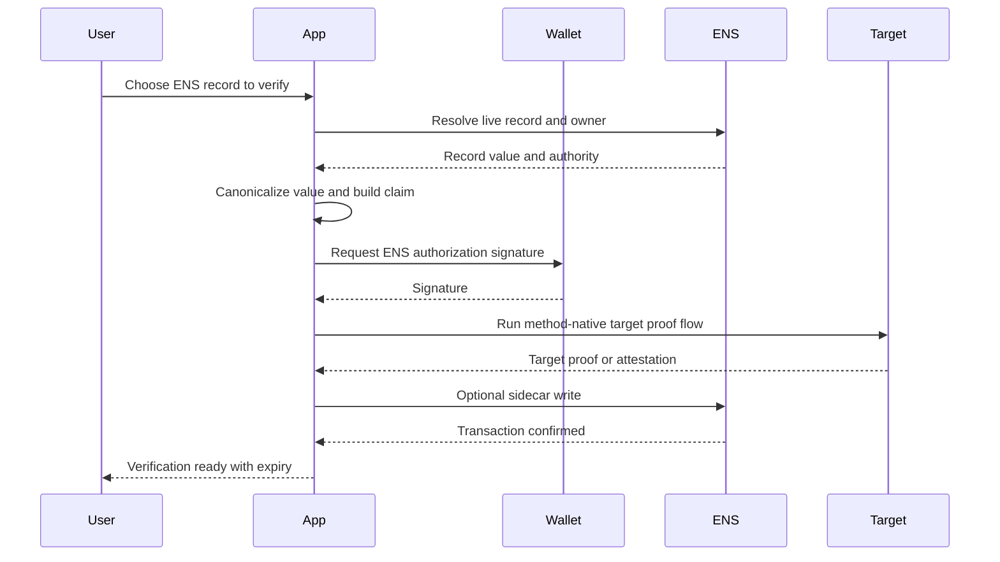
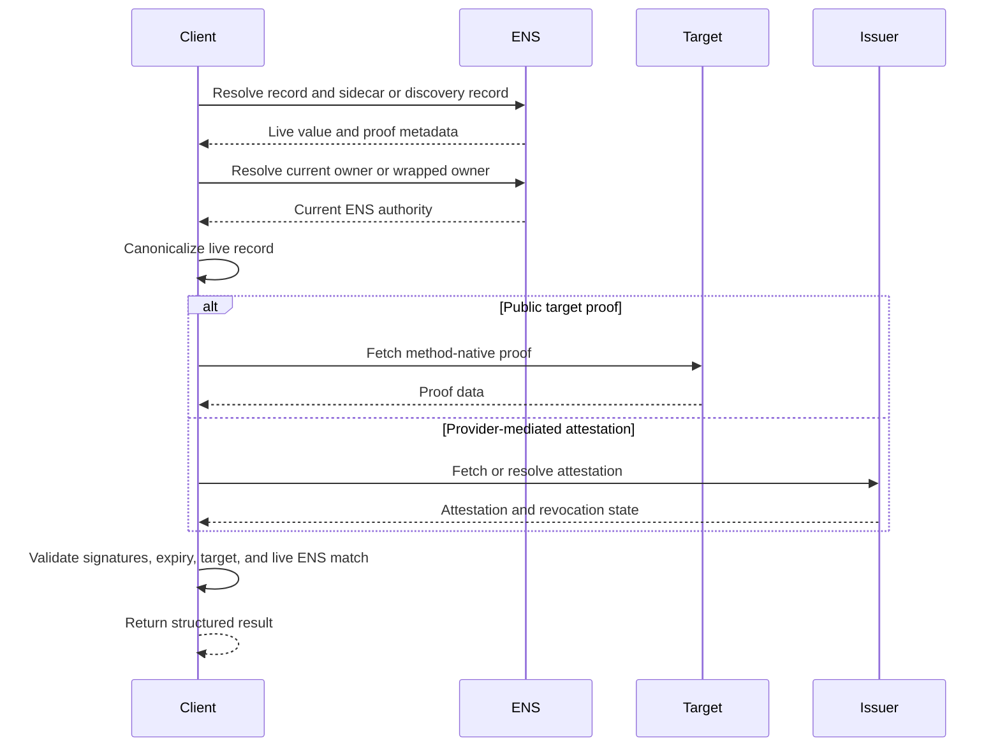

# Verification Kernel

The kernel defines shared rules used by all method profiles. It is not a
mandatory singleton proof format. Method profiles may publish proofs as ENS text
records, DNS TXT records, HTTPS files, EIP-712 signatures, ERC-1271 contract
responses, EAS attestations, provider attestations, or content manifests.

## Core Terms

| Term | Meaning |
| --- | --- |
| ENS context | `chainId`, registry address, normalized name, and node. |
| Record selector | The resolver call being verified, such as `text("url")`, `addr(60)`, or `contenthash()`. |
| Canonical value | Method-defined canonical representation of the live resolver value. |
| ENS authority | Current owner, wrapped owner, or explicit scoped delegate for the ENS name. |
| Target authority | The external account, website, DNS host, social account, publisher key, or issuer being checked. |
| Method profile | Versioned verification method, such as `url-https@1` or `addr-evm-eip712@1`. |
| Sidecar | Optional ENS text record that anchors proof metadata for a specific claim. |

## Result Levels

Verification clients MUST return structured levels, not a single overloaded
boolean.

| Level | Meaning |
| --- | --- |
| `unverified` | The record exists, but no accepted proof was found. |
| `ens-authorized` | Current ENS authority authorized the value, but no target confirmation was checked. |
| `target-confirmed` | Target evidence exists, but live ENS state or ENS authorization is missing. |
| `bidirectional` | Live ENS state and target evidence validate the same claim. |
| `provider-mediated` | A provider or verifier attested to a claim that clients cannot independently refetch. |
| `attested` | A third-party issuer made a structured claim. |
| `expired` | Proof, sidecar, delegation, or attestation is past its validity window. |
| `unsupported-method` | The client does not support the advertised method. |
| `invalid` | A proof exists but fails validation. |

## Canonical Verification Context

Every method profile MUST bind at least the following fields:

```json
{
  "chainId": 1,
  "registry": "0x00000000000C2E074eC69A0dFb2997BA6C7d2e1e",
  "name": "alice.eth",
  "node": "0x...",
  "record": {
    "kind": "text",
    "key": "url",
    "selector": "text(bytes32,string)",
    "canonicalValue": "https://example.com",
    "valueHash": "0x..."
  },
  "method": "url-https@1",
  "issuedAt": 1783123200,
  "expiresAt": 1790812800,
  "nonce": "0x..."
}
```

The exact encoding is method-defined. EVM signatures SHOULD use EIP-712 typed
data. Non-EVM and provider-mediated methods MAY use their native canonical
encoding, but MUST bind the same semantic fields.

## ENS Authority

Default authority resolution:

1. Normalize the ENS name.
2. Compute `node = namehash(name)`.
3. Query `ENSRegistry.owner(node)`.
4. If owner is the canonical Name Wrapper, query wrapped ownership.
5. If a method supports delegation, validate scoped delegation.
6. Otherwise, the current owner or wrapped owner is the ENS authority.

Verifier behavior:

- A proof signed by a previous owner MUST fail.
- A proof signed by a resolver writer alone MUST NOT count as ENS authority.
- A scoped delegate MUST be limited by record class, method, name/node, and
  expiry.

## Optional Sidecar Convention

Method profiles MAY define sidecar text records. Sidecar keys SHOULD follow
ENSIP-5 global-key style and ENSIP-25/26 parameter style:

```text
<category>-verification[<parameter-1>][<parameter-2>]
```

Parameters MUST define canonical encoding and MUST NOT contain `[` or `]`
unless percent-encoded by the method profile.

Recommended compact value format:

```text
v=<VERSION>;method=<method-id>;digest=<proofDigest>;exp=<unix-time>;uri=<optional-uri>
```

Parsing rules:

- field names are case-sensitive;
- fields are separated by semicolons;
- duplicate fields invalidate the sidecar;
- unknown fields MAY be ignored unless a method profile says otherwise;
- `exp` MUST be a base-10 Unix timestamp in seconds;
- empty or absent sidecar means no sidecar is available.

Sidecars are optional publication modes. A method profile may instead use a
resolver-native response, attestation reference, or target-only proof.

## EIP-712 ENS Authorization

When a method needs explicit ENS authority authorization, the recommended typed
message is:

```solidity
EIP712Domain(
  string name,
  string version,
  uint256 chainId,
  address verifyingContract
)

ENSRecordVerification(
  bytes32 node,
  string name,
  string recordKind,
  string recordKey,
  bytes32 valueHash,
  string method,
  bytes32 targetHash,
  uint64 issuedAt,
  uint64 expiresAt,
  bytes32 nonce
)
```

Domain values:

```text
name = "ENS Record Verification"
version = "1"
chainId = ENS registry chain ID
verifyingContract = ENS registry address or method-specific verifier contract
```

Contract-account signatures MUST use ERC-1271:

```solidity
isValidSignature(bytes32 hash, bytes signature) returns (bytes4)
```

The magic value is `0x1626ba7e`.

## Generic User Flow



## Generic Verifier Flow



## Cache Rules

Positive results MUST NOT be cached past the earliest of:

- proof `expiresAt`;
- sidecar `exp`;
- delegate expiry;
- attestation expiry or revocation;
- DNS TTL for DNS methods;
- HTTP cache lifetime for HTTPS methods;
- next observed ENS record, owner, resolver, or wrapper ownership change.

Negative results MAY be cached briefly, but clients SHOULD allow manual refresh
because target proofs can be published after the ENS record is set.

## Failure Handling

Verification failure MUST NOT hide the underlying ENS record. Clients SHOULD
display the record as unverified and include a machine-readable failure reason:

```json
{
  "level": "invalid",
  "reason": "target_signature_mismatch",
  "record": "text:url",
  "method": "url-https@1"
}
```

## Common Failure Reasons

| Reason | Meaning |
| --- | --- |
| `record_missing` | Resolver returned empty or unsupported record. |
| `sidecar_missing` | Method requires a sidecar and none was found. |
| `sidecar_malformed` | Sidecar parsing failed. |
| `owner_changed` | Proof signer is no longer current ENS authority. |
| `delegate_invalid` | Delegate is missing, expired, or out of scope. |
| `target_missing` | Target proof could not be found. |
| `target_mismatch` | Target proof binds a different name, value, or method. |
| `signature_invalid` | EOA recovery or ERC-1271 validation failed. |
| `attestation_revoked` | Issuer attestation was revoked. |
| `expired` | Expiry boundary has passed. |
| `unsupported_method` | Client does not implement the method profile. |

