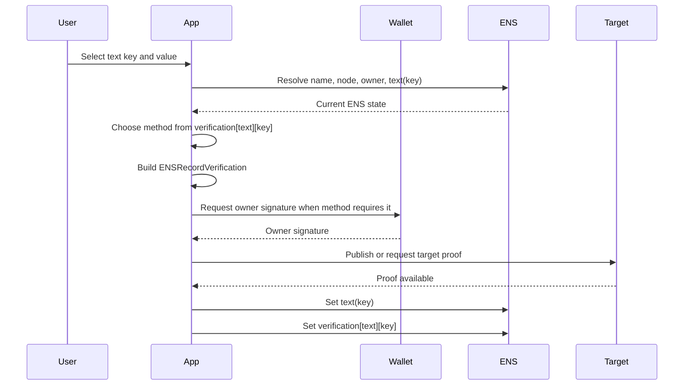
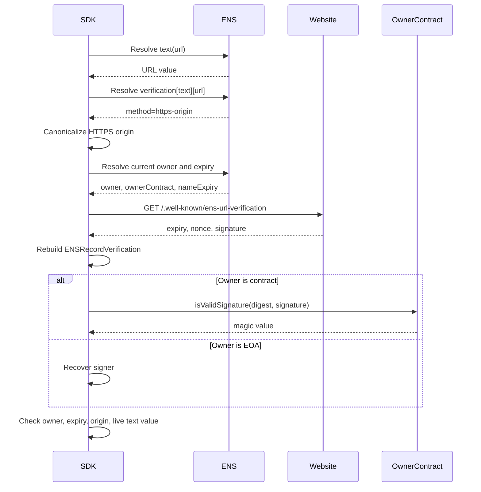
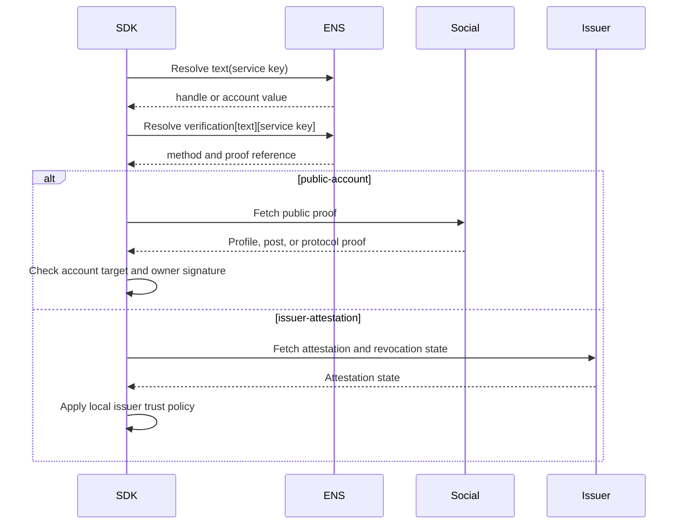
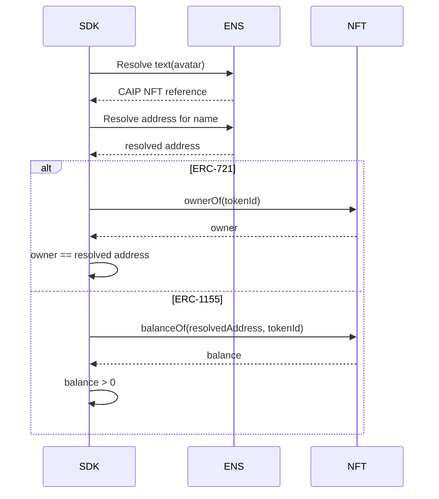

# Text Record Verification

Text verification applies to any ENSIP-5 text record:

```text
text(node, key)
```

The verification record is also a text record:

```text
text(node, "verification[text][<key>]")
```

This layout avoids hard-coding top-level groups such as URL or social. The text
key identifies the record; the verification record value identifies the method.

## Verification Record

Examples:

```text
verification[text][url] = v=ENS-VERIFY-1;method=https-origin;uri=https://example.com/.well-known/ens-url-verification;expiry=1790812800
verification[text][com.github] = v=ENS-VERIFY-1;method=public-account;uri=https://github.com/alice/...
verification[text][avatar] = v=ENS-VERIFY-1;method=caip-nft
verification[text][description] = v=ENS-VERIFY-1;method=none
```

`method=none` explicitly advertises no proof. It always returns `status=none`.

## Canonical Claim

```text
record = "text:<key>"
valueHash = keccak256(bytes(textValue))
target = method-defined target
```

Method profiles MAY define stricter canonicalization. For example,
`https-origin` parses the text value as a URL and derives the target origin.

## Initial Text Methods

| Method | Example key | Target | Proof |
| --- | --- | --- | --- |
| `none` | `description` | None | No proof advertised. |
| `https-origin` | `url` | HTTPS origin | Owner signature plus well-known HTTPS proof. |
| `dns-host` | `url` | DNS host | Owner signature plus DNS TXT proof. |
| `public-account` | `com.github` | Stable account ID or handle | Public profile/post/protocol proof. |
| `issuer-attestation` | Any text key | Issuer subject | Signed or onchain attestation. |
| `caip-nft` | `avatar` | CAIP NFT reference | Live NFT ownership by resolved address. |

Future text keys reuse this document by defining a new `method` value or using
an existing method.

## Generic 0-to-1 Flow



## URL Method Flow

For `text(node, "url")`:

```text
verification[text][url] = v=ENS-VERIFY-1;method=https-origin;uri=https://example.com/.well-known/ens-url-verification
```



DNS uses `method=dns-host` and `_ens-url-verification.<host>. TXT`.
DNSSEC validation is verifier evidence, not a separate signed method.

## Social Account Flow

For `text(node, "com.github")`:

```text
verification[text][com.github] = v=ENS-VERIFY-1;method=public-account;uri=https://github.com/alice/...
```



Service profiles SHOULD use stable account IDs when available. OAuth tokens and
private API responses MUST NOT be published in ENS.

## Avatar NFT Flow

For `text(node, "avatar")` containing a CAIP NFT reference:

```text
verification[text][avatar] = v=ENS-VERIFY-1;method=caip-nft
```



`caip-nft` is a deterministic live-state check and does not require an owner
signature.

## No-Proof Metadata

Display metadata such as `name`, `description`, `location`, `keywords`, and
theme fields usually has no external target. Use no verification record or:

```text
verification[text][description] = v=ENS-VERIFY-1;method=none
```

Applications MAY display the metadata but MUST NOT show it as verified.

## SDK Checklist

- Resolve `text(node, key)` and `verification[text][key]` together.
- Treat missing verification records and `method=none` as `status=none`.
- Let the method define target parsing and proof fetching.
- Re-read the live text value before returning `verified`.
- Reject owner-signed proofs where `expiry` exceeds name expiry.
- Cache only until the earliest of proof expiry, verification record expiry,
  target cache lifetime, name expiry, owner change, resolver change, text value
  change, or verification record change.

## Failure Mapping

| Case | Error |
| --- | --- |
| Empty text value | `record_missing` |
| Missing verification record | none |
| `method=none` | none |
| Unknown method | `unsupported_method` |
| Target proof missing | `proof_missing` |
| Target mismatch | `target_mismatch` |
| Owner signature fails | `signature_invalid` |
| Issuer untrusted | `issuer_untrusted` |
