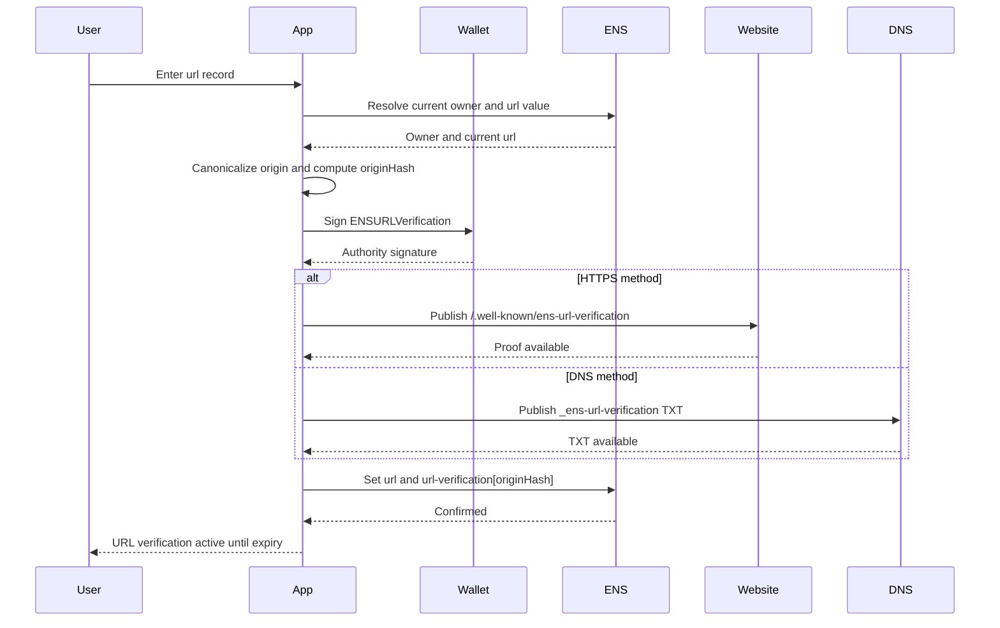
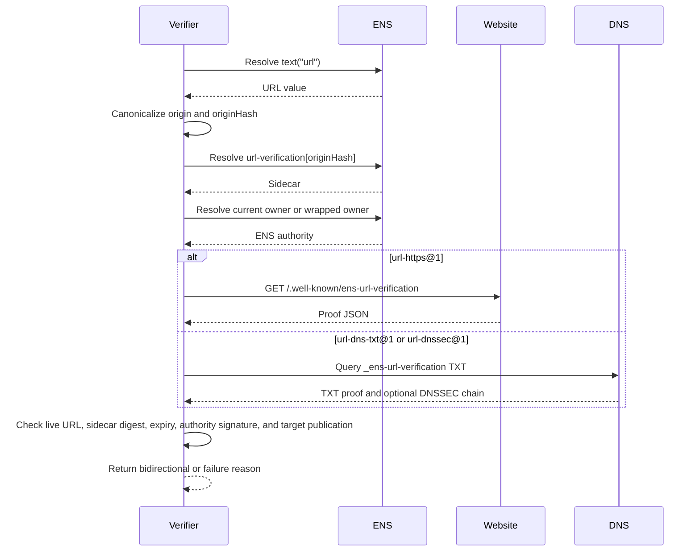

# URL and Web Origin Verification

URL verification applies to ENS records that point to a web origin:

- `text("url")`
- URL-valued agent endpoints such as `agent-endpoint[web]`
- URL-valued media records when the URL itself is the identity target

This profile verifies control of a web origin or DNS host. It does not verify
site safety, trademark ownership, or legal identity.

## Method Profiles

| Method | Target Authority | Result Level |
| --- | --- | --- |
| `url-https@1` | HTTPS origin | `bidirectional` |
| `url-dns-txt@1` | DNS host | `bidirectional` |
| `url-dnssec@1` | DNSSEC-validated host | `bidirectional` with stronger evidence |

## ENS Record and Sidecar

Canonical record:

```text
text(node, "url") = https://example.com/path?x=1
```

Sidecar key:

```text
url-verification[<originHash>]
```

Where:

```text
originHash = keccak256(bytes(canonicalOrigin))
```

Sidecar value:

```text
v=ENSURL1;method=url-https@1,url-dns-txt@1;digest=<proofDigest>;exp=<unix-time>
```

Rules:

- The sidecar is REQUIRED for `bidirectional` URL verification.
- The live `url` record remains canonical and MUST still match.
- `digest` is the digest of the URL proof object.
- `exp` MUST equal `proof.expiresAt`.
- A missing or invalid sidecar returns `unverified`, not record failure.

## URL Canonicalization

The verifier MUST parse the live `url` value and derive `canonicalOrigin`.

Valid URL requirements:

- absolute URL;
- `https` scheme;
- host present;
- no username or password;
- no IP literal;
- no `localhost`;
- no empty host.

Canonical origin algorithm:

1. Lowercase scheme to `https`.
2. Convert host to DNS A-label using IDNA.
3. Lowercase host.
4. Remove one trailing dot.
5. Omit port `443`.
6. Include non-default ports.
7. Drop path, query, and fragment.

Examples:

| URL | Canonical Origin |
| --- | --- |
| `https://Example.COM/` | `https://example.com` |
| `https://example.com:443/a` | `https://example.com` |
| `https://example.com:8443/a` | `https://example.com:8443` |

## Proof Object

HTTPS and DNS methods use the same proof object.

```json
{
  "type": "ENSURLVerification",
  "version": 1,
  "chainId": 1,
  "registry": "0x00000000000C2E074eC69A0dFb2997BA6C7d2e1e",
  "name": "alice.eth",
  "node": "0x...",
  "recordKey": "url",
  "origin": "https://example.com",
  "method": "url-https@1",
  "ensAuthority": "0x1111111111111111111111111111111111111111",
  "issuedAt": 1783123200,
  "expiresAt": 1790812800,
  "nonce": "0x2222222222222222222222222222222222222222222222222222222222222222",
  "signature": "0x..."
}
```

Signature:

- EOA authority: EIP-712 signature by `ensAuthority`.
- Contract authority: ERC-1271 validation on `ensAuthority`.
- Signed fields MUST include `chainId`, `registry`, `node`, `recordKey`,
  `origin`, `method`, `issuedAt`, `expiresAt`, and `nonce`.

Maximum validity: 90 days.

## HTTPS Publication

For `url-https@1`, publish proof at:

```text
<canonicalOrigin>/.well-known/ens-url-verification
```

Response requirements:

- HTTPS with normal WebPKI validation;
- HTTP status `200`;
- UTF-8 JSON body;
- body size at most 64 KiB;
- no redirect to a different origin;
- same-origin redirects MAY be followed.

Recommended content type:

```text
application/ens-url-verification+json
```

## DNS TXT Publication

For `url-dns-txt@1`, publish:

```text
_ens-url-verification.<host>. TXT "ENSURL1 <base64url-json-proof>"
```

Rules:

- Concatenate multiple TXT character strings in order.
- If multiple TXT records exist, any one valid proof is enough.
- DNS TXT MUST NOT verify a URL with a non-default HTTPS port.
- DNSSEC validation upgrades method result to `url-dnssec@1`.

## User Setup Flow



## Independent Verification Flow



## API and Indexer Verification

An API or indexer can precompute candidates from ENS events:

- `TextChanged(node, "url", value)`;
- `TextChanged(node, "url-verification[...]", value)`;
- registry owner changes;
- Name Wrapper transfers;
- resolver changes.

The indexer MUST still fetch live HTTPS or DNS evidence before returning a
positive result. A stale database row is not a verification result.

Recommended API response:

```json
{
  "name": "alice.eth",
  "record": "text:url",
  "value": "https://example.com/",
  "canonicalTarget": "https://example.com",
  "level": "bidirectional",
  "method": "url-https@1",
  "expiresAt": 1790812800,
  "checkedAt": 1783200000,
  "evidence": {
    "sidecarKey": "url-verification[0x...]",
    "proofUrl": "https://example.com/.well-known/ens-url-verification"
  }
}
```

Cache until the earliest of proof expiry, sidecar expiry, HTTP cache expiry,
DNS TTL, or next relevant ENS event.

## Security Notes

- A verified URL proves control of the ENS name and origin/host at validation
  time. It does not prove the website is safe.
- Shared origins cannot be verified for user-specific paths.
- DNS TXT without DNSSEC depends on resolver trust.
- HTTPS proof fetches leak verification interest to the website.
- Clients should display the verified origin, not arbitrary URL text.

