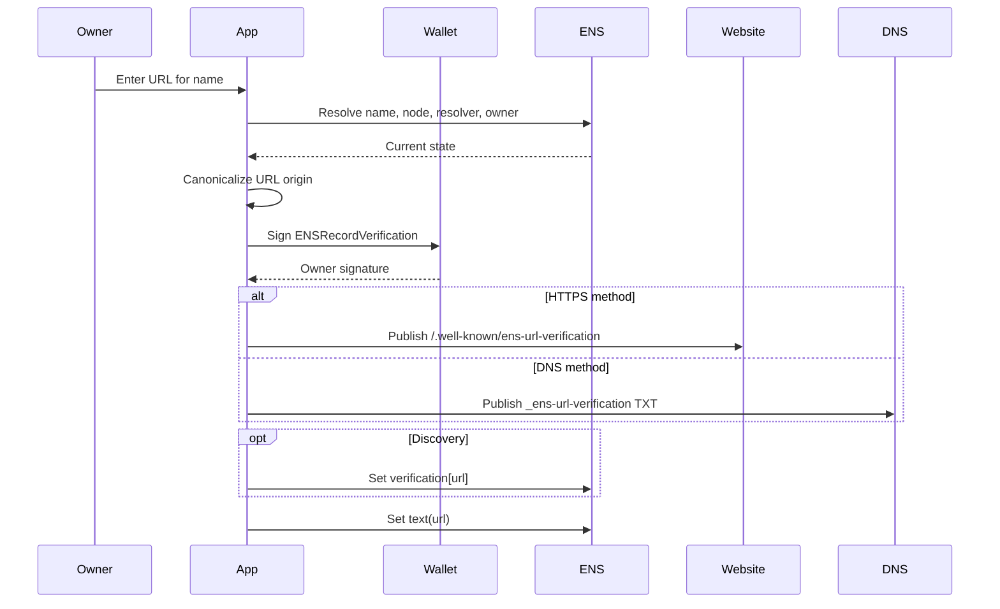
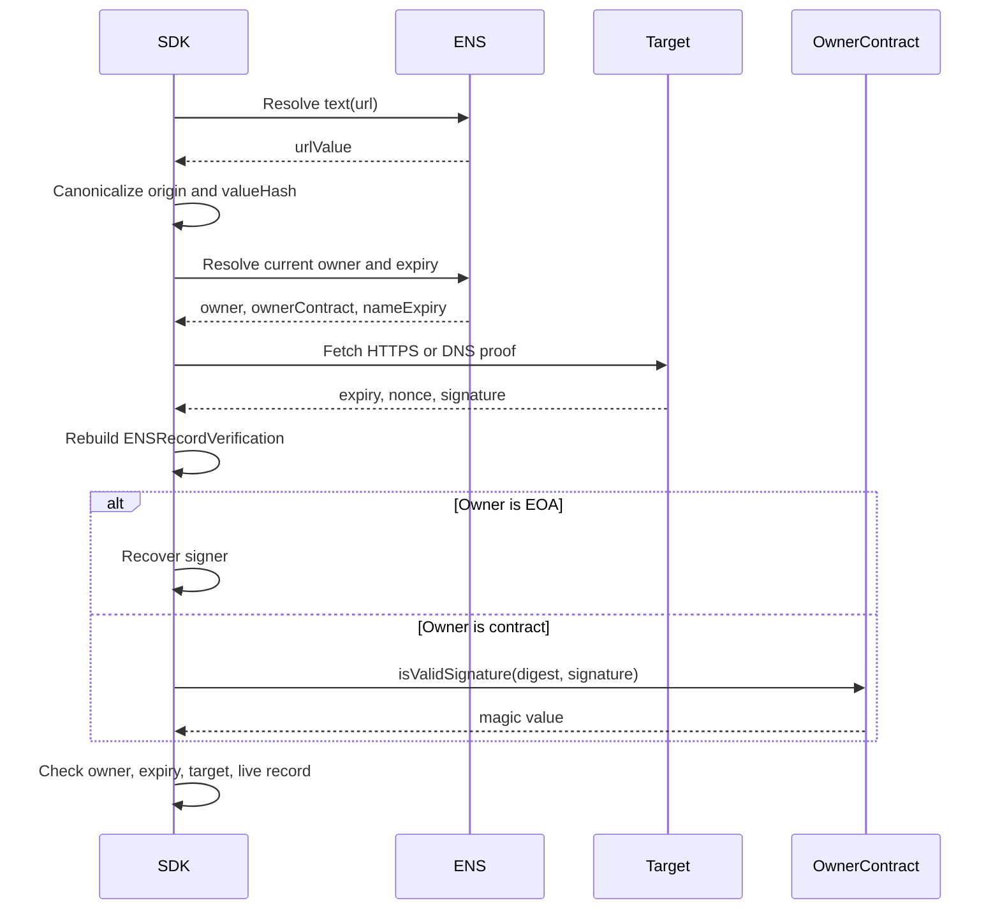

# URL Verification

URL verification applies to:

```text
text(node, "url")
```

It proves that the current ENS owner authorized the live URL record and that the
website origin or DNS host currently publishes a matching proof.

## Records

| Item | Value |
| --- | --- |
| ENS record | `text(node, "url")` |
| Discovery record | `text(node, "verification[url]")` |
| Methods | `url:https`, `url:dns` |
| Result | `verified/control` |

## Canonical Values

```text
record = "text:url"
valueHash = keccak256(bytes(urlValue))
target = canonical HTTPS origin
```

The URL MUST be absolute HTTPS, MUST NOT contain username or password, MUST NOT
use an IP literal, and MUST NOT use `localhost`.

The origin is scheme, host, and optional non-default port. Path, query, and
fragment are not part of the target.

## 0-to-1 Setup Flow



## HTTPS Proof

Publish at:

```text
<origin>/.well-known/ens-url-verification
```

Body:

```json
{
  "v": "ENS-VERIFY-1",
  "expiry": 1790812800,
  "nonce": "0x2222222222222222222222222222222222222222222222222222222222222222",
  "signature": "0x..."
}
```

The verifier reconstructs:

```text
name
node
record = "text:url"
valueHash
target = origin
method = "url:https"
expiry
nonce
```

## DNS Proof

Publish:

```text
_ens-url-verification.<host>. TXT "ENS-VERIFY-1 <expiry> <nonce> <signature>"
```

DNS verification MUST NOT be accepted for non-default HTTPS ports. DNSSEC is
evidence in the result, not a separate signed method.

## Verification Flow



## SDK Checklist

- Re-read `text(node, "url")` before returning a positive result.
- Verify the current owner at the same chain/registry context used for signing.
- Reject stale proofs where `expiry <= now`.
- Reject proofs where `expiry` exceeds name expiry.
- Reject DNS proofs for non-default ports.
- Cache only until the earliest of proof expiry, DNS TTL, HTTP cache lifetime,
  name expiry, owner change, resolver change, or record change.

## Failure Mapping

| Case | Error |
| --- | --- |
| Empty URL record | `record_missing` |
| Invalid URL | `record_invalid` |
| No target proof | `proof_missing` |
| Signature fails | `signature_invalid` |
| Signer is not current owner | `owner_mismatch` |
| Proof expired | `expired` |
