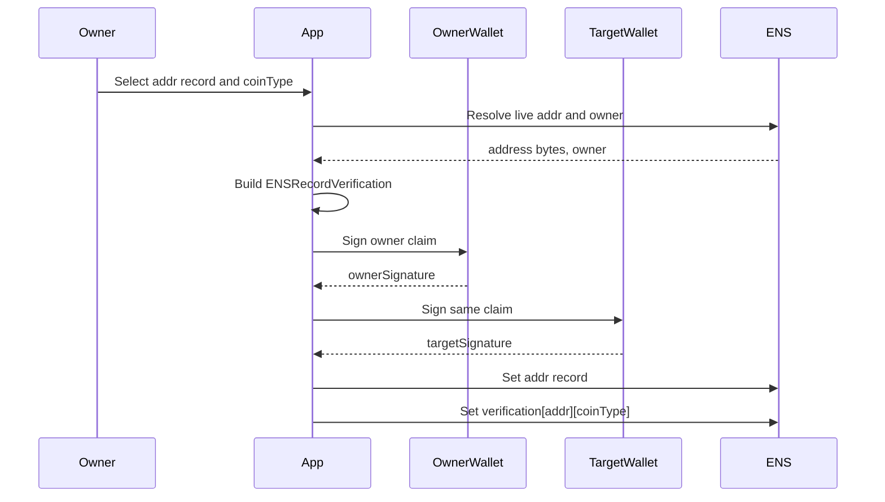
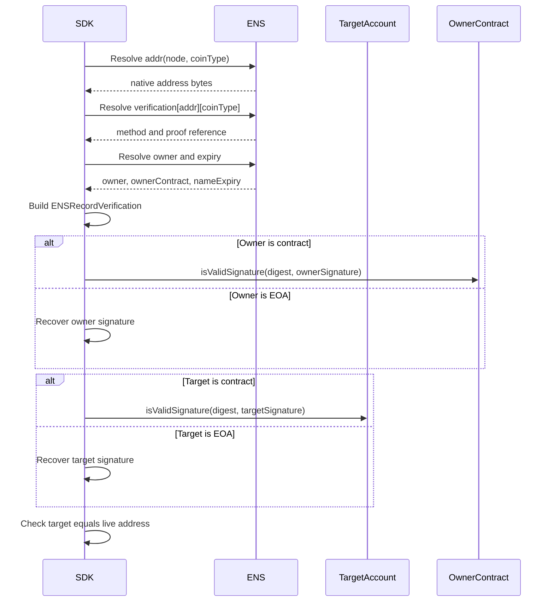
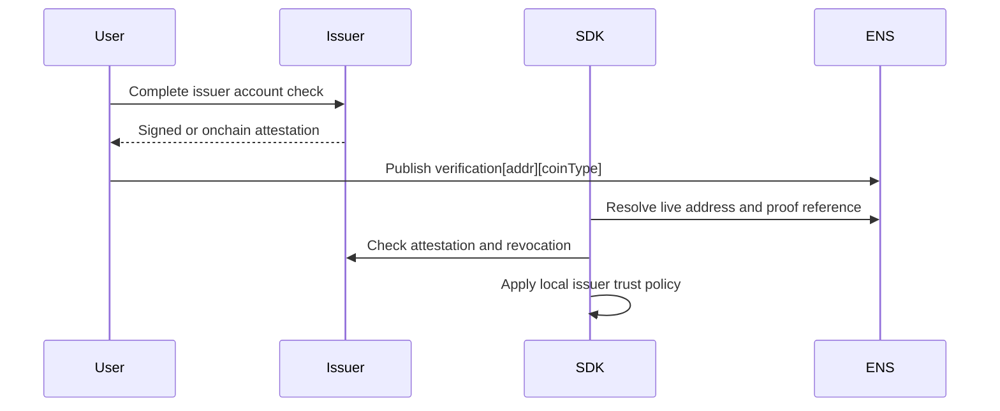

# Addr Record Verification

Addr verification applies to ENSIP-9 address records:

```text
addr(node)
addr(node, coinType)
```

The verification record is:

```text
text(node, "verification[addr][<coinType>]")
```

For `addr(node)`, `<coinType>` is `60`.

## Verification Record

Examples:

```text
verification[addr][60] = v=ENS-VERIFY-1;method=account-signature;uri=ipfs://...
verification[addr][0] = v=ENS-VERIFY-1;method=issuer-attestation;uri=eas:...
verification[addr][60] = v=ENS-VERIFY-1;method=none
```

## Canonical Claim

```text
record = "addr:<coinType>"
valueHash = keccak256(nativeAddressBytes)
target = method-defined account identifier
```

For EVM addresses, `nativeAddressBytes` are the 20 raw address bytes. Display
checksum is not signed.

## Initial Addr Methods

| Method | Verification |
| --- | --- |
| `none` | No proof advertised. |
| `account-signature` | Current owner signature plus target account signature. |
| `issuer-attestation` | Trusted issuer attestation. |

## 0-to-1 Flow



## Proof Object

```json
{
  "v": "ENS-VERIFY-1",
  "expiry": 1790812800,
  "nonce": "0x...",
  "ownerSignature": "0x...",
  "targetSignature": "0x..."
}
```

Both signatures cover the same `ENSRecordVerification` digest. For contract
owners or contract target accounts, the verifier calls ERC-1271.

## Verification Flow



## Attestation Flow



## SDK Checklist

- Use ENSIP-9 binary address bytes for `valueHash`.
- Include `coinType` in the signed `record`.
- Require owner signature for `account-signature`.
- Require target signature for `account-signature`.
- Use ERC-1271 for contract owners and contract target accounts.
- Revalidate before high-value transfers.

## Failure Mapping

| Case | Error |
| --- | --- |
| Empty address | `record_missing` |
| Verification record missing | none |
| `method=none` | none |
| Unsupported coin type | `unsupported_method` |
| Owner signature fails | `signature_invalid` |
| Target signature fails | `target_signature_invalid` |
| Attestation issuer untrusted | `issuer_untrusted` |
