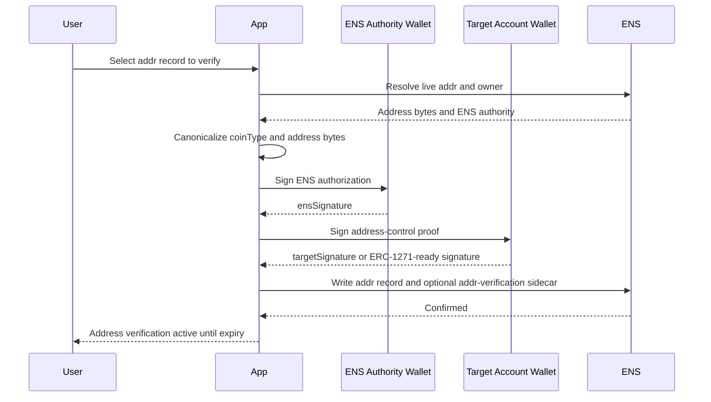
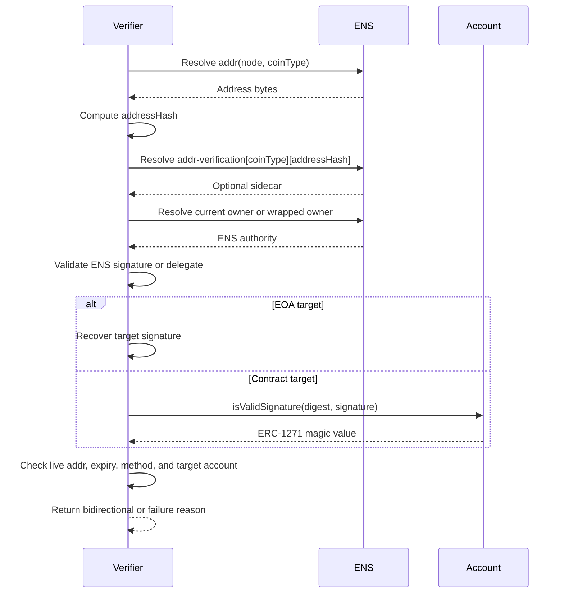

# Address Verification

Address verification applies to ENS address records:

- `addr(bytes32)` for Ethereum mainnet address compatibility;
- `addr(bytes32,uint256 coinType)` for multicoin records;
- EVM chain-derived coin types from ENSIP-11.

This profile verifies account control. It does not prove willingness to receive
funds, legal ownership, sanctions status, or safety.

## Method Profiles

| Method | Target Authority | Result Level |
| --- | --- | --- |
| `addr-evm-eip712@1` | EVM EOA address | `bidirectional` |
| `addr-evm-erc1271@1` | EVM contract account | `bidirectional` |
| `addr-chain-specific@1` | Non-EVM account | Chain-specific |
| `addr-attestation@1` | Issuer attestation | `attested` or `provider-mediated` |

## ENS Record and Sidecar

Canonical record examples:

```text
addr(node) = 0x1111111111111111111111111111111111111111
addr(node, 60) = 0x1111111111111111111111111111111111111111
addr(node, 0) = <bitcoin scriptPubKey bytes>
```

Sidecar key:

```text
addr-verification[<coinType>][<addressHash>]
```

Where:

```text
addressHash = keccak256(canonicalAddressBytes)
```

Sidecar value:

```text
v=ENSADDR1;method=addr-evm-eip712@1;digest=<proofDigest>;exp=<unix-time>
```

Rules:

- Sidecar is RECOMMENDED for discoverability and caching.
- EVM target signature is REQUIRED for `bidirectional`.
- If the ENS authority and target account are the same account, one signature
  MAY satisfy both roles if the signed message explicitly states both roles.
- Contract accounts MUST validate with ERC-1271.

## Address Canonicalization

EVM:

- `coinType = 60` is Ethereum mainnet.
- ENSIP-11 EVM coin types derive from `0x80000000 | chainId`.
- Canonical EVM value is 20 raw address bytes.
- Display value SHOULD use EIP-55 checksum.

Non-EVM:

- Use ENSIP-9 native binary encoding.
- Method profile MUST define signing algorithm and canonical target bytes.
- If no robust signing standard exists, return `unverified` or `attested`.

## Proof Object

```json
{
  "type": "ENSAddressVerification",
  "version": 1,
  "chainId": 1,
  "registry": "0x00000000000C2E074eC69A0dFb2997BA6C7d2e1e",
  "name": "alice.eth",
  "node": "0x...",
  "record": {
    "kind": "addr",
    "coinType": 60,
    "canonicalAddress": "0x1111111111111111111111111111111111111111",
    "addressHash": "0x..."
  },
  "targetAccount": "0x1111111111111111111111111111111111111111",
  "ensAuthority": "0x2222222222222222222222222222222222222222",
  "method": "addr-evm-eip712@1",
  "issuedAt": 1783123200,
  "expiresAt": 1790812800,
  "nonce": "0x...",
  "ensSignature": "0x...",
  "targetSignature": "0x..."
}
```

EIP-712 target message:

```solidity
AddressTargetVerification(
  bytes32 node,
  string name,
  uint256 coinType,
  bytes32 addressHash,
  string method,
  uint64 issuedAt,
  uint64 expiresAt,
  bytes32 nonce
)
```

ENS authority message MAY use the shared `ENSRecordVerification` type from the
kernel.

## User Setup Flow



## Independent Verification Flow



## Verifier Requirements

For `addr-evm-eip712@1`:

1. Resolve live address bytes.
2. Recompute `addressHash`.
3. Check sidecar if required by app policy.
4. Determine current ENS authority.
5. Validate ENS authority signature or scoped delegation.
6. Recover target signer from `targetSignature`.
7. Check recovered address equals canonical target address.
8. Check expiry and nonce policy.

For `addr-evm-erc1271@1`:

1. Resolve live address bytes.
2. Treat address as contract account.
3. Call `isValidSignature(targetDigest, targetSignature)`.
4. Require `0x1626ba7e`.
5. Continue with ENS authority and expiry checks.

## API and Indexer Verification

Indexers can discover candidates from:

- `AddrChanged(node,address)`;
- `AddressChanged(node,coinType,bytes)`;
- `TextChanged(node,"addr-verification[...]",value)`;
- owner, resolver, and wrapper transfer events.

Subgraphs can index address records and sidecars, but ECDSA/ERC-1271 checks are
better handled by an offchain worker or API because contract validation needs
chain calls at verification time.

Recommended API response:

```json
{
  "name": "alice.eth",
  "record": "addr:60",
  "value": "0x1111111111111111111111111111111111111111",
  "level": "bidirectional",
  "method": "addr-evm-eip712@1",
  "expiresAt": 1790812800,
  "checkedAt": 1783200000,
  "checks": {
    "liveEnsRecord": true,
    "currentEnsAuthority": true,
    "targetAccountSignature": true
  }
}
```

## Security Notes

- Address verification can reveal wallet linkage.
- Custodial deposit addresses may not be able to sign.
- Contract account validation can change with contract state.
- A valid signature does not imply the address should receive all payments.
- Clients should revalidate before high-value transfers.

