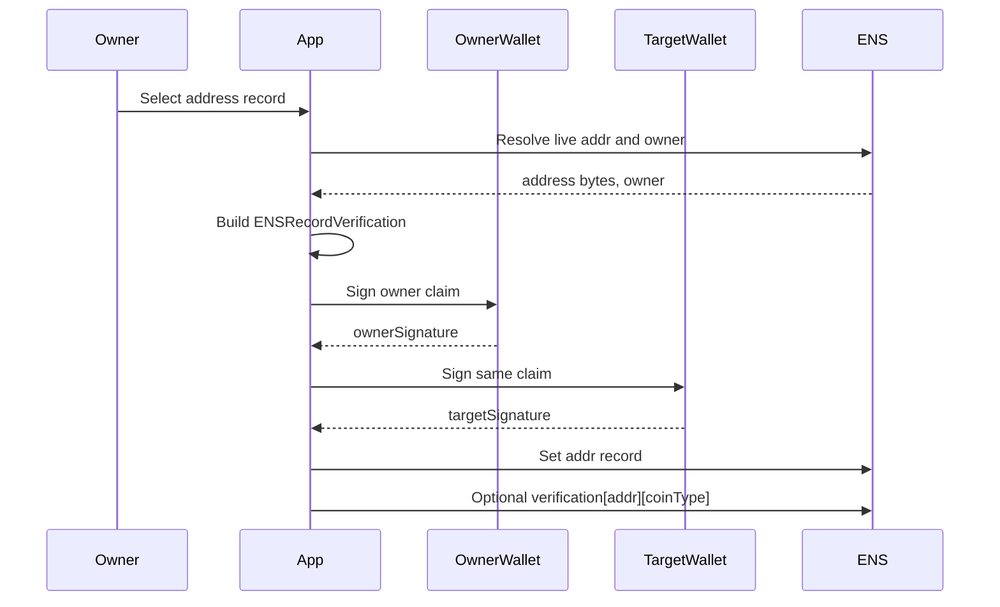
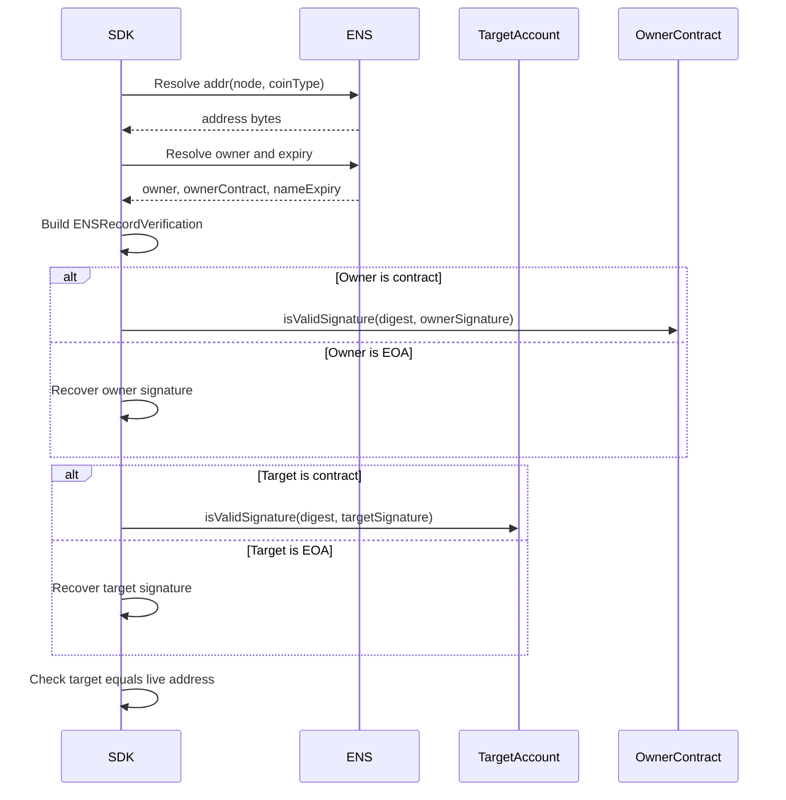
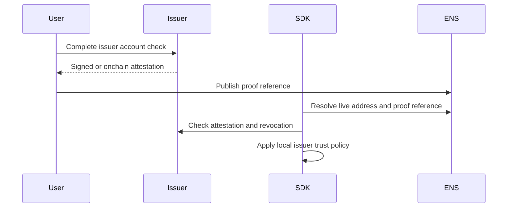

# Address Verification

Address verification applies to:

```text
addr(node)
addr(node, coinType)
```

It proves that the current ENS owner authorized the live address record and that
the target account controls the corresponding private key or contract account.

## Records

| Item | Value |
| --- | --- |
| ENS record | `addr(node)` or `addr(node, coinType)` |
| Discovery record | `text(node, "verification[addr][<coinType>]")` |
| Methods | `addr:evm`, `addr:attestation` |
| Result | `verified/control` or `verified/attestation` |

## Canonical Values

```text
record = "addr:<coinType>"
valueHash = keccak256(nativeAddressBytes)
target = method-defined account identifier
```

For EVM addresses, `nativeAddressBytes` are the 20 raw address bytes. Display
checksum is not signed.

## 0-to-1 Setup Flow



## EVM Proof Object

```json
{
  "v": "ENS-VERIFY-1",
  "expiry": 1790812800,
  "nonce": "0x...",
  "ownerSignature": "0x...",
  "targetSignature": "0x..."
}
```

The target signature covers the same EIP-712 digest as the owner signature. For
contract accounts, the verifier calls ERC-1271 on the target account.

## Verification Flow



## Attestation Flow

Use `addr:attestation` when the target account cannot produce a public
signature, such as some custody or chain-specific accounts.



## SDK Checklist

- Use ENSIP-9 binary address bytes, not display strings, for `valueHash`.
- Include `coinType` in `record`.
- Require owner signature for `addr:evm`.
- Require target signature for `addr:evm`.
- Use ERC-1271 for contract owners and contract target accounts.
- Revalidate before high-value transfers.

## Failure Mapping

| Case | Error |
| --- | --- |
| Empty address | `record_missing` |
| Unsupported coin type | `unsupported_method` |
| Owner signature fails | `signature_invalid` |
| Target signature fails | `target_signature_invalid` |
| Attestation issuer untrusted | `issuer_untrusted` |
| Proof expired | `expired` |
