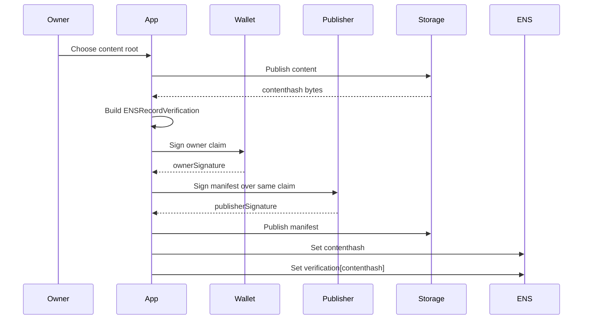
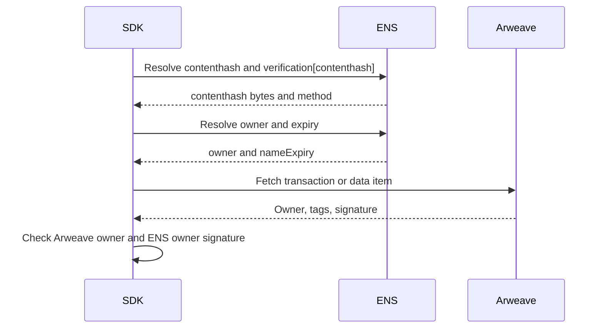
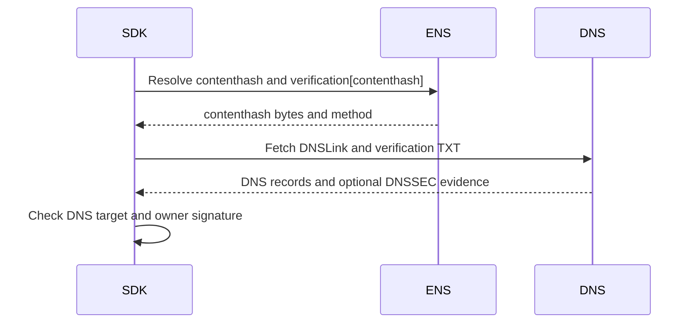
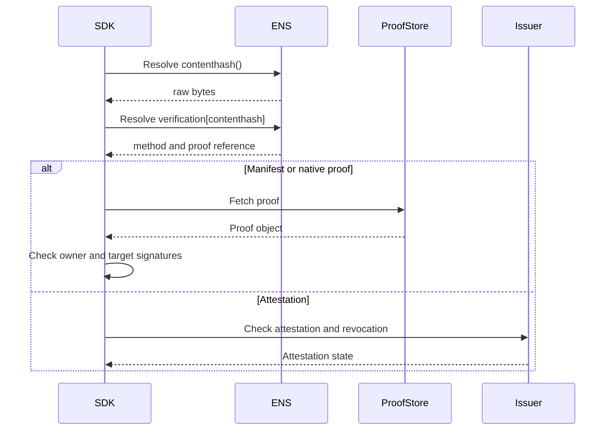

# Contenthash Verification

Contenthash verification applies to ENSIP-7 records:

```text
contenthash(node)
```

The verification record is:

```text
text(node, "verification[contenthash]")
```

Content addressing proves byte integrity. It does not prove publisher identity
or safety.

## Verification Record

Examples:

```text
verification[contenthash] = v=ENS-VERIFY-1;method=publisher-manifest;uri=ipfs://...
verification[contenthash] = v=ENS-VERIFY-1;method=arweave-owner;uri=ar://...
verification[contenthash] = v=ENS-VERIFY-1;method=dnslink;uri=dns:_dnslink.example.com
verification[contenthash] = v=ENS-VERIFY-1;method=none
```

## Canonical Claim

```text
record = "contenthash"
valueHash = keccak256(contenthashBytes)
target = publisher key, Arweave owner, DNS name, or issuer subject
```

`contenthashBytes` are the raw bytes returned by the resolver. Gateway URLs are
transport and MUST NOT be signed as content identity.

## Initial Contenthash Methods

| Method | Verification |
| --- | --- |
| `none` | No proof advertised. |
| `publisher-manifest` | Current owner signature plus publisher manifest signature. |
| `arweave-owner` | Current owner signature plus Arweave transaction or data-item owner proof. |
| `dnslink` | Current owner signature plus DNSLink proof. |
| `issuer-attestation` | Trusted issuer attestation. |

## 0-to-1 Manifest Flow



## Manifest Proof

```json
{
  "v": "ENS-VERIFY-1",
  "method": "publisher-manifest",
  "expiry": 1790812800,
  "nonce": "0x...",
  "publisher": "did:key:z...",
  "ownerSignature": "0x...",
  "publisherSignature": "..."
}
```

The manifest MAY live inside the content root, as a separate content-addressed
object, behind the verification record URI, or in onchain data.

## Arweave Flow



## DNSLink Flow



DNSSEC validation is evidence, not a separate signed method.

## Verification Flow



## SDK Checklist

- Hash raw `contenthash(node)` bytes.
- Do not sign gateway URLs.
- IPFS has no native account owner; use manifest, DNSLink, or attestation.
- Arweave can use transaction or data-item owner as target authority.
- Mutable namespaces require their own authority proof.
- Verification does not imply content safety.

## Failure Mapping

| Case | Error |
| --- | --- |
| Empty contenthash | `record_missing` |
| Verification record missing | none |
| `method=none` | none |
| Unsupported protocol | `unsupported_method` |
| Missing manifest | `proof_missing` |
| Publisher signature fails | `target_signature_invalid` |
| Issuer revoked | `revoked` |
