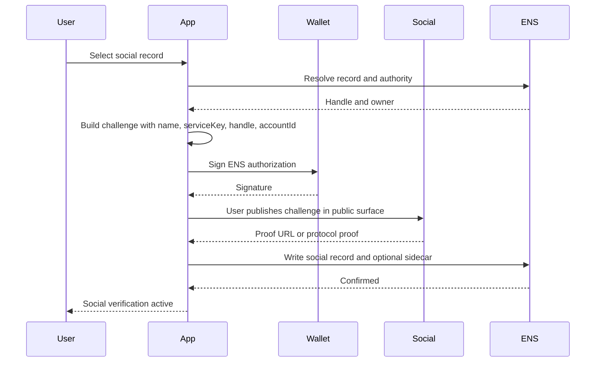
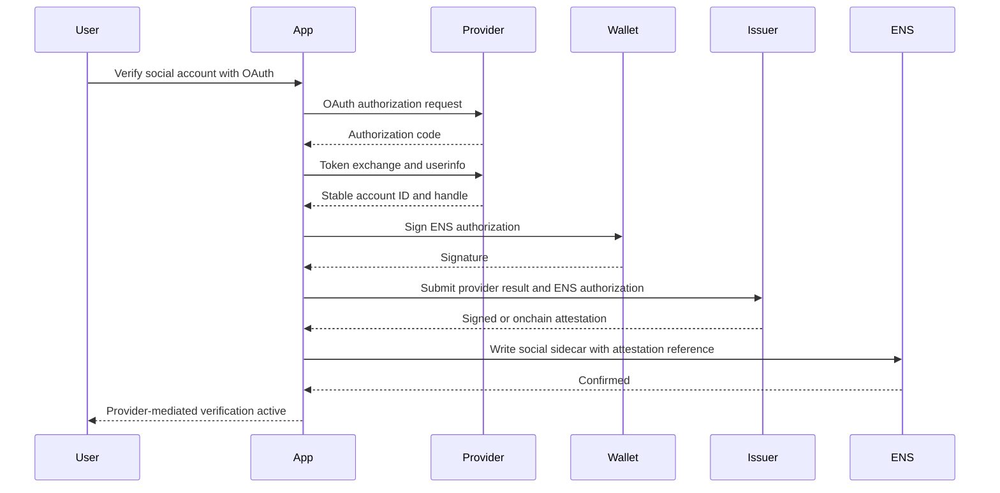
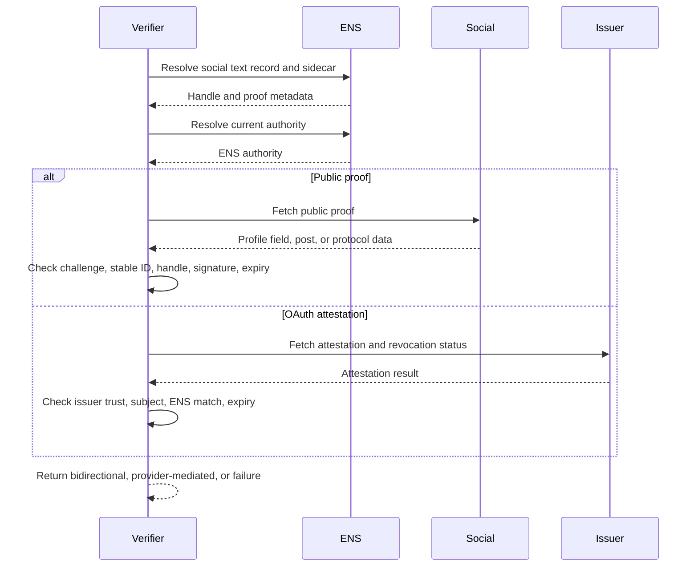

# Social Account Verification

Social verification applies to ENS service keys and social profile records:

- `text("com.github")`
- `text("com.twitter")`
- `text("org.telegram")`
- `text("xyz.farcaster")` or future service-owned keys
- protocol-native identity records such as Nostr or AT Protocol handles

This profile verifies that a target account participated in the claim or that a
trusted provider attested to it. It does not prove the social account is safe or
that a handle will never be recycled.

## Method Profiles

| Method | Target Authority | Result Level |
| --- | --- | --- |
| `social-public-proof@1` | Public account surface or protocol proof | `bidirectional` |
| `social-oauth-attestation@1` | OAuth/OIDC provider plus verifier issuer | `provider-mediated` |
| `social-protocol-native@1` | Protocol-specific signed proof | `bidirectional` or `attested` |

## ENS Record and Sidecar

Canonical record example:

```text
text(node, "com.github") = alice
```

Sidecar key:

```text
social-verification[<serviceKey>][<accountIdHash>]
```

Where:

- `serviceKey` is the ENSIP-5 service key, such as `com.github`.
- `accountIdHash = keccak256(bytes(canonicalStableAccountId))`.
- If a platform has no stable account ID, hash the canonical handle and mark
  the method as weaker in UI.

Sidecar value:

```text
v=ENSSOC1;method=social-public-proof@1;digest=<proofDigest>;exp=<unix-time>;issuer=<optional>
```

Rules:

- The live ENS text record MUST still equal the canonical display handle or
  service-defined value.
- Stable account IDs SHOULD be used when available.
- The sidecar MUST bind both the stable account ID and display handle when both
  exist.
- OAuth tokens MUST NOT be published in ENS.

## Public Proof Model

Use when the target account exposes a public proof that any verifier can fetch.

Supported proof families:

| Family | Example |
| --- | --- |
| Profile field | Bio contains signed challenge or ENS name. |
| Public post | Post contains proof URI or challenge digest. |
| Reciprocal link | Website or profile contains `rel="me"` link. |
| NIP-05 | HTTPS JSON maps identifier to Nostr public key. |
| AT Protocol | DNS TXT or HTTPS handle proof maps handle to DID. |
| Farcaster | Protocol message verifies address, FID, or username relationship. |

Public proof object:

```json
{
  "type": "ENSSocialVerification",
  "version": 1,
  "chainId": 1,
  "registry": "0x00000000000C2E074eC69A0dFb2997BA6C7d2e1e",
  "name": "alice.eth",
  "node": "0x...",
  "serviceKey": "com.github",
  "handle": "alice",
  "stableAccountId": "123456",
  "method": "social-public-proof@1",
  "proofUrl": "https://github.com/alice/...",
  "ensAuthority": "0x...",
  "issuedAt": 1783123200,
  "expiresAt": 1790812800,
  "nonce": "0x...",
  "signature": "0x..."
}
```

## OAuth Attestation Model

OAuth and OIDC are provider-mediated. The public cannot verify the original
OAuth token, so the result is not the same as a public target proof.

Flow:

1. User signs into provider through OAuth/OIDC.
2. Verifier obtains stable provider account ID and handle.
3. User signs ENS authorization or verifier checks sidecar.
4. Verifier issues an attestation binding ENS name, service key, stable account
   ID, handle, issuer, expiry, and revocation.
5. ENS sidecar references the attestation digest or URI.

Attestation payload:

```json
{
  "type": "ENSSocialOAuthAttestation",
  "version": 1,
  "issuer": "0x3333333333333333333333333333333333333333",
  "provider": "github.com",
  "serviceKey": "com.github",
  "stableAccountId": "123456",
  "handle": "alice",
  "name": "alice.eth",
  "node": "0x...",
  "issuedAt": 1783123200,
  "expiresAt": 1790812800,
  "revocationRef": "eas:0x..."
}
```

## User Setup Flow: Public Proof



## User Setup Flow: OAuth Attestation



## Independent Verification Flow



## Verifier Requirements

Public proof:

1. Resolve live ENS social record.
2. Canonicalize handle according to service rules.
3. Resolve sidecar and proof reference.
4. Fetch public proof.
5. Check proof binds name, node, service key, stable account ID, handle, method,
   and expiry.
6. Check ENS authority signature or scoped delegate.
7. Check target account identity using service-specific adapter.

OAuth attestation:

1. Resolve live ENS social record.
2. Resolve sidecar attestation reference.
3. Verify issuer signature or onchain attestation.
4. Check issuer is trusted by the verifier policy.
5. Check stable account ID and handle match.
6. Check expiry and revocation.
7. Return `provider-mediated` unless the provider exposes a public proof that
   can be independently refetched.

## API and Indexer Verification

Indexers can discover:

- `TextChanged(node, "com.github", value)`;
- `TextChanged(node, "social-verification[...]", value)`;
- attestation events;
- owner, resolver, and wrapper transfer events.

Provider-mediated checks require offchain workers because OAuth tokens cannot be
stored in a subgraph. A subgraph should index attestation references and issuer
events, while an API worker verifies provider revocation and issuer policy.

Recommended API response:

```json
{
  "name": "alice.eth",
  "record": "text:com.github",
  "value": "alice",
  "level": "provider-mediated",
  "method": "social-oauth-attestation@1",
  "provider": "github.com",
  "stableAccountId": "123456",
  "issuer": "0x3333333333333333333333333333333333333333",
  "expiresAt": 1790812800,
  "checkedAt": 1783200000
}
```

## Security Notes

- Prefer stable account IDs over handles.
- Handle-only verification is weak if the platform recycles usernames.
- OAuth tokens are secrets and must never be published.
- Provider-mediated verification depends on issuer trust.
- Public proofs can be deleted or edited; clients must revalidate.
- A verified social account is not proof that the account is safe or official.

