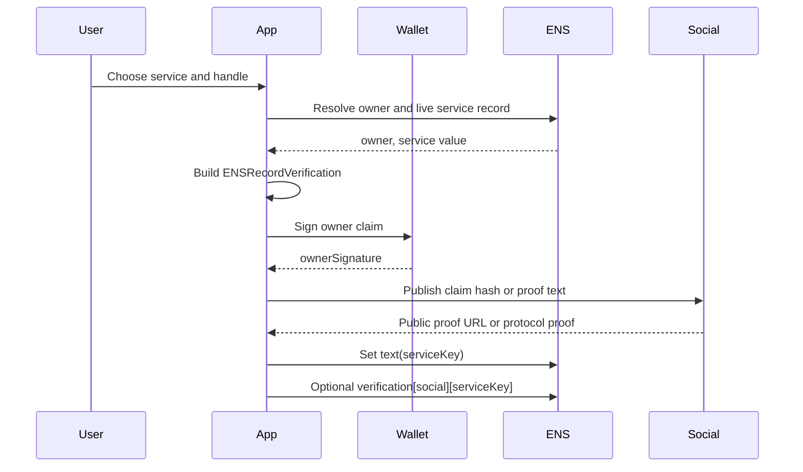
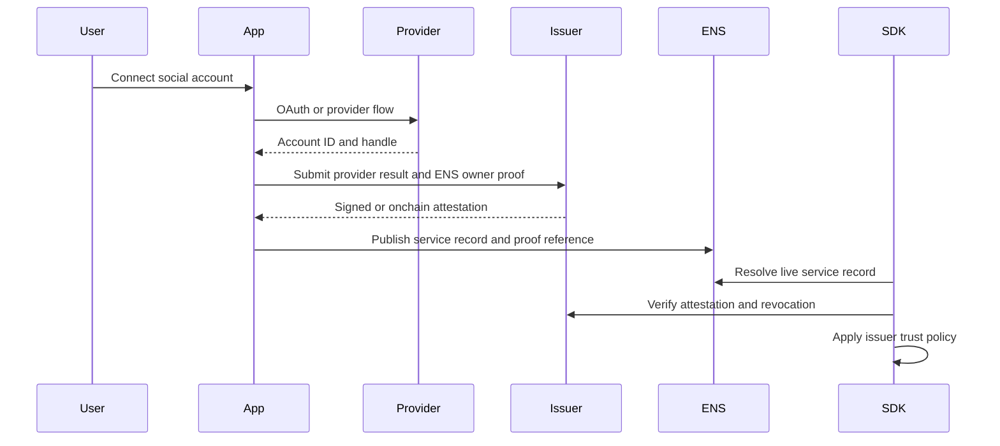
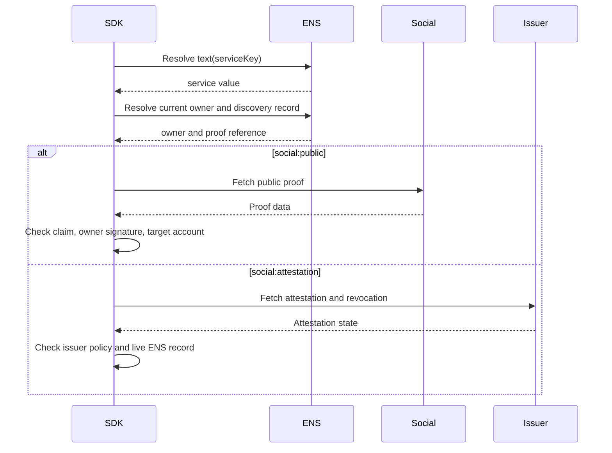

# Social Account Verification

Social verification applies to ENSIP-5 service text records:

```text
text(node, serviceKey)
```

Examples include `com.github`, `com.twitter`, `org.telegram`, and
protocol-specific service keys.

## Records

| Item | Value |
| --- | --- |
| ENS record | `text(node, serviceKey)` |
| Discovery record | `text(node, "verification[social][<serviceKey>]")` |
| Methods | `social:public`, `social:attestation` |
| Result | `verified/control` or `verified/attestation` |

## Service Profile

Each service profile MUST define:

- `serviceKey`;
- canonicalization of the ENS text value;
- stable account ID, if available;
- public proof location, if available;
- whether handles can be recycled;
- target string used in `ENSRecordVerification`.

If a service has no stable account ID, verification is weaker and clients SHOULD
display that limitation.

## 0-to-1 Public Proof Flow



## Public Proof Object

The exact public proof is service-defined. It MUST bind the same claim as the
ENS owner signature. Common forms:

- profile field containing a claim hash;
- public post containing a claim hash;
- protocol-native signed message;
- well-known file for protocols that support domain proofs.

The proof MUST be publicly fetchable for `social:public`.

## Attestation Flow

Use `social:attestation` when OAuth or a private API is required.



OAuth tokens MUST NOT be published in ENS.

## Verification Flow



## SDK Checklist

- Prefer stable account IDs over handles.
- Do not treat OAuth as public control verification.
- Re-read the live ENS service record before returning positive verification.
- Verify owner signature for public proofs unless the service profile defines a
  stronger target-native proof.
- Apply local issuer trust policy for attestations.
- Expire or invalidate proofs when handles are recycled or public proofs are
  removed.

## Failure Mapping

| Case | Error |
| --- | --- |
| Empty service record | `record_missing` |
| Unknown service profile | `unsupported_method` |
| Public proof deleted | `proof_missing` |
| Account mismatch | `target_mismatch` |
| Issuer untrusted | `issuer_untrusted` |
| Attestation revoked | `revoked` |
