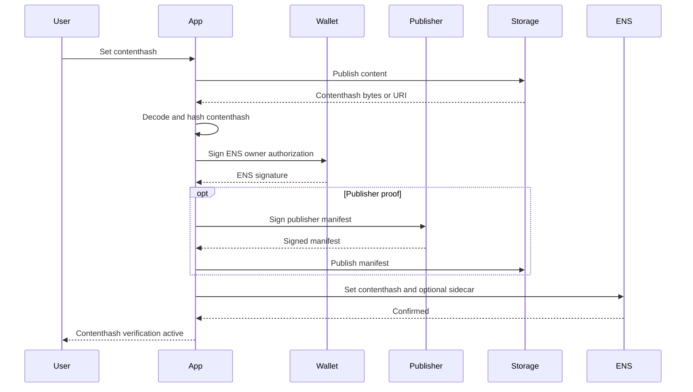
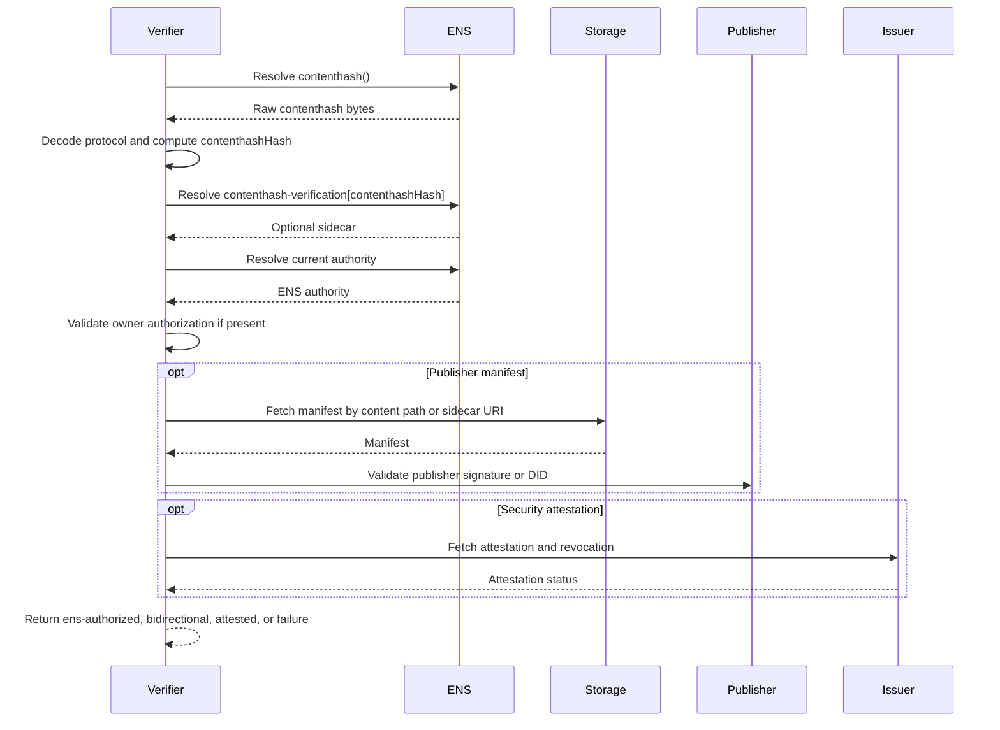

# Contenthash Verification

Contenthash verification applies to:

- `contenthash(bytes32 node)`;
- content references embedded in text records;
- IPFS, Swarm, IPNS, DNSLink, or future content-addressed targets.

Contenthash already verifies content integrity when the protocol is
content-addressed. The missing properties are current ENS endorsement, publisher
authorship, mutable namespace control, and optional safety review. These MUST be
reported as different levels.

## Method Profiles

| Method | Target Authority | Result Level |
| --- | --- | --- |
| `contenthash-owner@1` | Current ENS authority | `ens-authorized` |
| `contenthash-publisher@1` | Publisher key or manifest signer | `bidirectional` or `attested` |
| `contenthash-dnslink@1` | DNS host for DNSLink target | `target-confirmed` or `bidirectional` |
| `contenthash-security-attestation@1` | Security issuer | `attested` |

## ENS Record and Sidecar

Canonical record:

```text
contenthash(node) = <multicodec bytes>
```

Sidecar key:

```text
contenthash-verification[<contenthashHash>]
```

Where:

```text
contenthashHash = keccak256(contenthashBytes)
```

Sidecar value:

```text
v=ENSCONTENT1;method=contenthash-owner@1,contenthash-publisher@1;digest=<proofDigest>;exp=<unix-time>;uri=<optionalManifestUri>
```

Rules:

- The live `contenthash()` return value MUST equal the proof contenthash bytes.
- `contenthash-owner@1` does not require a target-side proof.
- `contenthash-publisher@1` requires a publisher manifest or signature.
- Security attestations MUST be labeled separately from authorship or ENS
  endorsement.

## Canonicalization

The verifier MUST operate on resolver-returned bytes, not a gateway URL.

Canonical fields:

- `contenthashBytes`: raw resolver bytes;
- `contenthashHash`: `keccak256(contenthashBytes)`;
- `protocol`: decoded multicodec protocol, if supported;
- `displayUri`: user-facing URI, derived only for display;
- `gatewayUrl`: optional transport URL, not part of content identity unless the
  method profile says so.

## Owner Authorization Proof

`contenthash-owner@1` proves that the current ENS authority authorized the
current contenthash.

Proof:

```json
{
  "type": "ENSContenthashOwnerVerification",
  "version": 1,
  "chainId": 1,
  "registry": "0x00000000000C2E074eC69A0dFb2997BA6C7d2e1e",
  "name": "alice.eth",
  "node": "0x...",
  "contenthash": "0xe301...",
  "contenthashHash": "0x...",
  "method": "contenthash-owner@1",
  "ensAuthority": "0x...",
  "issuedAt": 1783123200,
  "expiresAt": 1790812800,
  "nonce": "0x...",
  "signature": "0x..."
}
```

Result level: `ens-authorized`.

This does not prove that a publisher authored the content or that the content is
safe.

## Publisher Manifest Proof

`contenthash-publisher@1` proves that a publisher key signed a manifest binding
content to the ENS name.

Manifest location options:

- content root path `/.well-known/ens-content-verification.json` for directory
  content;
- content-addressed manifest URI in sidecar `uri`;
- application-specific manifest path defined by method profile.

Manifest:

```json
{
  "type": "ENSContentPublisherManifest",
  "version": 1,
  "name": "alice.eth",
  "node": "0x...",
  "contenthashHash": "0x...",
  "publisher": "did:key:z...",
  "issuedAt": 1783123200,
  "expiresAt": 1790812800,
  "claims": {
    "title": "Alice Site",
    "build": "2026-07-04"
  },
  "signature": "..."
}
```

Rules:

- The manifest MUST bind the contenthash hash, not only a gateway URL.
- The publisher key trust model MUST be explicit.
- If the publisher key is itself listed in ENS, that record MUST be verified
  separately.

## User Setup Flow



## Independent Verification Flow



## API and Indexer Verification

Indexers can discover:

- `ContenthashChanged(node, bytes)`;
- `TextChanged(node, "contenthash-verification[...]", value)`;
- owner, resolver, and wrapper changes;
- attestation events.

Workers SHOULD fetch manifests and attestations. A subgraph can store
contenthash bytes and sidecar references, but should not claim publisher
verification unless a worker has validated signatures and revocation state.

Recommended response:

```json
{
  "name": "alice.eth",
  "record": "contenthash",
  "contenthash": "ipfs://bafy...",
  "level": "ens-authorized",
  "methods": ["contenthash-owner@1"],
  "expiresAt": 1790812800,
  "checkedAt": 1783200000
}
```

## Security Notes

- Do not label contenthash as safe solely because it is verified.
- Gateway URLs are transports and can be malicious or stale.
- IPNS and DNSLink are mutable namespaces; verify their own authority if used.
- Publisher identity requires a trust model.
- Security scans are third-party attestations and can expire or be revoked.

