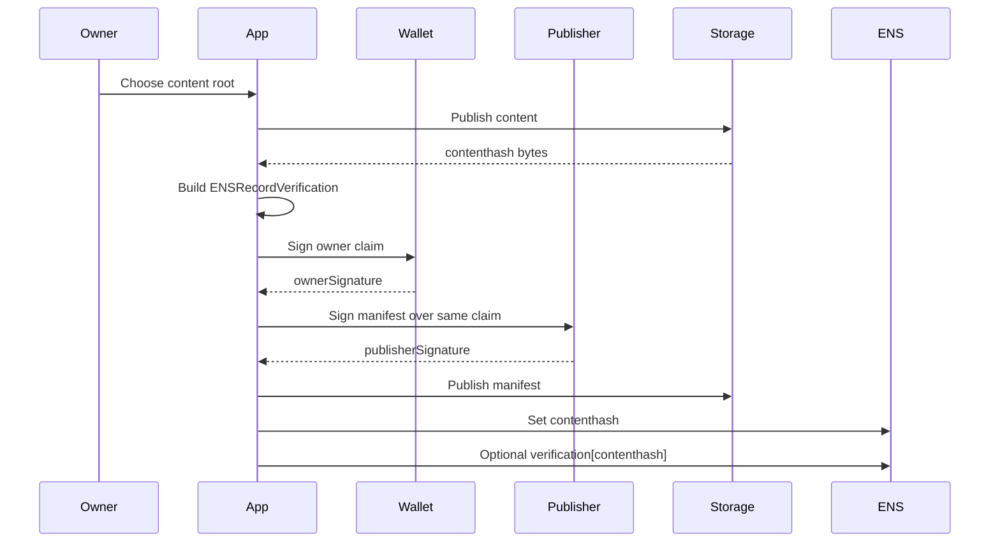
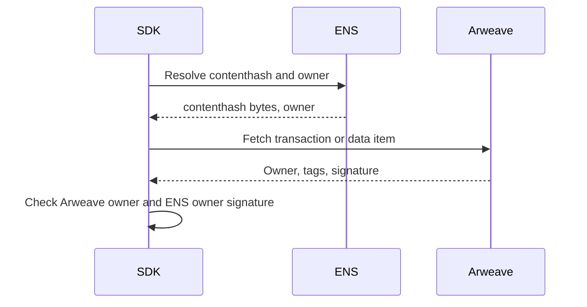
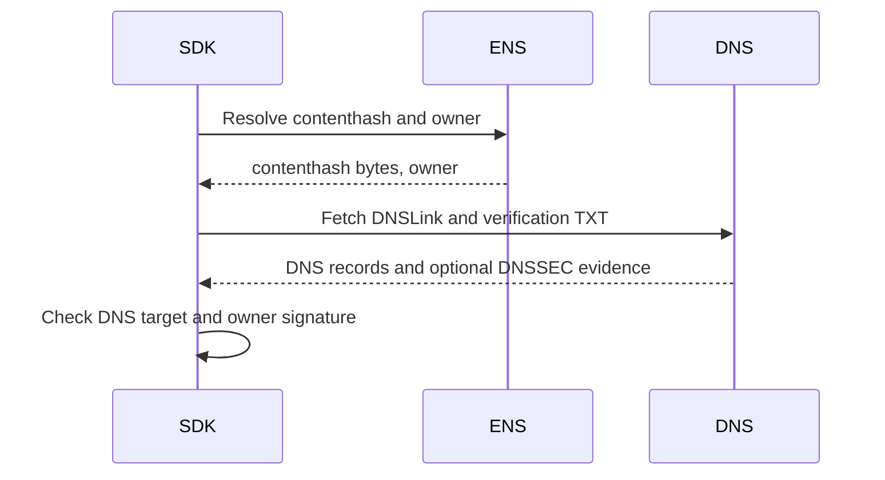
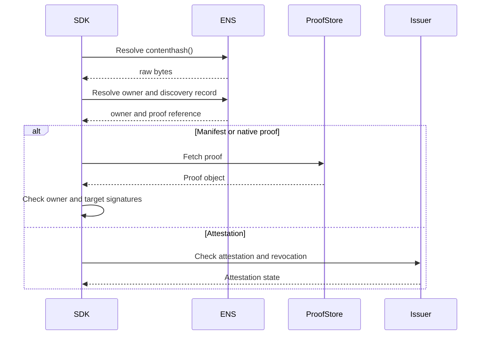

# Contenthash Verification

Contenthash verification applies to:

```text
contenthash(node)
```

It verifies publisher or namespace control for content-addressed or
content-routed targets such as IPFS, Arweave, Swarm, IPNS, and DNSLink.

Content addressing proves byte integrity. It does not prove publisher identity
or safety.

## Records

| Item | Value |
| --- | --- |
| ENS record | `contenthash(node)` |
| Discovery record | `text(node, "verification[contenthash]")` |
| Methods | `contenthash:manifest`, `contenthash:arweave`, `contenthash:dnslink`, `contenthash:attestation` |
| Result | `verified/control` or `verified/attestation` |

## Canonical Values

```text
record = "contenthash"
valueHash = keccak256(contenthashBytes)
target = publisher key, Arweave owner, DNS name, or issuer subject
```

`contenthashBytes` are the raw bytes returned by the resolver. Gateway URLs are
transport and MUST NOT be signed as content identity.

## 0-to-1 Manifest Flow



## Manifest Proof

```json
{
  "v": "ENS-VERIFY-1",
  "method": "contenthash:manifest",
  "expiry": 1790812800,
  "nonce": "0x...",
  "publisher": "did:key:z...",
  "ownerSignature": "0x...",
  "publisherSignature": "..."
}
```

The manifest MAY live:

- inside the content root;
- as a separate content-addressed object;
- behind the discovery record URI;
- in onchain data.

Existing immutable content can be verified by publishing a separate manifest
that binds the live `contenthash(node)` bytes.

## Arweave Flow



`contenthash:arweave` verifies the Arweave transaction or data-item owner and a
claim binding that owner to the live ENS contenthash.

## DNSLink Flow



DNSSEC validation is evidence, not a separate signed method.

## Verification Flow



## SDK Checklist

- Hash raw `contenthash(node)` bytes.
- Do not sign gateway URLs.
- IPFS has no native account owner; use manifest, DNSLink, or attestation.
- Arweave can use transaction or data-item owner as target authority.
- Mutable namespaces require their own authority proof.
- Verification does not imply content safety.

## Failure Mapping

| Case | Error |
| --- | --- |
| Empty contenthash | `record_missing` |
| Unsupported protocol | `unsupported_method` |
| Missing manifest | `proof_missing` |
| Publisher signature fails | `target_signature_invalid` |
| Issuer revoked | `revoked` |
| Gateway mismatch only | `target_mismatch` |
