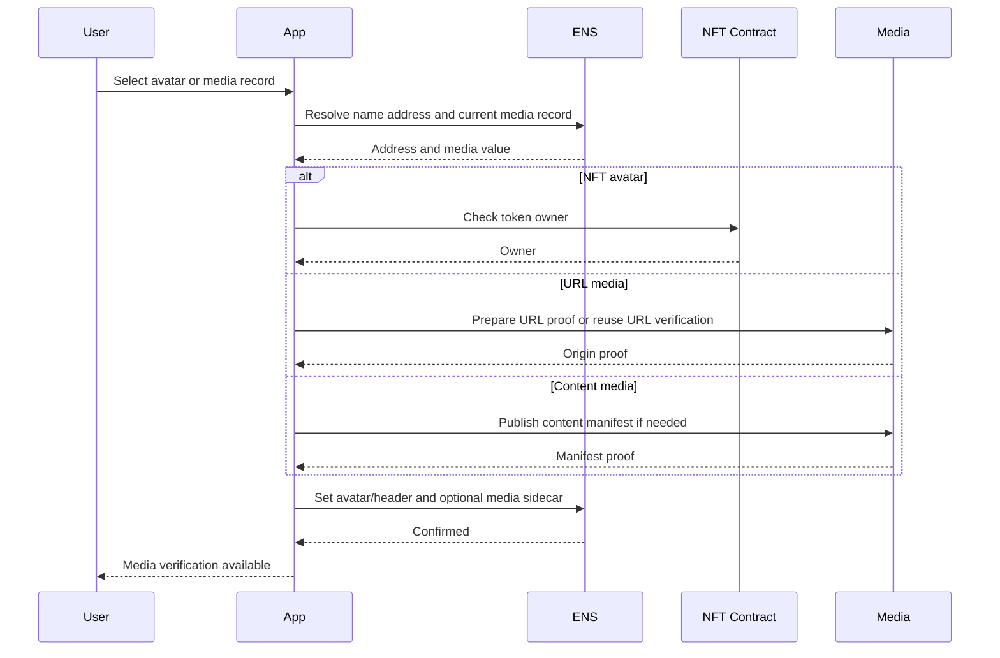
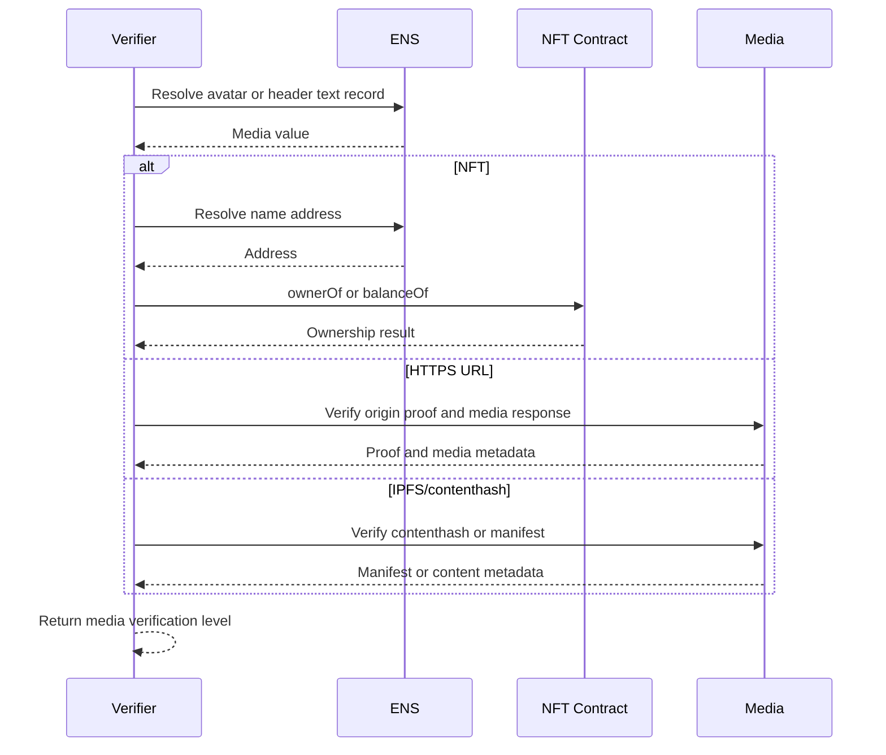

# Avatar and Media Verification

Avatar and media verification applies to:

- `text("avatar")`;
- `text("header")`;
- URL-valued media records;
- NFT avatar references;
- IPFS or contenthash media references.

This profile builds on ENSIP-12. It verifies whether the media target is valid
under its native authority model. It does not prove the image is safe,
appropriate, or legally owned.

## Method Profiles

| Method | Target Authority | Result Level |
| --- | --- | --- |
| `avatar-ensip12-nft@1` | NFT owner according to token contract | `bidirectional` |
| `media-url@1` | HTTPS origin or DNS host | `bidirectional` |
| `media-contenthash@1` | Contenthash owner or publisher | `ens-authorized` or `bidirectional` |
| `media-attestation@1` | Issuer or moderation service | `attested` |

## ENS Record and Sidecar

Canonical records:

```text
text(node, "avatar") = eip155:1/erc721:0x.../123
text(node, "avatar") = https://example.com/avatar.png
text(node, "header") = ipfs://bafy...
```

Sidecar key:

```text
media-verification[<recordKey>][<targetHash>]
```

Examples:

```text
media-verification[avatar][0x...]
media-verification[header][0x...]
```

Sidecar value:

```text
v=ENSMEDIA1;method=avatar-ensip12-nft@1;digest=<proofDigest>;exp=<unix-time>
```

Sidecar is optional. NFT avatar validation can often be performed directly from
the avatar value and resolved address.

## NFT Avatar Verification

For `avatar-ensip12-nft@1`:

1. Resolve `text(node, "avatar")`.
2. Parse CAIP-22 or CAIP-29 NFT URI.
3. Resolve the owner address for the ENS name.
4. Check that the owner address owns the referenced token.
5. Resolve token metadata.
6. Resolve image URI from metadata.
7. Return `bidirectional` only if ownership check passes.

If the ENS name was reached through reverse resolution, first perform
forward-confirmed reverse resolution to identify the address.

## URL Media Verification

For `media-url@1`, reuse `url-https@1` or `url-dnssec@1` against the media
origin, not the full media path.

Additional media checks:

- content type SHOULD be an expected image or media type;
- response body SHOULD respect client size limits;
- clients SHOULD avoid executing active content.

## Contenthash Media Verification

For `media-contenthash@1`, reuse contenthash verification:

- `contenthash-owner@1` if the current ENS authority signed the contenthash;
- `contenthash-publisher@1` if a publisher manifest signs the media target.

## User Setup Flow



## Independent Verification Flow



## API and Indexer Verification

Indexers can discover:

- `TextChanged(node, "avatar", value)`;
- `TextChanged(node, "header", value)`;
- `TextChanged(node, "media-verification[...]", value)`;
- address record changes for NFT ownership context;
- NFT transfer events if the indexer tracks the NFT chain.

Verification workers should re-check NFT ownership at display time or near it,
because ownership can change without an ENS event.

Recommended response:

```json
{
  "name": "alice.eth",
  "record": "text:avatar",
  "value": "eip155:1/erc721:0x.../123",
  "level": "bidirectional",
  "method": "avatar-ensip12-nft@1",
  "checkedAt": 1783200000
}
```

## Security Notes

- SVGs and remote media can contain active or privacy-sensitive content.
- NFT ownership can change at any time.
- URL media origin verification does not prove the specific file is permanent.
- Media verification should not be used as a safety badge.
- Clients should enforce size and content-type limits.

