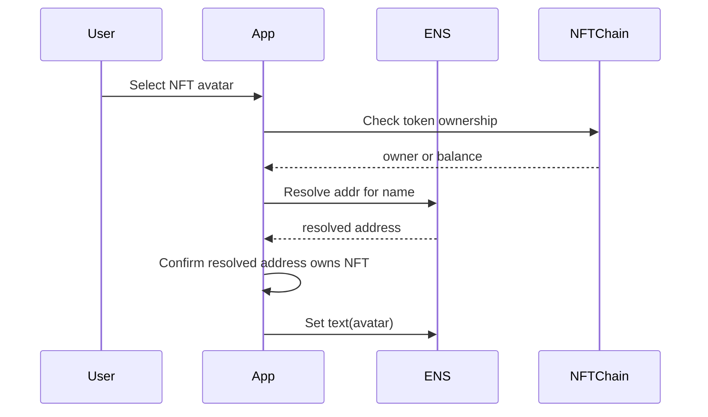
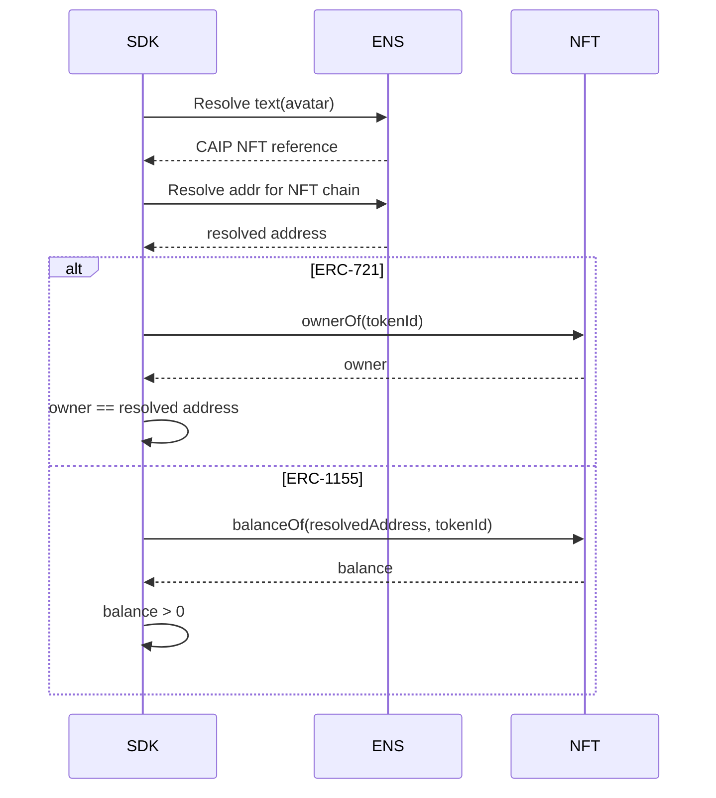

# Avatar NFT Verification

Avatar NFT verification applies to:

```text
text(node, "avatar")
```

Only CAIP NFT references are verified by this category. HTTPS, IPFS, data, and
generic image avatar URIs can still be displayed by clients but are not verified
by this method.

## Records

| Item | Value |
| --- | --- |
| ENS record | `text(node, "avatar")` |
| Discovery record | Not required |
| Method | `avatar:nft` |
| Result | `verified/control` |

## Supported Values

```text
eip155:<chainId>/erc721:<contract>/<tokenId>
eip155:<chainId>/erc1155:<contract>/<tokenId>
```

Verification follows the ENSIP-12 NFT ownership check.

## 0-to-1 Setup Flow



No signature proof is required because verification is a live-state check across
ENS and the NFT contract.

## Verification Flow



## SDK Checklist

- Parse only CAIP NFT references for verification.
- Resolve the address for the same ENS name.
- For ERC-721, require `ownerOf(tokenId)` to equal the resolved address.
- For ERC-1155, require `balanceOf(resolvedAddress, tokenId) > 0`.
- Revalidate when avatar record, resolved address, NFT ownership, or NFT
  balance changes.
- Do not treat NFT metadata image safety as verified.

## Failure Mapping

| Case | Error |
| --- | --- |
| Non-CAIP avatar URI | `unsupported_method` |
| Malformed CAIP reference | `record_invalid` |
| Unsupported NFT standard | `unsupported_method` |
| Resolved address missing | `address_missing` |
| Token not owned | `target_mismatch` |
| NFT chain unavailable | `target_unavailable` |
