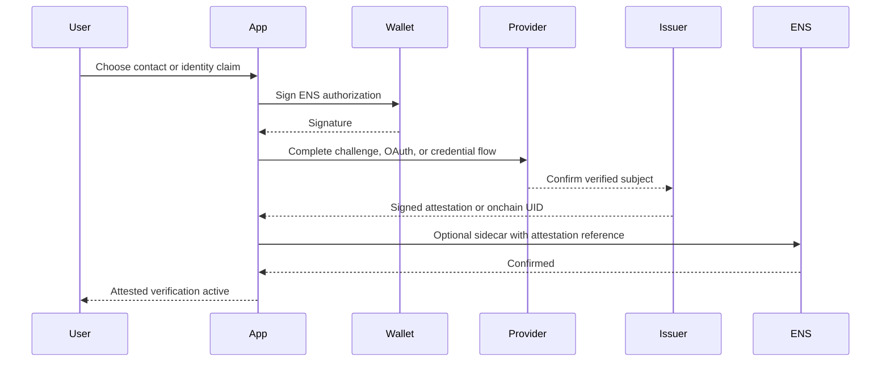
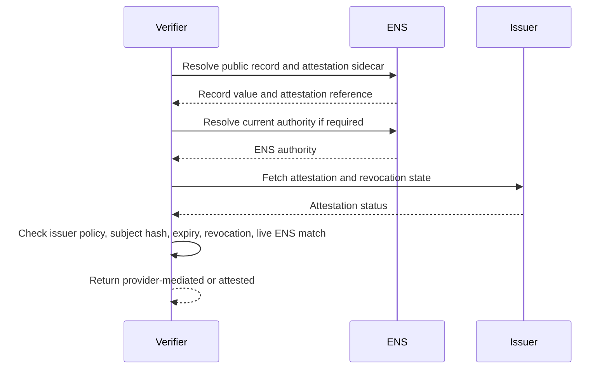

# Contact, Identity, and Attestation Verification

This profile covers records that are sensitive, private, or real-world in
nature:

- `text("email")`;
- `text("phone")`;
- `text("mail")`;
- organization, role, legal name, location, or credential-style claims;
- private contact endpoints.

Most of these records SHOULD NOT be publicly verified by default. Verification
should be opt-in and attestation-based unless the target is a public domain or
organization endpoint.

## Method Profiles

| Method | Target Authority | Result Level |
| --- | --- | --- |
| `contact-domain@1` | DNS or email domain | `target-confirmed` or `bidirectional` |
| `contact-provider-attestation@1` | Email/phone provider or verifier | `provider-mediated` |
| `identity-attestation@1` | Credential issuer | `attested` |
| `organization-attestation@1` | Organization issuer | `attested` |

## Records That Should Usually Remain Unverified

Do not verify by default:

- `description`;
- `notice`;
- `keywords`;
- `theme`;
- `alias`;
- `location`, unless issued as a credential;
- arbitrary freeform profile text.

These fields are self-expression or display metadata. A verification badge would
overstate their meaning.

## Contact Verification

### Domain-Based Contact

Use when the contact is tied to a domain the user controls, such as
`alice@example.com`.

Sidecar key:

```text
contact-verification[email][<domainHash>]
```

Possible proof methods:

- DNS TXT at `_ens-contact.<domain>`;
- HTTPS well-known proof at `https://<domain>/.well-known/ens-contact`;
- provider attestation from an email verification service.

The proof should verify domain or provider control. It SHOULD NOT publish inbox
challenge secrets permanently.

### Provider-Mediated Contact

For email inboxes or phone numbers, a provider or verifier should issue an
attestation after challenge response.

Attestation:

```json
{
  "type": "ENSContactAttestation",
  "version": 1,
  "issuer": "0x3333333333333333333333333333333333333333",
  "name": "alice.eth",
  "node": "0x...",
  "recordKey": "email",
  "recordValueHash": "0x...",
  "verifiedAt": 1783123200,
  "expiresAt": 1790812800,
  "revocationRef": "eas:0x..."
}
```

The attestation should hash private values when public disclosure is not
required. If the email or phone number is already public in ENS, the hash binds
to the live record.

## Real-World Identity Verification

Legal name, role, organization, and location should use credentials or
attestations. The ENS protocol should not define a global truth source.

Sidecar key:

```text
identity-attestation[<schemaId>][<subjectHash>]
```

Value:

```text
v=ENSID1;method=identity-attestation@1;issuer=<issuer>;uri=<attestationUri>;exp=<unix-time>
```

Rules:

- Issuer trust is client policy.
- Revocation MUST be checked.
- Expiry MUST be checked.
- Selective disclosure SHOULD be supported where possible.

## User Setup Flow



## Independent Verification Flow



## API and Indexer Verification

Subgraphs can index attestation references and onchain attestation events. They
cannot determine issuer trust for every application. APIs should expose issuer,
schema, expiry, and revocation state so clients can apply policy.

Recommended response:

```json
{
  "name": "alice.eth",
  "record": "text:email",
  "level": "provider-mediated",
  "method": "contact-provider-attestation@1",
  "issuer": "0x3333333333333333333333333333333333333333",
  "schema": "email-control-v1",
  "expiresAt": 1790812800,
  "revoked": false,
  "checkedAt": 1783200000
}
```

## Security Notes

- Public email and phone proofs can expose sensitive data.
- Do not publish reusable challenge secrets.
- Do not imply KYC, employment, or legal identity without issuer context.
- Issuer compromise affects attestations.
- Clients must distinguish `provider-mediated` from independently refetchable
  proofs.

