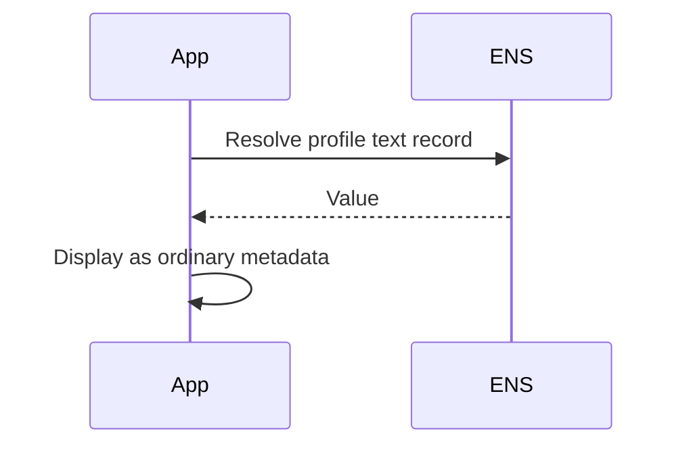

# Non-verifiable Profile Metadata

Some ENS records are display metadata. They do not point to an external target
with a meaningful control check.

Examples:

```text
text(node, "name")
text(node, "description")
text(node, "location")
text(node, "keywords")
text(node, "display")
```

These records SHOULD be displayed as ordinary ENS profile data, not as verified
records.

## Why No Verification

Verification needs a target authority. For a website, the target authority is an
origin or DNS host. For an address, it is the account. For a social record, it is
the platform account or issuer. For profile text, there is no external target
that can independently confirm the value.

## Display Flow



## SDK Behavior

```text
status = none
error = unsupported_record
```

Applications MAY still show the record. They MUST NOT show the same trust
indicator used for verified URL, address, social, contenthash, or avatar NFT
records.

## Future Extensions

Some private contact records, legal identity fields, or organization claims may
need attestation-based verification in future ENSIPs. Those profiles should be
separate because they need issuer policy, privacy rules, revocation, and clear
user-interface language.
