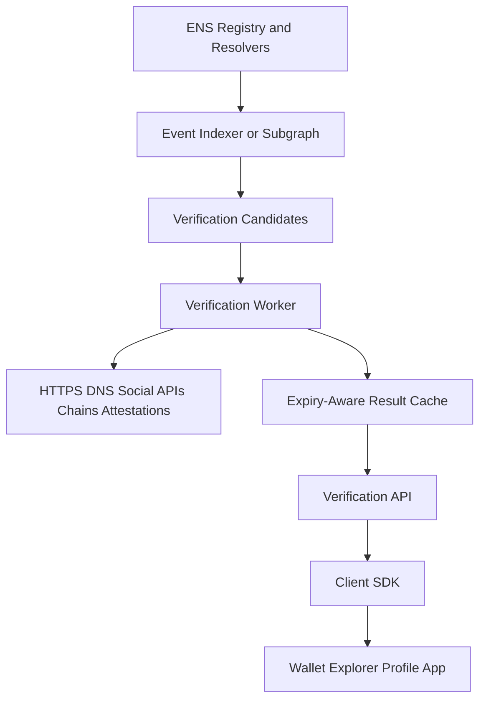
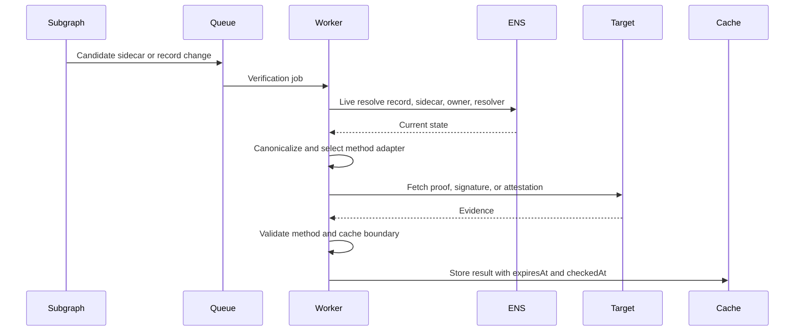

# Indexers, APIs, Subgraphs, and SDKs

This document defines how external APIs, indexers, subgraphs, and libraries
should verify ENS record verification profiles.

The rule is simple: indexers can discover candidates, but a positive
verification result requires method validation against current state.

## Architecture



Recommended components:

- chain indexer or subgraph for ENS events;
- worker queue for method-native proof checks;
- result cache with expiry boundaries;
- API for applications;
- SDK that can either call the API or verify locally.

## Events to Index

Index these events where available:

| Event | Use |
| --- | --- |
| `TextChanged(node,indexedKey,key,value)` | Text records and sidecars. |
| `AddrChanged(node,address)` | Ethereum address changes. |
| `AddressChanged(node,coinType,bytes)` | Multicoin address changes. |
| `ContenthashChanged(node,bytes)` | Contenthash changes. |
| `NameChanged(node,string)` | Reverse resolution changes. |
| registry owner changes | Transfer invalidation. |
| resolver changes | Record invalidation and re-fetch. |
| Name Wrapper transfer/fuse events | Wrapped owner invalidation. |
| attestation issued/revoked events | Provider and issuer state. |

Subgraphs may not see every offchain resolver mutation. For CCIP-Read or
offchain resolvers, pair event indexing with live resolver reads.

## Candidate Discovery

Candidate keys:

```text
url-verification[...]
addr-verification[...]
social-verification[...]
contenthash-verification[...]
media-verification[...]
contact-verification[...]
identity-attestation[...]
verification-manifest
```

Discovery logic:

1. Index known record changes.
2. Index known sidecar changes.
3. Build candidate jobs by name/node and record category.
4. Resolve live ENS state before verification.
5. Drop stale jobs where the current record no longer matches the candidate.

## Verification Worker Pipeline



Workers MUST re-read live ENS state at job execution time. Event payload alone
is not enough.

## API Contract

Endpoint:

```text
GET /v1/verify/{name}?record=text:url
GET /v1/verify/{name}?record=addr:60
GET /v1/verify/{name}?record=contenthash
```

Response:

```json
{
  "name": "alice.eth",
  "node": "0x...",
  "record": "text:url",
  "value": "https://example.com/",
  "canonicalTarget": "https://example.com",
  "level": "bidirectional",
  "method": "url-https@1",
  "status": "valid",
  "checkedAt": 1783200000,
  "expiresAt": 1790812800,
  "cacheUntil": 1783203600,
  "checks": {
    "liveEnsRecord": true,
    "currentEnsAuthority": true,
    "targetEvidence": true,
    "signature": true,
    "revocation": true
  },
  "evidence": {
    "sidecarKey": "url-verification[0x...]",
    "proofUri": "https://example.com/.well-known/ens-url-verification"
  }
}
```

Error response:

```json
{
  "name": "alice.eth",
  "record": "text:url",
  "level": "invalid",
  "status": "failed",
  "reason": "owner_changed",
  "checkedAt": 1783200000
}
```

## GraphQL Shape

Subgraph entity sketch:

```graphql
type EnsRecord @entity {
  id: ID!
  node: Bytes!
  name: String
  resolver: Bytes
  owner: Bytes
  recordKind: String!
  recordKey: String
  coinType: BigInt
  value: Bytes
  textValue: String
  updatedAt: BigInt!
}

type VerificationCandidate @entity {
  id: ID!
  node: Bytes!
  name: String
  record: String!
  sidecarKey: String
  sidecarValue: String
  method: String
  proofDigest: Bytes
  expiresAt: BigInt
  updatedAt: BigInt!
}

type VerificationResult @entity {
  id: ID!
  node: Bytes!
  name: String
  record: String!
  level: String!
  method: String
  status: String!
  reason: String
  checkedAt: BigInt!
  expiresAt: BigInt
  cacheUntil: BigInt
}
```

The subgraph can store `VerificationResult` only if an offchain worker writes
back to an indexed contract or if the subgraph ingests a trusted result source.
Otherwise, expose candidates and let APIs/workers compute results.

## SDK Interface

```typescript
type VerificationLevel =
  | "unverified"
  | "ens-authorized"
  | "target-confirmed"
  | "bidirectional"
  | "provider-mediated"
  | "attested"
  | "expired"
  | "unsupported-method"
  | "invalid";

type VerifyEnsRecordInput =
  | { name: string; record: { kind: "text"; key: string } }
  | { name: string; record: { kind: "addr"; coinType: number } }
  | { name: string; record: { kind: "contenthash" } };

type VerificationResult = {
  name: string;
  node: string;
  record: string;
  value?: string;
  canonicalTarget?: string;
  level: VerificationLevel;
  method?: string;
  reason?: string;
  checkedAt: number;
  expiresAt?: number;
  evidence?: Record<string, unknown>;
};

async function verifyEnsRecord(input: VerifyEnsRecordInput): Promise<VerificationResult>;
```

SDK requirements:

- support local verification for public methods;
- support API fallback for provider-mediated methods;
- expose unsupported methods distinctly;
- never coerce `provider-mediated` into `bidirectional`;
- revalidate before high-value actions;
- allow caller policy for trusted issuers and supported methods.

## Method Adapter Interface

```typescript
interface VerificationMethodAdapter {
  id: string;
  supports(record: VerifyEnsRecordInput["record"]): boolean;
  discover(ctx: LiveEnsContext): Promise<VerificationCandidate[]>;
  verify(candidate: VerificationCandidate, ctx: LiveEnsContext): Promise<VerificationResult>;
}
```

Adapters:

- `UrlHttpsAdapter`;
- `UrlDnsTxtAdapter`;
- `AddressEip712Adapter`;
- `AddressErc1271Adapter`;
- `SocialPublicProofAdapter`;
- `SocialOAuthAttestationAdapter`;
- `ContenthashOwnerAdapter`;
- `ContenthashPublisherAdapter`;
- `AvatarEnsip12Adapter`;
- `AttestationAdapter`.

## Cache Invalidation

Invalidate positive results on:

- sidecar key changed or removed;
- underlying record changed;
- resolver changed;
- owner or wrapped owner changed;
- delegate revoked or expired;
- attestation revoked;
- DNS TTL elapsed;
- HTTP proof cache elapsed;
- proof `expiresAt` elapsed;
- method adapter version changed.

## Operational Requirements

Workers SHOULD:

- rate limit target fetches by host and method;
- cap response sizes;
- isolate OAuth credentials;
- keep issuer trust policy configurable;
- log failure reasons without leaking secrets;
- store `checkedAt`, `expiresAt`, and `cacheUntil`;
- expose stale result status instead of silently serving old positives.

APIs SHOULD:

- return deterministic JSON;
- include method and level;
- include failure reason;
- expose freshness metadata;
- support batch verification;
- allow clients to request accepted methods.

## Batch API

```text
POST /v1/verify
```

Request:

```json
{
  "records": [
    { "name": "alice.eth", "record": { "kind": "text", "key": "url" } },
    { "name": "alice.eth", "record": { "kind": "addr", "coinType": 60 } }
  ],
  "acceptedMethods": ["url-https@1", "addr-evm-eip712@1"],
  "maxStaleness": 300
}
```

Response:

```json
{
  "results": [
    {
      "name": "alice.eth",
      "record": "text:url",
      "level": "bidirectional",
      "method": "url-https@1",
      "checkedAt": 1783200000,
      "expiresAt": 1790812800
    },
    {
      "name": "alice.eth",
      "record": "addr:60",
      "level": "unverified",
      "reason": "sidecar_missing",
      "checkedAt": 1783200000
    }
  ]
}
```

## Security Notes

- External APIs are convenience layers, not the trust root.
- Clients should verify public evidence locally when risk is high.
- Provider-mediated results require issuer trust policy.
- Subgraphs cannot fetch HTTPS, DNS, OAuth, or arbitrary offchain proofs by
  themselves.
- Verification APIs must avoid turning stale cached results into badges.

